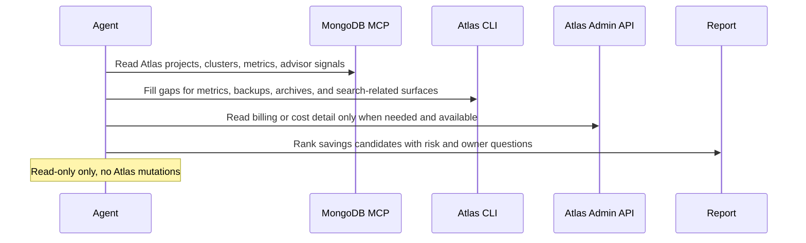

# Atlas Cost Optimization Digest

## Overview

`atlas-cost-optimization-digest` runs a read-only recurring review of one MongoDB Atlas project and returns a compact cost-optimization report that separates likely savings opportunities from cases that still look ambiguous or business-dependent.

Use it when Atlas spend is rising, cluster metrics alone are too noisy to trust, or the team wants a recurring review that asks the right owner questions before anyone scales down, removes backups, drops indexes, or cuts Search capacity.

This automation is intentionally read-only. It does not resize or pause clusters, change auto-scaling, delete dev/test deployments, modify backup policy, drop indexes, change Search Nodes, or mutate billing settings. When the workspace is writable, it can also persist a companion static HTML artifact for faster review.

## Preview


## How It Works

1. Requires one explicit Atlas project and defaults everything else to a rolling 30-day review with inference-first behavior.
2. Reads Atlas cluster inventory, tiering, tags, auto-scaling posture, process metrics, and performance or schema signals.
3. Adds backup, snapshot, online archive, and Search or Vector Search cost context when those surfaces are visible.
4. Uses org-level billing or Cost Explorer data when available; otherwise labels savings as inferred from configuration and usage evidence.
5. Ranks only the strongest candidates and returns each one with evidence, risk, owner questions, and the next best human check.
   The prompt starts from common Atlas cost lenses, but it explicitly allows other Atlas-visible spend drivers when the evidence supports them.



## When To Use It

- you want a recurring Atlas spend and resource-fit review without turning every low-CPU chart into a scale-down action
- you need cluster, storage, backup, and search costs interpreted together rather than as isolated screens
- you want dev/test cleanup opportunities surfaced carefully instead of guessed from one idle period
- you want a report that tells owners what to confirm before action, not just what looks expensive

## Prerequisites

- Read access to the target Atlas project through the MongoDB MCP Server, Atlas CLI, Atlas Admin API, or a combination of them
- `Project Read Only` or stronger for cluster inventory, process metrics, and Performance Advisor or schema evidence
- `Organization Billing Viewer` or stronger if you want Cost Explorer or invoice-backed cost detail instead of usage-only inference
- A clearly named Atlas project scope that can be stated explicitly in the prompt

Important Atlas constraints:

- Atlas recommends reviewing a rolling 30-day period of normal CPU, memory, cache, and IOPS usage before scaling down a cluster.
- Atlas billing visibility is organization-scoped, so exact cost evidence may be unavailable even when project inventory is readable.
- MongoDB MCP Atlas tools cover core Atlas inventory and Performance Advisor surfaces, but some backup, archive, billing, or search-cost details may still require Atlas CLI or Atlas Admin API coverage.
- MongoDB documents that backups are generally not recommended for development and test environments, while continuous backups are the most expensive backup mode and are best reserved for the most critical production data.
- Separate Search Nodes are billed hourly per node and also affect transfer costs, so search-heavy or vector-heavy workloads deserve their own review path.

## Cursor Cloud Usage

1. Open [Cursor Automations](https://cursor.com/automations/new).
2. Name your automation and paste [atlas-cost-optimization-digest.md](/Users/adamchmara/projects/awesome-agent-automations/automations/atlas-cost-optimization-digest/atlas-cost-optimization-digest.md) as the prompt.
3. Add the MongoDB MCP Server with Atlas API credentials in read-only mode.
4. If your MCP setup does not expose the backup, archive, or billing surfaces you need, also make the Atlas CLI available in the runtime.
5. Set the Atlas project in the prompt and save the automation.
6. Start with a weekly schedule. Daily runs are usually too noisy for cost review unless the project is changing rapidly.

References:

- [MongoDB MCP Server Get Started](https://www.mongodb.com/docs/mcp-server/get-started/)
- [MongoDB MCP Server Tools](https://www.mongodb.com/docs/mcp-server/tools/)

## Codex App Usage

1. Click `Automation` > `New Automation`.
2. Name your automation and paste [atlas-cost-optimization-digest.md](/Users/adamchmara/projects/awesome-agent-automations/automations/atlas-cost-optimization-digest/atlas-cost-optimization-digest.md) as the prompt.
3. Install the official MongoDB plugin for Codex or configure the MongoDB MCP Server manually.
4. If you need backup, archive, process-metric, or billing detail beyond MCP coverage, make the Atlas CLI available too.
5. Set the Atlas project in the prompt and save the automation.

References:

- [Codex Automations](https://openai.com/academy/codex-automations)
- [MongoDB MCP Server Configuration Methods](https://www.mongodb.com/docs/mcp-server/configuration/methods/)

## Claude Code / Codex CLI / Copilot Usage

1. Configure the MongoDB MCP Server with Atlas API credentials, or make the Atlas CLI available with authenticated read access.
2. If you need invoice or Cost Explorer context, make sure the runtime also has organization billing visibility.
3. Keep the automation read-only and schedule it against one explicit Atlas project at a time.
4. For repeated checks in an open Claude Code session, use `/loop`, for example:

```text
/loop 1w Follow the instructions in automations/atlas-cost-optimization-digest/atlas-cost-optimization-digest.md
```

5. For durable Claude-managed automation, use `/schedule` or create a Routine in `claude.ai/code/routines`.

## CLI Alternative

If you prefer not to rely on MCP alone, the official Atlas CLI is a credible alternative for most of this automation. Use Atlas Admin API coverage through `atlas api` only when the higher-level CLI or MCP surfaces do not expose the needed read-only detail.

Install and authenticate the CLI first:

```bash
brew install mongodb-atlas-cli
atlas auth login
atlas auth whoami
```

If you need organization billing detail and already have billing access, Atlas CLI also exposes generated Admin API coverage for Cost Explorer and invoice endpoints through `atlas api invoices ...`. Treat that as a runtime fallback, not the primary human setup path.

Relevant official docs:

- [Atlas CLI Overview](https://www.mongodb.com/docs/atlas/cli/current/)
- [atlas auth login](https://www.mongodb.com/docs/atlas/cli/current/command/atlas-auth-login/)
- [atlas auth whoami](https://www.mongodb.com/docs/atlas/cli/current/command/atlas-auth-whoami/)
- [atlas clusters list](https://www.mongodb.com/docs/atlas/cli/current/command/atlas-clusters-list/)
- [atlas processes list](https://www.mongodb.com/docs/atlas/cli/current/command/atlas-processes-list/)
- [atlas metrics processes](https://www.mongodb.com/docs/atlas/cli/v1.49/command/atlas-metrics-processes/)
- [atlas backups snapshots](https://www.mongodb.com/docs/atlas/cli/current/command/atlas-backups-snapshots/)
- [atlas clusters onlineArchives list](https://www.mongodb.com/docs/atlas/cli/v1.44/command/atlas-clusters-onlineArchives-list/)
- [atlas api invoices getCostExplorerUsage](https://www.mongodb.com/docs/atlas/cli/v1.50/command/atlas-api-invoices-getcostexplorerusage/)

## Recommended Defaults

| Setting | Default |
| --- | --- |
| Atlas scope | `one explicit Atlas project` |
| Review window | `last 30 days` |
| Mutation policy | `report only` |
| Final ranked candidates | `up to 8` |
| Cost visibility | `prefer measured billing, otherwise inferred` |
| Savings language | `measured dollars when visible, otherwise qualitative direction` |
| Delivery | `Markdown digest with optional static HTML artifact` |

Additional prompt behavior:

- Treat low CPU as a lead, not a conclusion.
- Prefer rolling usage and configuration patterns over one-day spikes.
- Infer production versus dev/test intent from tags, names, tiering, backup posture, and observed activity before asking for extra operator input.
- Downgrade confidence when billing data is unavailable and say that clearly.
- Use tags and naming hints to distinguish production from dev/test, but ask owner questions when the environment intent is still unclear.
- Review Search Nodes and vector or search-heavy workloads separately from core cluster tiering.
- Do not recommend production backup reductions without explicit retention and recovery-owner confirmation.
- Use the built-in categories as default review lenses, not as a closed list of allowed findings.

## Useful Atlas-Specific Inputs

Tell the runner anything it cannot safely infer.

Minimal prompt example:

```text
Atlas project: checkout-production
```

Optional context example:

```text
Atlas project: checkout-production
Known no-touch clusters or policies: billing-primary requires PITR and cross-region snapshot distribution
The nightly reconciliation job runs from 01:00 to 03:00 UTC and can spike CPU and disk briefly.
```

Only add extra context when the project has unusual workload timing, strict recovery requirements, or naming and tagging that Atlas cannot interpret cleanly on its own.
