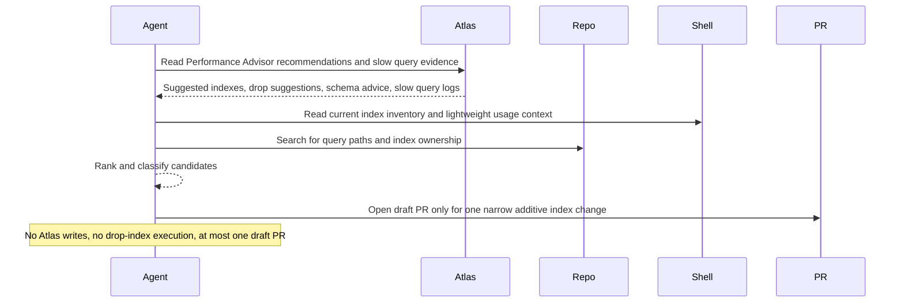

# Atlas Performance Advisor Digest And PR

## Overview

`atlas-performance-advisor-digest-and-pr` reads Atlas Performance Advisor signals for one Atlas cluster through the Atlas CLI, cross-checks them against database and repository context, turns that into a ranked performance report, and opens a draft PR only when exactly one additive index change is clearly justified and safe enough to stage for review.

Each run should answer a practical question: which Atlas recommendations look safe enough to try, which ones need benchmarking, which ones are probably noise, and which ones should not be applied yet. Most runs should still stop at the digest. A draft PR is allowed only for one narrow additive index candidate with clear repo ownership, a bounded migration path, and targeted validation.

## How It Works

1. Requires a completed run-configuration block with explicit Atlas project, cluster, review window, and allowed write paths for PR-capable runs.
2. Reads the best available Performance Advisor evidence:
   - suggested indexes
   - slow query logs
   - drop-index suggestions
   - schema suggestions
3. Uses `mongosh` when available to check current index inventory, overlap, and lightweight usage evidence.
4. Uses the current repository, local search, or GitHub search when available to find collection usage, query paths, existing index definitions, and migration ownership.
5. Ranks the strongest candidates and classifies them into `safe to try`, `needs benchmark`, `probably noisy`, and `do not apply yet`.
6. If exactly one additive index stands out and the repo has an obvious migration path, implements the narrowest safe repo change, runs targeted validation, and opens a draft PR.
7. Otherwise returns the digest without code changes.



## When To Use It

- you want a recurring review of Atlas Performance Advisor output without treating every recommendation as automatically correct
- you want index suggestions weighed against write cost, overlap, rollout risk, and application reality
- you want one ranked digest instead of manually comparing Atlas, slow query logs, repo code, and current index state
- you want drop-index suggestions treated cautiously instead of as automatic cleanup work
- you want the automation to prepare one reviewable draft PR when a single additive index change is strongly supported

## Prerequisites

- the official Atlas CLI, installed and authenticated
- MongoDB read access for database-side corroboration
- Atlas access with at least `Project Read Only` for recommendations
- `Project Data Access Read Only` or higher if you want Atlas sample query fields to be visible instead of redacted
- an M10+ Atlas cluster because Performance Advisor is only available there
- repository or GitHub search access if you want code-usage corroboration instead of Atlas-only ranking
- repository write access if you want the automation to create migration files or edit index definitions
- GitHub or equivalent PR tooling if you want automatic draft PR creation
- a narrow, reviewable migration or index-definition surface in the repository
- optional: MongoDB MCP or `mongosh` for extra database-side corroboration

## Cursor Cloud Usage

1. Open [Cursor Automations](https://cursor.com/automations/new).
2. Name your automation and paste [atlas-performance-advisor-digest-and-pr.md](/Users/adamchmara/projects/awesome-agent-automations/automations/atlas-performance-advisor-digest-and-pr/atlas-performance-advisor-digest-and-pr.md) as the automation prompt.
3. Make the Atlas CLI available in the runtime and authenticate it against the target Atlas organization or project.
4. Make sure the runtime can read the repository or GitHub context if you want recommendation-to-code correlation.
5. Add draft PR capability through GitHub integration, MCP, CLI, or equivalent tooling.
6. Complete the run-configuration block in the prompt, then set the schedule or run manually and save the automation.

References:

- [MongoDB MCP Server Overview](https://www.mongodb.com/docs/mcp-server/overview/)
- [MongoDB MCP Server Tools](https://www.mongodb.com/docs/mcp-server/tools/)
- [Atlas Performance Advisor](https://www.mongodb.com/docs/atlas/performance-advisor/)

## Codex App Usage

1. Install the Atlas CLI in the runtime:

```bash
brew install mongodb-atlas-cli
```

2. Authenticate the Atlas CLI:

```bash
atlas auth login
```

3. Optional: add MongoDB MCP or `mongosh` if you also want database-side corroboration during the run.
4. Click `Automation` > `New Automation`.
5. Name your automation and paste [atlas-performance-advisor-digest-and-pr.md](/Users/adamchmara/projects/awesome-agent-automations/automations/atlas-performance-advisor-digest-and-pr/atlas-performance-advisor-digest-and-pr.md) as the automation prompt.
6. Add the GitHub plugin to Codex, or make equivalent draft PR tooling available in the runtime.
7. Make sure the runtime can read the current repository, or provide GitHub search access if the repo is not present locally.
8. Complete the run-configuration block, set the schedule or run manually, and save the automation.

References:

- [Codex Automations](https://openai.com/academy/codex-automations)
- [Install or Update the Atlas CLI](https://www.mongodb.com/docs/atlas/cli/current/install-atlas-cli/)
- [atlas auth login](https://www.mongodb.com/docs/atlas/cli/current/command/atlas-auth-login/)

## Claude Code / Codex CLI / Copilot Usage

1. Install the Atlas CLI in the runtime:

```bash
brew install mongodb-atlas-cli
```

2. Authenticate it:

```bash
atlas auth login
```

3. Optional: add MongoDB MCP or `mongosh` for database-side corroboration.
4. Make sure the runtime can read the target repository or otherwise search the relevant GitHub code.
5. Make sure the runtime can create branches, commit repo changes, and open draft PRs if you want the write path.
6. Complete the run-configuration block before scheduling repeated runs.
7. For repeated checks in an open Claude Code session, use `/loop`, for example:

```text
/loop 1w Follow the instructions in automations/atlas-performance-advisor-digest-and-pr/atlas-performance-advisor-digest-and-pr.md
```

8. For durable Claude-managed automation, use `/schedule` or create a Routine in `claude.ai/code/routines`.

## CLI Alternative

The Atlas CLI is the required Atlas evidence path for this automation. You still need normal git and PR tooling for the draft PR path.

Install and authenticate it first:

```bash
brew install mongodb-atlas-cli
atlas auth login
```

Optional database-side corroboration:

```bash
brew install mongosh
```

Relevant Atlas CLI commands:

```bash
atlas performanceAdvisor suggestedIndexes list
atlas performanceAdvisor slowQueryLogs list
atlas api performanceAdvisor listDropIndexSuggestions
atlas api performanceAdvisor listSchemaAdvice
```

Useful optional `mongosh` checks:

```javascript
db.collection.getIndexes()
db.collection.aggregate([{ $indexStats: {} }])
db.collection.explain("executionStats").find({...})
```

Relevant official docs:

- [Install or Update the Atlas CLI](https://www.mongodb.com/docs/atlas/cli/current/install-atlas-cli/)
- [atlas auth login](https://www.mongodb.com/docs/atlas/cli/current/command/atlas-auth-login/)
- [atlas performanceAdvisor](https://www.mongodb.com/docs/atlas/cli/current/command/atlas-performanceAdvisor/)
- [Install mongosh](https://www.mongodb.com/docs/mongodb-shell/install/)

## Recommended Defaults

| Setting | Default |
| --- | --- |
| Atlas project scope | `required in run configuration` |
| Atlas cluster scope | `required in run configuration` |
| Current review window | `required in run configuration` |
| Repository scope | `current repository when available` |
| Allowed write paths | `required for PR-capable runs` |
| First-pass candidate cap | `top 25 recommendations or slow-query shapes` |
| Final spotlight count | `top 8 candidates across all buckets` |
| Delivery | `Markdown digest plus optional draft PR` |
| Mutation mode | `digest-first, one additive index PR max` |
| PR mode | `draft only` |
| Branch | `chore/atlas-index-addition-YYYY-MM-DD` |
| Commit message | `feat(db): add Atlas-suggested index` |

Additional prompt behavior:

- Treat Atlas as the source of truth for observed performance signals, not for final decision quality.
- Require Atlas CLI access for Atlas-side evidence.
- Only treat a candidate as `safe to try` when evidence coverage is full.
- If evidence is partial, keep the best additive candidate in `needs benchmark` and do not open a PR.
- Downgrade confidence when sample query fields are redacted or when the repo cannot be inspected.
- Treat drop-index suggestions as higher-risk than additive index suggestions unless redundancy and low usage are both well supported.
- Keep schema suggestions high-level unless repo and workload context clearly support them.
- Prefer one strong recommendation with concrete evidence over a long list of generic index churn.
- Prefer no PR over a speculative PR.
- Never bundle more than one index change into a run.

## Useful Workspace-Specific Inputs

Tell the runner anything it cannot safely infer.

Scope example:

```text
Allowed Atlas project(s): checkout-prod
Allowed Atlas cluster(s): checkout-primary
Current review window: last 7 days
Optional comparison window: previous 7 days
Allowed write paths: db/migrations/**, packages/data/**
```

Repo ownership example:

```text
Use the current repository as the primary code context.
Index migrations live under db/migrations and application queries live under services/api.
```

Priority example:

```text
Rank user-facing read latency and repeated high-frequency queries above one-off admin jobs.
```

Write-cost example:

```text
Collections with heavy write volume should be downgraded unless the read benefit is clearly strong enough to justify the index maintenance cost.
```

Drop-index caution example:

```text
Do not classify a drop-index suggestion as safe to try unless both Atlas evidence and repo or database evidence suggest the index is redundant or unused.
```

PR example:

```text
If exactly one additive index is clearly low risk and the repo ownership path is obvious, create a draft PR. Do not modify more than one migration or index-definition surface.
```

Delivery example:

```text
Keep the digest short. Every promoted recommendation must land in exactly one of: safe to try, needs benchmark, probably noisy, do not apply yet.
```
