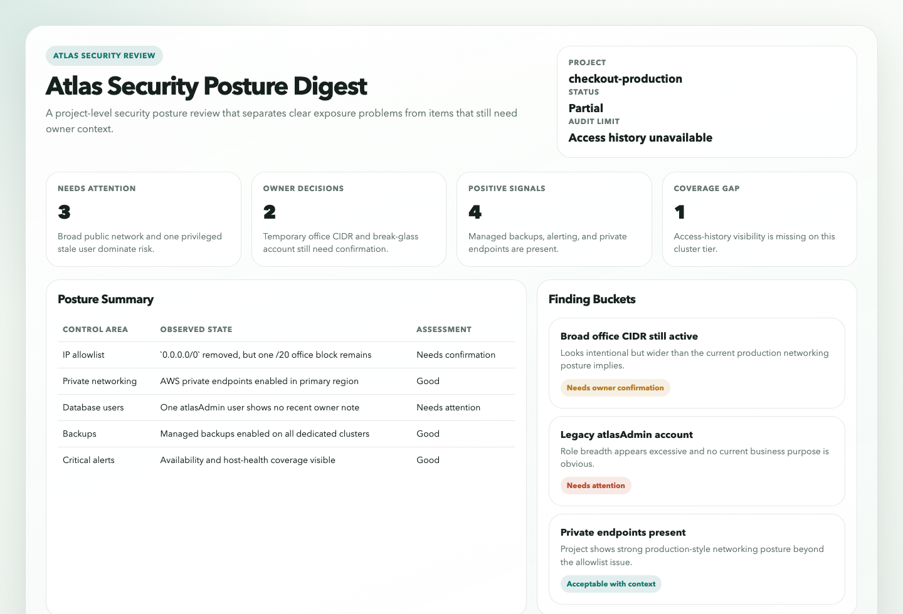
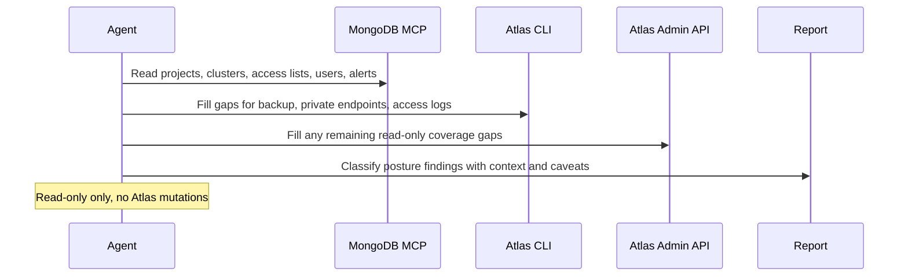

# Atlas Security Posture Digest

## Overview

`atlas-security-posture-digest` runs a read-only recurring audit of one MongoDB Atlas project and returns a compact security posture report that explains which deviations likely matter, which ones may be acceptable with context, and which ones need an explicit owner decision.

It is not a generic settings export. The point of the automation is to interpret Atlas security posture against the expectations for the scoped project, especially around network exposure, database-user hygiene, role breadth, recent access, backup policy, and critical alert coverage. When the workspace is writable, it can also persist a companion static HTML artifact for faster posture review.

## Preview



## How It Works

1. Requires only the Atlas project scope. Everything else uses built-in defaults unless the operator later adds extra context in plain language.
2. Reads Atlas security posture from the best available read-only sources, preferring MongoDB MCP Atlas tools first, then Atlas CLI, then Atlas Admin API coverage for missing surfaces.
3. Checks IP access list breadth, `0.0.0.0/0` exposure, database users and roles, recent database access history, backup policy coverage, alert coverage, and public-versus-private connectivity posture.
4. Separates findings into `Needs Attention`, `Acceptable With Context`, and `Needs Owner Confirmation`.
5. Produces one concise Markdown report with ranked findings, evidence, confidence, and explicit coverage gaps.



## When To Use It

- you want a recurring security review of Atlas configuration without changing provider state
- you need a project-level posture digest instead of manually checking Atlas screens
- you want wide access lists, public exposure, stale users, and role breadth interpreted in context
- you want backup-policy and alert-coverage gaps called out alongside access-control risks
- you need a report that distinguishes clear problems from items that require project-owner confirmation

## Prerequisites

- Read access to the target Atlas organization and project through MongoDB MCP, Atlas CLI, Atlas Admin API, or a combination of them
- Atlas project scope that can be stated explicitly in the prompt
- Enough access to read:
  - project clusters
  - IP access list entries
  - database users
  - alert configurations
  - backup compliance policy or backup-policy details
  - private endpoint or public-networking posture
  - database access history when you expect stale-access analysis beyond basic user inventory

Important Atlas constraints:

- Atlas database access history is only available for the last 7 days and is not available for free and Flex clusters.
- Atlas API access is role-scoped, and some posture surfaces may require higher project roles than simple cluster listing.
- MongoDB MCP Atlas tools cover the core Atlas inventory, but some checks in this automation may still need Atlas CLI or Atlas Admin API coverage.

## Cursor Cloud Usage

1. Open [Cursor Automations](https://cursor.com/automations/new).
2. Name your automation and paste [atlas-security-posture-digest.md](/Users/adamchmara/projects/awesome-agent-automations/automations/atlas-security-posture-digest/atlas-security-posture-digest.md) as the automation prompt.
3. Add the MongoDB MCP server with Atlas API credentials and read-only mode enabled.
4. If your MCP setup does not expose every required surface, also make the Atlas CLI available in the runtime.
5. Set the Atlas project name in the prompt before saving the automation.
6. Set the schedule or run manually, then save the automation.

References:

- [MongoDB MCP Server overview](https://www.mongodb.com/docs/mcp-server/overview/)
- [MongoDB MCP Server configuration](https://www.mongodb.com/docs/mcp-server/configuration/)
- [MongoDB MCP Server tools](https://www.mongodb.com/docs/mcp-server/tools/)

## Codex App Usage

1. Click `Automation` > `New Automation`.
2. Name your automation and paste [atlas-security-posture-digest.md](/Users/adamchmara/projects/awesome-agent-automations/automations/atlas-security-posture-digest/atlas-security-posture-digest.md) as the automation prompt.
3. Install or configure the MongoDB MCP server with Atlas API credentials in read-only mode.
4. If you need backup-policy, private-endpoint, or access-history coverage that MCP alone does not expose cleanly, make the Atlas CLI available too.
5. Set the Atlas project name in the prompt and save the automation.

References:

- [MongoDB MCP Server configuration methods](https://www.mongodb.com/docs/mcp-server/configuration/methods/)
- [Codex Automations](https://openai.com/academy/codex-automations)

## Claude Code / Codex CLI / Copilot Usage

1. Configure the MongoDB MCP server with Atlas API credentials, or make the Atlas CLI available with authenticated read access.
2. Make sure the runtime can read the Atlas organization, project, cluster, user, access-list, backup, and alert surfaces you expect.
3. For repeated checks in an open Claude Code session, use `/loop`, for example:

```text
/loop 1w Follow the instructions in automations/atlas-security-posture-digest/atlas-security-posture-digest.md
```

4. For durable Claude-managed automation, use `/schedule` or create a Routine in `claude.ai/code/routines`.

## CLI Alternative

If you prefer not to rely on MCP alone, the official Atlas CLI is a credible read-only alternative for much of this automation, with Atlas Admin API coverage available through `atlas api` where the higher-level CLI surface is incomplete.

Install and authenticate the CLI first:

```bash
brew install mongodb-atlas-cli
atlas auth login
```

Programmatic service-account authentication is also supported when you provide the Atlas CLI environment variables for client ID and client secret.

Relevant official docs:

- [What is the Atlas CLI?](https://www.mongodb.com/docs/atlas/cli/current/)
- [atlas auth login](https://www.mongodb.com/docs/atlas/cli/current/command/atlas-auth-login/)
- [Atlas Admin API reference](https://www.mongodb.com/docs/atlas/api/atlas-admin-api-ref/)
- [Atlas Admin API via Atlas CLI](https://www.mongodb.com/docs/atlas/cli/current/command/atlas-api/)

## Recommended Defaults

| Setting | Default |
| --- | --- |
| Atlas scope | `one explicit Atlas project` |
| Mutation policy | `report only` |
| Project resolution | `match one explicit Atlas project; infer organization from that project when possible` |
| Access-list review | `all project entries, with special attention to 0.0.0.0/0 and very broad CIDRs` |
| Private networking expectation | `prefer private networking for production-like projects; otherwise treat public access as context-sensitive` |
| Backup expectation | `dedicated production-like clusters should have backups enabled; stronger compliance expectations are optional` |
| Critical alert baseline | `warn when core availability and host-health coverage appears missing, but do not block if no custom baseline is supplied` |
| Stale-user threshold | `90 days without observed recent access unless stricter policy is supplied` |
| Access-history window | `last 7 days when available, otherwise inventory-only with a coverage gap` |
| Final ranked findings | `up to 10` |
| Output | `Markdown security posture report with optional static HTML artifact` |

Additional prompt behavior:

- Prefer one explicit Atlas project over broad org-wide scanning unless the operator intentionally duplicates the automation per project.
- Treat `0.0.0.0/0`, very broad CIDRs, broad admin roles, and clearly missing backups or alert coverage as high-priority checks.
- Do not treat a wide IP range, elevated role, or public access path as automatically wrong when the available evidence suggests it may be temporary or intentional.
- Use `Needs Owner Confirmation` when the risk is plausible but the project-specific business context is still missing.
- Use `Acceptable With Context` for deviations that appear intentional and bounded by the supplied baseline or other strong evidence.
- If access-history visibility is unavailable, do not invent inactivity; downgrade that portion of the audit and say so explicitly.

## Minimal Prompt

Use this by default:

```text
Atlas project: checkout-production
```

That is enough for the normal version of this automation.

## Optional Extra Context

Most users should not add anything else. If a team later wants stricter project-specific policy, they can add plain-language notes around the prompt or in the automation description instead of editing a config form.

Example:

```text
Atlas project: checkout-production
Treat any public IP allowlist entry as suspicious unless it is the approved office NAT or break-glass entry.
Only the break-glass DBA account and platform automation account should have atlasAdmin.
This production project is expected to use private networking and managed backups.
```

Examples of useful extra context:

- expected exceptions such as a break-glass admin user or a temporary office CIDR
- stricter backup expectations for production projects
- a team-specific definition of which alerts are mandatory
- a note that a project is transitional, dev-only, or intentionally public
