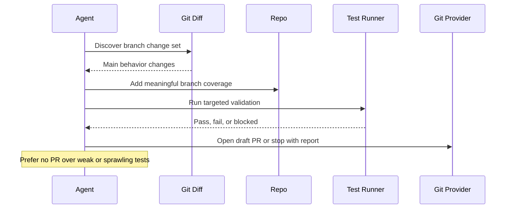

# Branch Change Test Coverage

## Overview

`branch-change-test-coverage` inspects the current branch or a recent merged change set, identifies the main behavior that should be covered by tests, adds the minimum meaningful missing coverage, validates the touched test surface, and opens a draft PR only when the result is coherent and trustworthy.

It is intentionally not a generic coverage maximizer. The automation is for making sure the important logic in a feature, fix, or other branch change is covered well enough for review, not for chasing percentage targets or generating broad low-signal tests.

## How It Works

1. Discovers a trustworthy diff from the current branch or the repository default branch.
2. Identifies the main behavior changes that should be covered by tests.
3. Updates existing nearby tests or adds small new tests only when local conventions are clear.
4. Runs the narrowest relevant validation for the touched area.
5. Opens a draft PR or stops with a clear blocked report.



## Cursor Cloud Usage

1. Open [Cursor Automations](https://cursor.com/automations/new).
2. Name your automation and paste [branch-change-test-coverage.md](/Users/adamchmara/projects/awesome-agent-automations/automations/branch-change-test-coverage/branch-change-test-coverage.md) as the automation prompt.
3. Add the `Open Pull Request` tool, or let the agent use existing PR tooling in the runtime.
4. Make sure the environment can run the repository's targeted test commands.
5. Click `Create`.

## Codex App Usage

1. Click `Automation` > `New Automation`.
2. Name your automation and paste [branch-change-test-coverage.md](/Users/adamchmara/projects/awesome-agent-automations/automations/branch-change-test-coverage/branch-change-test-coverage.md) as the automation prompt.
3. Set the schedule or run manually and save the automation.
4. Add the GitHub plugin to Codex, or let Codex use existing GitHub CLI or PR tooling in the environment.
5. Make sure the environment can run the repository's relevant targeted test commands.

## Claude Code Usage

1. No extra MCP setup is required for the core prompt.
2. Make sure the runtime has git, test commands, and PR tooling if you want automatic draft PR creation.
3. For repeated checks in an open Claude Code session, use `/loop`, for example:

```text
/loop 1d Follow the instructions in automations/branch-change-test-coverage/branch-change-test-coverage.md
```

4. For durable Claude-managed automation that survives outside the current session, use `/schedule` or create a Routine in `claude.ai/code/routines`.

Claude-native automation options:

- `/loop` for repeated runs in the current session
- `/schedule` for scheduled routines managed by Claude
- Routines in `claude.ai/code/routines` for durable cloud-hosted automation

## Recommended Defaults

| Setting | Default |
| --- | --- |
| PR scope | `one coherent branch change set` |
| Test file count | `as many as justified by one reviewable change set` |
| Branch | `test/branch-change-test-coverage-YYYY-MM-DD` |
| Commit message | `test: improve branch change coverage` |
| PR mode | `Draft` |

Additional prompt behavior:

- Prefer updating existing nearby test files over creating new ones.
- Prefer report-only output over adding speculative tests or sprawling coverage campaigns.
- Skip snapshot-heavy or environment-fragile test additions.
- Stop when the branch change is broad, conventions are unclear, or targeted validation is missing.

## Suggested Scheduling

The safest starting pattern is:

- manual runs on important merged changes
- daily or weekday schedule on the default branch
- strict draft-only PR policy

If you run it on a schedule, keep the repo instructions explicit about which validation commands matter most so the agent does not guess across the whole codebase.

## Useful Repo-Specific Inputs

Tell the runner anything it cannot reliably infer from the repo.

Validation example:

```text
For validation, prefer:
pnpm --filter api test -- src/auth/session.test.ts
pnpm --filter web test -- src/lib/permissions.test.ts
pytest tests/auth/test_session.py
pnpm --filter checkout test
```

Guardrails example:

```text
Do not edit end-to-end tests.
Do not touch snapshot files.
Skip changes that need database setup beyond existing local test helpers.
Skip changes that would require a broad cross-workspace validation campaign.
```

Priority example:

```text
Prioritize auth, billing, API validation, parsing, and permission changes.
Prefer bug-fix commits over routine refactors.
Prefer covering the main happy path plus the most meaningful edge case when both changed in the branch.
```

Notification example:

```text
If a chat connector is available, send a short message after opening the draft PR with the production area covered, the test file changed, the validation result, and the PR link.
```
