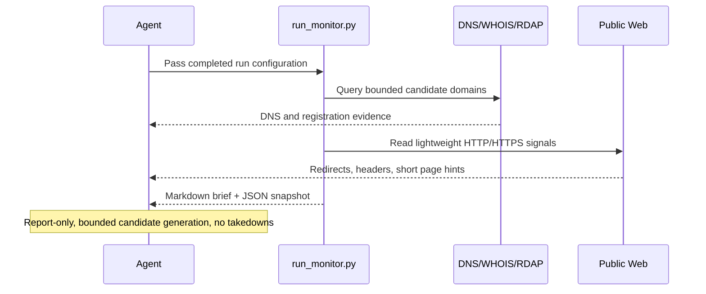

# Brand Typosquat Monitor

## Overview

`brand-typosquat-monitor` reviews one protected brand or domain family, generates a bounded set of likely typo or impersonation domains, and returns a short read-only risk brief backed by public DNS, registration, and lightweight web evidence.

It is intentionally narrow. This automation is good at portable first-pass monitoring and triage. It is not a replacement for commercial brand-protection feeds, zone-file access, or a full certificate-transparency pipeline.

This package now uses a bundled Python collector as the execution path. The script handles candidate generation, bounded parallel evidence collection, timeout control, and report artifacts. The prompt is now mostly an execution wrapper around that collector, not the crawler itself.

## Preview


Use it when you want a recurring answer to a concrete question such as "did any close typo or impersonation domains around our brand start looking active or risky?" rather than a claim of exhaustive global coverage.

## How It Works

1. Reads a required run-configuration block with the protected brand and canonical domains.
2. Runs the bundled Python collector with those inputs.
3. Derives a compact set of close typo and impersonation candidates from that brand family.
4. Checks public DNS, registration, and lightweight HTTP or HTTPS evidence for each candidate with bounded parallelism and timeouts.
5. Ranks only the candidates that look worth human review and returns a concise brief.



## When To Use It

Use it when:

- you want a daily or weekly first-pass monitor for one brand or domain family;
- you want a compact triage brief rather than a giant list of all syntactic permutations;
- you want the model to rank ambiguous evidence instead of relying on raw similarity alone.

Do not use it when:

- you need comprehensive internet-wide discovery;
- you need bulk homoglyph coverage across many scripts;
- you need automated takedown or abuse-submission workflows.

## Prerequisites

- The runtime must be able to execute `python3`.
- `dig` is required for DNS evidence.
- Public HTTPS access is required for RDAP and lightweight web checks.
- `whois` is optional secondary registration evidence.
- Public internet access is required.
- The required run-configuration block inside the prompt must be completed before the automation is saved or run.

If `whois` is unavailable, the collector still runs with RDAP-first registration evidence. If `dig` is unavailable, the collector stops with a blocked report rather than guessing.

## Cursor Cloud Usage

1. Open [Cursor Automations](https://cursor.com/automations/new).
2. Name your automation and paste [brand-typosquat-monitor.md](/Users/adamchmara/projects/awesome-agent-automations/automations/brand-typosquat-monitor/brand-typosquat-monitor.md) as the automation prompt.
3. Make sure the runtime can execute `python3` and `dig`, and can reach public HTTPS endpoints. `whois` is optional.
4. Replace the required run-configuration block inside the prompt with the protected brand and canonical domains before saving the automation.
5. Set the schedule or run manually, then save the automation.

## Codex App Usage

1. Click `Automation` > `New Automation`.
2. Name your automation and paste [brand-typosquat-monitor.md](/Users/adamchmara/projects/awesome-agent-automations/automations/brand-typosquat-monitor/brand-typosquat-monitor.md) as the automation prompt.
3. Make sure the runtime can execute `python3` and `dig`, and can reach public HTTPS endpoints. `whois` is optional.
4. Replace the required run-configuration block inside the prompt before saving the automation.
5. Set the schedule or run manually and save the automation.

## Claude Code / Codex CLI / Copilot Usage

1. Make sure the runtime can execute `python3` and `dig`, and can reach public DNS and HTTPS endpoints.
2. Replace the required run-configuration block in the prompt before using `/loop` or `/schedule`. For example:

```text
Protected brand or company name: Acme
Canonical domains or official URLs: acme.com, app.acme.com
Optional high-risk terms: login, secure, support, billing, account
```

3. The preferred direct invocation is:

```text
python3 automations/brand-typosquat-monitor/run_monitor.py \
  --workspace . \
  --brand "Novu" \
  --canonical "novu.co, app.novu.co, docs.novu.co" \
  --high-risk-terms "login, dashboard, auth, support, billing"
```

4. For repeated checks in an open Claude Code session, use `/loop`, for example:

```text
/loop 1d Follow the instructions in automations/brand-typosquat-monitor/brand-typosquat-monitor.md
```

5. For durable Claude-managed automation outside the current session, use `/schedule` or create a Routine in `claude.ai/code/routines`.

## Recommended Defaults

| Setting | Default |
| --- | --- |
| Brand scope | `one protected brand or domain family per run` |
| Input mode | `required run-configuration block with protected brand and canonical domains` |
| Collector | `python3 automations/brand-typosquat-monitor/run_monitor.py` |
| Candidate count | `up to 75 generated domains total` |
| TLD scope | `canonical TLDs plus com, net, org, io` |
| Evidence sources | `DNS first, RDAP second, WHOIS secondary when needed, lightweight HTTP or HTTPS after that` |
| Final findings | `up to 10 ranked domains` |
| Output | `Markdown risk brief with optional static HTML artifact` |
| Writes | `none` |

Additional prompt behavior:

- Prefer a compact candidate set over broad speculative generation.
- Prefer the script's deterministic candidate set over ad hoc manual shell loops.
- Prefer exact canonical-domain evidence over fuzzy name matching.
- Treat active MX, HTTPS, login-like wording, and suspicious redirects as stronger signals than raw similarity.
- Return `watchlist` instead of `high-risk` when the evidence is mixed.
- Say `no suspicious result` when nothing in the bounded candidate set is worth review.
- Stop with a blocked or partial report when the run configuration is incomplete or the core public evidence cannot be gathered reliably.

## Files And Artifacts

- Entrypoint: [run_monitor.py](/Users/adamchmara/projects/awesome-agent-automations/automations/brand-typosquat-monitor/run_monitor.py)
- Collector package: [brand_monitor](/Users/adamchmara/projects/awesome-agent-automations/automations/brand-typosquat-monitor/brand_monitor)
- Prompt wrapper: [brand-typosquat-monitor.md](/Users/adamchmara/projects/awesome-agent-automations/automations/brand-typosquat-monitor/brand-typosquat-monitor.md)
- Latest state and reports: `.automation-state/brand-typosquat-monitor/`

Each run writes:

- a Markdown brief
- a JSON snapshot with per-domain evidence
- a rolling `previous_run_state.json` for simple cross-run comparison

## Useful Workspace-Specific Inputs

Replace the required run-configuration block in the prompt with content like this before scheduling runs.

`Optional high-risk terms` means a small list of phishing-oriented modifier words the automation may combine with the brand, such as `login`, `secure`, `billing`, or `support`. Keep the list short so the candidate set stays bounded and useful.

Simple example:

```text
Protected brand or company name: Acme
Canonical domains or official URLs: acme.com
Optional high-risk terms: login, secure, support, billing, account
```

Multi-domain same-brand example:

```text
Protected brand or company name: Novu
Canonical domains or official URLs: novu.co, app.novu.co, docs.novu.co
Optional high-risk terms: login, dashboard, auth, support, billing
```

Strict scope example:

```text
Protected brand or company name: ExampleCorp
Canonical domains or official URLs: examplecorp.io
Optional high-risk terms: login, secure
```

Audience example:

```text
Write for a security operations reviewer. Keep the brief short, evidence-first, and explicit about uncertainty.
```

No-overclaim example:

```text
If DNS or registration evidence is missing, say so directly and classify borderline domains as watchlist instead of high-risk.
```

## Limitations

- This automation does not enumerate the entire global domain space.
- It is intentionally weaker on broad homoglyph discovery, non-Latin script abuse, and arbitrary word-added domains that fall outside the bounded candidate generator.
- Short brands can still produce noisy close matches even with the tighter scripted ranking.
- For high-coverage monitoring, pair it with a dedicated certificate-transparency, passive-DNS, or commercial brand-protection source, then use the model as the triage layer rather than the discovery engine.
