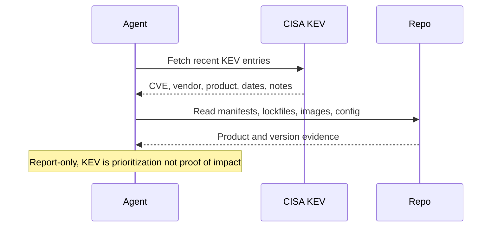

# CISA KEV Relevance Digest

## Overview

`cisa-kev-relevance-digest` reads a bounded recent slice of the official CISA Known Exploited Vulnerabilities catalog, compares it against high-signal evidence in the current repository or workspace, and returns a short read-only brief of the KEV items that look most relevant for human review.

This automation is intentionally narrower than a general security advisory monitor. It does not try to cover every advisory source, prove exploitability, or mutate dependency state. It uses KEV as a high-signal prioritization feed, then asks a simpler question: "does this repository or workspace show credible evidence that this KEV item deserves follow-up?"

Use it when you want a recurring answer to a concrete question such as "which newly added or recently updated KEV items might actually matter to this codebase?" rather than a generic vulnerability feed.

## How It Works

1. Fetches the official CISA KEV catalog.
2. Builds a bounded recent slice, defaulting to the last 7 days of added or updated entries when that is available from the source.
3. Inspects high-signal workspace evidence such as manifests, lockfiles, Dockerfiles, deployment config, and authoritative top-level docs.
4. Maps KEV entries to exact or plausible repository evidence and returns a short digest.



## When To Use It

Use it when:

- you want a daily or weekly digest of recent CISA KEV additions that may matter to the current repo or workspace;
- you want something narrower and less noisy than a full vulnerability or advisory feed;
- you want repo-based evidence such as manifests, lockfiles, images, or deployment config before escalating a KEV item.

Do not use it when:

- you need full vulnerability coverage across package, OS, container, SaaS, or vendor advisory sources;
- you need runtime host scanning, package-manager remediation, or deployed version confirmation;
- you need vendor breach, SaaS incident, or general security news monitoring;
- you need proof that a deployed environment is actually vulnerable.

## Prerequisites

- The runtime must be able to execute `curl`.
- `jq` is strongly recommended for structured KEV parsing.
- `rg` is strongly recommended for bounded repository evidence gathering.
- Public internet access is required to fetch the CISA KEV catalog.

Optional but useful:

- GitHub access, Dependabot alerts, or equivalent internal alerting surfaces for stronger package-impact evidence.
- SBOM files or lockfiles in the repository for better exact matching.

If the runtime cannot fetch a trustworthy official KEV source, the automation should stop with a blocked result rather than guessing from third-party mirrors.

## Cursor Cloud Usage

1. Open [Cursor Automations](https://cursor.com/automations/new).
2. Name your automation and paste [cisa-kev-relevance-digest.md](/Users/adamchmara/projects/awesome-agent-automations/automations/cisa-kev-relevance-digest/cisa-kev-relevance-digest.md) as the automation prompt.
3. Make sure the runtime can execute `curl`, `jq`, and `rg`.
4. Set the schedule or run manually, then save the automation.

## Codex App Usage

1. Click `Automation` > `New Automation`.
2. Name your automation and paste [cisa-kev-relevance-digest.md](/Users/adamchmara/projects/awesome-agent-automations/automations/cisa-kev-relevance-digest/cisa-kev-relevance-digest.md) as the automation prompt.
3. Make sure the runtime can execute `curl`, `jq`, and `rg`.
4. Set the schedule or run manually and save the automation.

## Claude Code / Codex CLI / Copilot Usage

1. Make sure the runtime can execute `curl`, `jq`, and `rg`, and can reach the official CISA KEV catalog.
2. Start the agent in the repository or workspace you want reviewed.
3. For repeated checks in an open Claude Code session, use `/loop`, for example:

```text
/loop 1d Follow the instructions in automations/cisa-kev-relevance-digest/cisa-kev-relevance-digest.md
```

4. For durable Claude-managed automation outside the current session, use `/schedule` or create a Routine in `claude.ai/code/routines`.

## Recommended Defaults

| Setting | Default |
| --- | --- |
| Scope | `current repository or workspace only` |
| KEV window | `last 7 days of added or updated entries when available` |
| Evidence sources | `manifests, lockfiles, images, deployment config, top-level docs` |
| Final matches | `up to 10` |
| Classification | `repo-evidence match`, `possible workspace match`, `no clear workspace match` |
| Output | `Markdown digest` |
| Writes | `none` |

Additional prompt behavior:

- Prefer exact manifest or image evidence over fuzzy name matches.
- Treat KEV as a prioritization layer, not as proof of local impact.
- Keep the first-pass repo review bounded and high-signal.
- Return `possible workspace match` when the product evidence is real but the version or deployment state is unclear.
- Say `no recent KEV entries with a defensible workspace match` when nothing clears the threshold.
- Stop with a blocked or partial report when the official KEV source or the workspace evidence is too weak to support a trustworthy result.

## Useful Repo-Specific Inputs

Tell the runner anything it cannot reliably infer from the repo.

Deployment scope example:

```text
Treat only production deployment manifests and top-level application lockfiles as in scope.
Ignore demo apps, playgrounds, examples, and archived packages.
```

Infrastructure example:

```text
Prioritize Docker base images, Helm charts, Terraform, and reverse-proxy or ingress configuration because that is where externally exposed products are declared.
```

Monorepo example:

```text
Focus on services under apps/api, services/, and deploy/.
Ignore packages used only for local development tooling unless a KEV item clearly targets build or CI infrastructure.
```

Alert-enrichment example:

```text
If GitHub or Dependabot alerts are available, use them to strengthen or weaken candidate matches, but do not require them for the report.
```

Audience example:

```text
Write for security and platform reviewers. Keep the brief short, evidence-first, and explicit about uncertainty.
```

## Limitations

- This automation is not a substitute for a full advisory monitor across OSV, NVD, GitHub, vendor advisories, and internal runtime inventory.
- It is intentionally weaker when the repo lacks lockfiles, SBOMs, clear deployment manifests, or trustworthy version evidence.
- KEV tells you that exploitation is known in the wild. It does not tell you that this repository is affected, deployed, or reachable.
- For stronger impact confirmation, pair this automation with structured dependency alerts, SBOM analysis, or runtime asset inventory.
