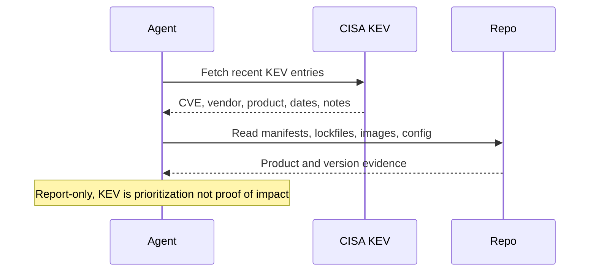

# CISA KEV Relevance Digest

## Overview

`cisa-kev-relevance-digest` reads a bounded recent slice of the official CISA Known Exploited Vulnerabilities catalog, compares it against high-signal evidence in the current repository or workspace, and returns a short read-only brief of the KEV items that look most relevant for human review.

This automation is narrower than a general security advisory monitor. It does not try to cover every advisory source, prove exploitability, or mutate dependency state. Use it when you want a recurring answer to "which newly added or recently updated KEV items might actually matter to this codebase?" rather than a generic vulnerability feed.

## How It Works

1. Fetches the official CISA KEV catalog.
2. Builds a bounded recent slice, defaulting to the last 7 days of added or updated entries when that is available from the source.
3. Inspects high-signal workspace evidence such as manifests, lockfiles, Dockerfiles, deployment config, and authoritative top-level docs.
4. Maps KEV entries to exact or plausible repository evidence and returns a short digest.



## When To Use It

- you want a daily or weekly digest of recent KEV additions that may matter to the current repo or workspace
- you want something narrower and less noisy than a full advisory feed
- you want repo-based evidence before escalating a KEV item

Do not use it for full vulnerability coverage, runtime host scanning, remediation, or proof that a deployed environment is vulnerable.

## Prerequisites

- `curl`
- `jq` for structured KEV parsing
- `rg` for bounded repository evidence gathering
- Public internet access to fetch the CISA KEV catalog
- Optional GitHub alerts, Dependabot, SBOMs, or lockfiles for stronger evidence

If the runtime cannot fetch a trustworthy official KEV source, the automation should stop instead of guessing from third-party mirrors.

## Cursor Cloud Usage

1. Open [Cursor Automations](https://cursor.com/automations/new).
2. Name your automation and paste [cisa-kev-relevance-digest.md](/Users/adamchmara/projects/ai-agent-automations/automations/cisa-kev-relevance-digest/cisa-kev-relevance-digest.md) as the automation prompt.
3. Make sure the runtime can execute `curl`, `jq`, and `rg`.
4. Set the schedule or run manually, then save the automation.

## Codex App Usage

1. Click `Automation` > `New Automation`.
2. Name your automation and paste [cisa-kev-relevance-digest.md](/Users/adamchmara/projects/ai-agent-automations/automations/cisa-kev-relevance-digest/cisa-kev-relevance-digest.md) as the automation prompt.
3. Make sure the runtime can execute `curl`, `jq`, and `rg`.
4. Set the schedule or run manually and save the automation.

## Claude Code / Codex CLI / Copilot Usage

1. Make sure the runtime can execute `curl`, `jq`, and `rg`, and can reach the official CISA KEV catalog.
2. Start the agent in the repository or workspace you want reviewed.
3. For repeated checks in an open Claude Code session, use `/loop`, for example:

```text
/loop 1d Follow the instructions in automations/cisa-kev-relevance-digest/cisa-kev-relevance-digest.md
```

4. For durable Claude-managed automation outside the current session, use `/schedule` or create a Routine in `claude.ai/code/routines`.

## Recommended Defaults

| Setting | Default |
| --- | --- |
| Scope | `current repository or workspace only` |
| KEV window | `last 7 days of added or updated entries when available` |
| Evidence sources | `manifests, lockfiles, images, deployment config, top-level docs` |
| Final matches | `up to 10` |
| Classification | `repo-evidence match`, `possible workspace match`, `no clear workspace match` |
| Output | `Markdown digest` |
| Writes | `none` |

Keep the run conservative: prefer exact manifest or image evidence over fuzzy matches, treat KEV as a prioritization layer rather than proof of impact, and say clearly when the workspace evidence is too weak for a confident match.

## Prompt Inputs

Add context only when scope is not obvious from the repo, for example:

```text
Treat only production deployment manifests and top-level application lockfiles as in scope.
Ignore demo apps, playgrounds, examples, and archived packages.
Prioritize Docker base images, Helm charts, Terraform, and ingress configuration.
Focus on services under apps/api, services/, and deploy/.
```

## Docs

- [CISA KEV Catalog](https://www.cisa.gov/known-exploited-vulnerabilities-catalog)
- [Codex Automations](https://openai.com/academy/codex-automations)
