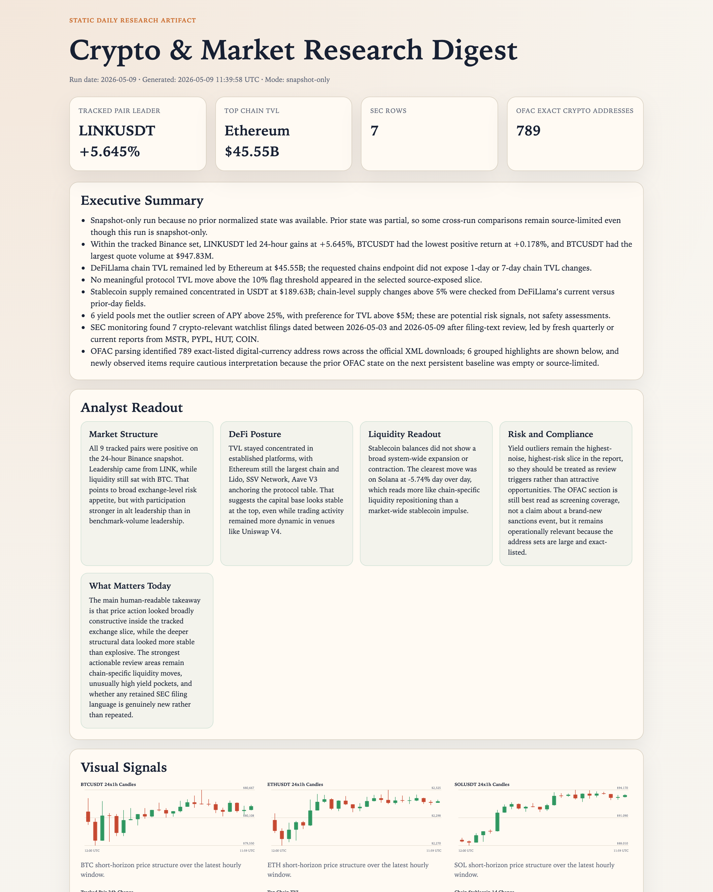

# Crypto Market Research Digest

## Overview

`crypto-market-research-digest` turns public crypto market, DeFi, SEC, and OFAC data into one daily research digest.

It fetches a fixed market slice, checks a bounded SEC watchlist, screens OFAC XML for crypto-relevant address entries, and returns a report-only output with an HTML companion artifact for easier review.

Use it when you want one recurring market-structure and compliance-oriented snapshot without turning the run into trading advice or a loose web-search summary.

## Preview



## How It Works

1. Resolve the current UTC run date and load prior normalized state when available.
2. Fetch public Binance, DeFiLlama, SEC, and OFAC data from the automation's default source set.
3. Normalize the data into a compact working snapshot and compare it against prior state when persistent state exists.
4. Build a report with market pulse, DeFi structure, liquidity moves, yield outliers, SEC watchlist filings, and OFAC screening signals.
5. Return one Markdown digest and write one HTML artifact for human review.

## Prerequisites

- A runtime that can execute `python3`

The automation can still run in snapshot-only mode when persistent state is unavailable.

## Cursor Cloud Usage

1. Open [Cursor Automations](https://cursor.com/automations/new).
2. Name your automation and paste [crypto-market-research-digest.md](./crypto-market-research-digest.md) as the automation prompt.
3. Make sure the runtime can execute:

```bash
python3 automations/crypto-market-research-digest/run_digest.py --workspace .
```

4. Set the schedule or run manually, then save the automation.

## Codex App Usage

1. Click `Automation` > `New Automation`.
2. Name your automation and paste [crypto-market-research-digest.md](./crypto-market-research-digest.md) as the automation prompt.
3. Make sure the workspace contains this repo and the runtime can execute:

```bash
python3 automations/crypto-market-research-digest/run_digest.py --workspace .
```

4. Set schedule or run manually and save the automation.

## Claude Code / Codex CLI Usage

1. Run from the repo root with:

```bash
python3 automations/crypto-market-research-digest/run_digest.py --workspace .
```

2. For repeated checks in an open Claude Code session, use `/loop`, for example:

```text
/loop weekdays at 8am Follow the instructions in automations/crypto-market-research-digest/crypto-market-research-digest.md
```

3. For durable Claude-managed automation outside the current session, use `/schedule` or create a Routine in `claude.ai/code/routines`.

## Recommended Defaults

| Setting | Default |
| --- | --- |
| Run date | `current UTC date` |
| Market slice | `Binance 24h snapshot for BTC, ETH, SOL, BNB, XRP, DOGE, ADA, AVAX, LINK` |
| SEC lookback | `last 7 calendar days` |
| SEC watchlist | `COIN, MSTR, MARA, RIOT, XYZ, PYPL, HOOD, CLSK, HUT, BTBT, CAN, IREN, WULF, BITF` |
| Yield outlier threshold | `APY above 25%` |
| Preferred yield TVL floor | `at least $5M` |
| Delivery | `Markdown digest + static HTML artifact` |
| Mode without state | `snapshot-only` |

Additional prompt behavior:

- Treat Binance data as exchange-level market activity, not total market-wide activity.
- Prefer direct public endpoints over search-driven summaries.
- Mark unavailable source fields as unavailable instead of inferring them.
- Treat SEC and OFAC sections as review-oriented monitoring, not legal or investment conclusions.

## Useful Inputs

Tell the runner anything that should override the default daily slice.

Schedule example:

```text
Keep the default source set and run it every weekday, but write the digest for the current UTC date only.
```

Coverage example:

```text
Keep the default digest structure, but expand the Binance tracked pair set to include TONUSDT and SUIUSDT.
```

Risk-filter example:

```text
Keep the default sources, but raise the yield outlier threshold to 40% APY and ignore pools below $10M TVL.
```

Audience example:

```text
Write the analyst readout for operators and compliance reviewers. Keep it factual, terse, and free of trading language.
```
