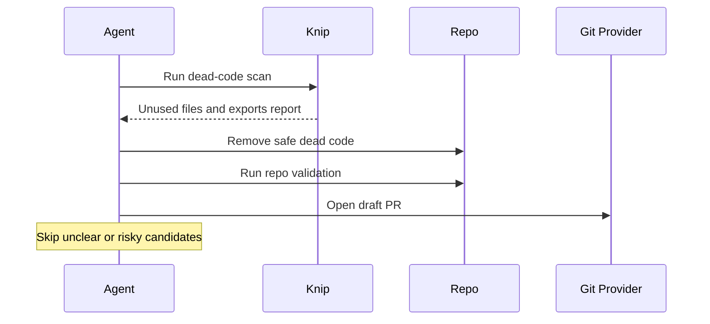

# Dead Code Sweep

## Overview

`dead-code-sweep` runs `knip`, reviews the report conservatively, removes a defined number of safe candidates, validates the affected surfaces, and prepares a draft PR or review summary.

Use it for small, repeatable cleanup passes rather than large one-shot refactors.

## How It Works

1. Runs `knip` and reads both the report and diagnostics output.
2. Picks a number of obviously safe dead-code candidates.
3. Removes safe unused files or exports conservatively.
4. Runs validation for the affected surfaces and opens a draft PR or prepares PR-ready output.




## Prerequisites

- Node.js `20.19.0+` or Bun, per Knip v6 requirements
- `knip` is available in the repo or runner environment
- GitHub or equivalent PR tooling if you want automatic PR creation

## Knip Setup

Preferred setup for reusable automation runs:

1. Add Knip to the repo as a dev dependency and keep it in `devDependencies`.
2. Add a `knip` script to `package.json`.
3. Commit the generated Knip config if your repo needs one.

Recommended setup from Knip:

```bash
pnpm create @knip/config
```

Manual setup:

```bash
pnpm add -D knip typescript @types/node
```

Then add a script such as:

```json
{
  "scripts": {
    "knip": "knip"
  }
}
```

Runner-only fallback when you do not want to modify the repo:

```bash
pnpm dlx knip
```

For ephemeral runners, this is usually better than a global install. Per Knip docs, `typescript` and `@types/node` are still expected to be present in that environment.

## Cursor Cloud Usage

1. Open [Cursor Automations](https://cursor.com/automations/new).
2. Name your automation and paste [dead-code-sweep.md](/Users/adamchmara/projects/awesome-agent-automations/automations/dead-code-sweep/dead-code-sweep.md) as the automation prompt.
3. Add trigger conditions.
4. Add the `Open Pull Request` tool, or let the agent use an existing GitHub CLI or plugin in the environment.
5. Make sure the runtime can execute `pnpm knip` or your chosen Knip fallback and the validation commands you expect.
6. Click `Create`.

References:

- [Cursor Automations](https://cursor.com/blog/automations)

## Codex App Usage

1. Click `Automation` > `New Automation`.
2. Name your automation and paste [dead-code-sweep.md](/Users/adamchmara/projects/awesome-agent-automations/automations/dead-code-sweep/dead-code-sweep.md) as the automation prompt.
3. Set schedule or run manually and save the automation.
4. Add the GitHub plugin to Codex, or let Codex use an existing GitHub CLI/tool in the agent environment.
5. Make sure the environment can run `pnpm knip` or your chosen Knip fallback and the validation commands relevant to your repo.

References:

- [Codex Automations](https://openai.com/academy/codex-automations)

## Claude Code Usage

1. No extra MCP setup is required for this automation.
2. Make sure the runtime can execute a Knip command and the validation commands you expect. Preferred: repo-local `knip` script. Fallback: `pnpm dlx knip` in ephemeral runners.
3. For repeated checks in an open Claude Code session, use `/loop`, for example:

```text
/loop 1d Follow the instructions in automations/dead-code-sweep/dead-code-sweep.md
```

4. For durable Claude-managed automation that survives outside the current session, use `/schedule` or create a Routine in `claude.ai/code/routines`.

Claude-native automation options:

- `/loop` for repeated runs in the current session
- `/schedule` for scheduled routines managed by Claude
- Routines in `claude.ai/code/routines` for durable cloud-hosted automation

References:

- [Claude Code MCP](https://code.claude.com/docs/en/mcp)
- [Claude Code CLI Reference](https://code.claude.com/docs/en/cli-usage)
- [Run prompts on a schedule](https://code.claude.com/docs/en/scheduled-tasks)
- [Automate work with routines](https://code.claude.com/docs/en/web-scheduled-tasks)

## Recommended Defaults

This automation assumes:

- repo-local scan command: `pnpm knip --reporter markdown > .artifacts/dead-code.md 2> .artifacts/dead-code.stderr`
- runner fallback scan command: `pnpm dlx knip --reporter markdown > .artifacts/dead-code.md 2> .artifacts/dead-code.stderr`
- report path: `.artifacts/dead-code.md`
- diagnostics path: `.artifacts/dead-code.stderr`


| Setting                   | Default                                     |
| ------------------------- | ------------------------------------------- |
| Max candidates per run    | `3`                                         |
| Max files changed per run | `10`                                        |
| Branch                    | `chore/dead-code-sweep-YYYY-MM-DD`          |
| Commit message            | `chore(code-health): remove safe dead code` |
| PR mode                   | `Draft`                                     |


Additional prompt behavior:

- If repo guardrails are unclear, skip the candidate
- If validation commands are not obvious, report what was not run and keep the PR draft

## Knip Docs And Useful Settings

If Knip output is noisy or inaccurate for your repo, these are the first official docs to read:

- [Getting Started](https://knip.dev/overview/getting-started)
- [Configuration](https://knip.dev/overview/configuration)
- [Configuring Project Files](https://knip.dev/guides/configuring-project-files)
- [Monorepos & Workspaces](https://knip.dev/features/monorepos-and-workspaces)

Useful defaults and settings from the Knip docs:

- Start with Knip defaults first. Knip aims for near zero-config and only targeted overrides should be added.
- On large repos, try `pnpm knip --max-show-issues 5` first to keep the report reviewable.
- Tune `entry` and `project` before reaching for `ignore`. The docs explicitly recommend using `project` patterns and negations to define analysis boundaries.
- Avoid adding too many `entry` files. More entry files reduce unused-export reporting.
- In workspaces, Knip handles workspaces out of the box. If you add per-workspace config, use the workspace named `"."` for the root workspace.
- Consider production mode if you want Knip to focus on production-relevant files and dependencies.

## Useful Repo-Specific Inputs

Tell the runner anything it cannot reliably infer from the repo.

You can still provide repo-specific guidance around the prompt when needed, for example:

Guardrails example:

```text
Skip anything under enterprise/.
Do not remove *.module.ts, main.ts, package.json, tsconfig*, or *.config.*.
Before removing framework-managed files, check how they are registered.
```

Validation example:

```text
For validation, run:
pnpm --filter api exec tsc --noEmit
pnpm --filter web exec tsc --noEmit
```

Monorepo example:

```text
Keep changes inside the package where the unused file or export lives unless adjacent shared tests or fixtures are clearly dead-code-specific.
```

Notification example:

```text
If a chat connector is available, send a short message after opening the draft PR with the PR link, what was removed, and the validation result.
```
