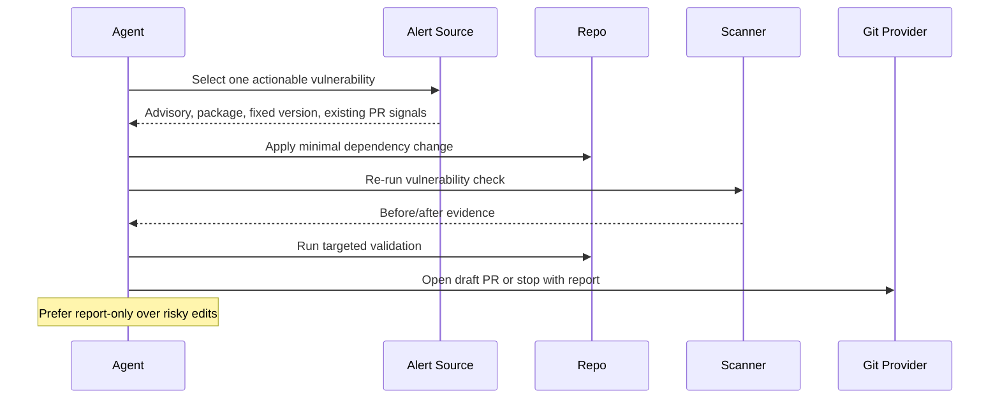

# Dependency Vulnerability Autofix

## Overview

`dependency-vulnerability-autofix` fixes at most one verified dependency vulnerability per run and opens a draft PR only when the remediation path is narrow, validated, and reviewable.

It is a global orchestrator, not a blind multi-ecosystem updater. It prefers existing provider-managed security PRs when they already exist, uses native preview or dry-run remediation flows where they are trustworthy, and falls back to report-only mode when safe autofix is not available.

## How It Works

1. Finds one high-confidence fixable vulnerability from alerts, existing security PRs, or native scanner output.
2. Prefers the lowest fixed version and avoids competing PRs.
3. Applies the smallest safe dependency change.
4. Re-runs the relevant scanner and local validation.
5. Opens a draft PR or prepares a blocked report when the fix path is not safe enough.



## When To Use It

Use it for one-at-a-time dependency vulnerability remediation with draft PRs.

## Prerequisites

- GitHub or equivalent PR tooling if you want automatic draft PR creation
- package-manager access and credentials for the ecosystems in scope

## Supported Fix Modes

First-class native autofix flows:

- `npm`
  - `npm audit --json`
  - `npm audit fix --dry-run --json`
  - `npm audit fix --package-lock-only` when appropriate
- `pip`
  - `pip-audit`
  - `pip-audit --fix --dry-run`
  - `pip-audit --fix`

Supported as advisory or PR-source signals:

- provider vulnerability alerts and security PRs
- OSV-Scanner or similar scanners for verification or report-only fallback

## Cursor Cloud Usage

1. Open [Cursor Automations](https://cursor.com/automations/new).
2. Name your automation and paste [dependency-vulnerability-autofix.md](/Users/adamchmara/projects/awesome-agent-automations/automations/dependency-vulnerability-autofix/dependency-vulnerability-autofix.md) as the automation prompt.
3. Add the `Open Pull Request` tool, or let the agent use an existing GitHub CLI or plugin in the environment.
4. Click `Create`.

## Codex App Usage

1. Click `Automation` > `New Automation`.
2. Name your automation and paste [dependency-vulnerability-autofix.md](/Users/adamchmara/projects/awesome-agent-automations/automations/dependency-vulnerability-autofix/dependency-vulnerability-autofix.md) as the automation prompt.
3. Set the schedule or run manually and save the automation.
4. Add the GitHub plugin to Codex, or let Codex use an existing GitHub CLI or tool in the environment.

## Claude Code Usage

1. No extra MCP setup is required for the core prompt.
2. Make sure the runtime has git and pull-request tooling, plus access to the package-manager and scanner commands you expect. If the automation should read provider alerts or open PRs automatically, provide GitHub CLI, GitHub MCP, or an equivalent integration.
3. For repeated checks in an open Claude Code session, use `/loop`, for example:

```text
/loop 1d Follow the instructions in automations/dependency-vulnerability-autofix/dependency-vulnerability-autofix.md
```

4. For durable Claude-managed automation that survives outside the current session, use `/schedule` or create a Routine in `claude.ai/code/routines`.

Claude-native automation options:

- `/loop` for repeated runs in the current session
- `/schedule` for scheduled routines managed by Claude
- Routines in `claude.ai/code/routines` for durable cloud-hosted automation

## Recommended Defaults

| Setting | Default |
| --- | --- |
| Vulnerabilities per run | `1` |
| Severity threshold | `high` and `critical` |
| Existing security PR policy | `prefer and do not compete` |
| Major update policy | `skip by default` |
| Branch | `fix/dependency-vulnerability-autofix-YYYY-MM-DD` |
| Commit message | `fix(deps): remediate vulnerable dependency` |
| PR mode | `Draft` |

Additional prompt behavior:

- If the ecosystem is unsupported for safe autofix, stop in report-only mode.
- If a scanner confirms the issue but no validation path is obvious, prefer a blocked report to a weak PR.
- If the diff is broad or unrelated, revert only this run's attempted change and stop.
- Do not use `--force` or other force-major remediation flows unless you intentionally configure the automation to allow major upgrades.

## Useful Repo-Specific Inputs

Tell the runner anything it cannot reliably infer from the repo.

Validation example:

```text
Run the relevant package or workspace commands for the changed surface, for example:
npm test
npm run build
pytest
pnpm --filter <package> test
pnpm --filter <package> typecheck
```

Guardrails example:

```text
Do not touch generated files, vendored dependencies, infrastructure, or deployment manifests.
Do not use override-based fixes unless the repo already uses overrides for security remediation.
Skip fixes that require changes in more than one workspace unless the update is already contained to one lockfile refresh.
```

Monorepo example:

```text
Keep changes inside the affected package or workspace unless the lockfile update is unavoidably shared.
If the parent package choice is ambiguous, stop and report the competing fix paths instead of guessing.
```

Notification example:

```text
If a chat connector is available, send a short message after opening the draft PR with the advisory, package, validation result, and PR link.
```
