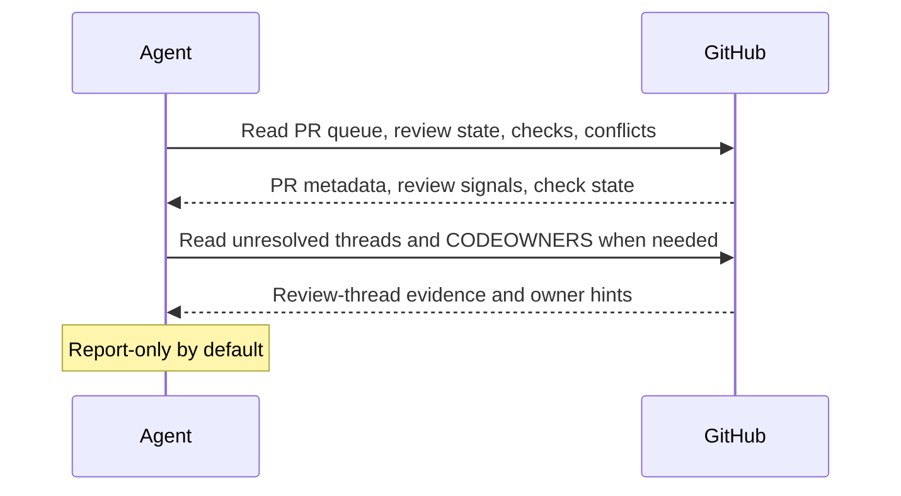

# GitHub PR Review Router

## Overview

`github-pr-review-router` reads the open pull request queue for a repository, classifies each PR by its real blocking state, and turns that into a concise review-routing report.

Use it when you want a reliable answer to "what needs attention in our PR queue?" without merging, reviewing, relabeling, or otherwise mutating GitHub state.

## Preview


## How It Works

1. Reads a bounded set of open pull requests from the current repository or the explicitly provided repository scope.
2. Expands each PR with review state, unresolved review-thread status when available, checks, conflicts, labels, reviewers, and recent activity.
3. Adds a short plain-language summary of what each PR is about so the queue is understandable without opening every link.
4. Classifies each PR into a small set of actionable states such as `needs author response`, `needs reviewer`, `blocked by CI`, or `ready for maintainer`.
5. Produces a compact routing report with one active-queue view, short PR summaries, and the next best owner/action for each PR.
6. Falls back to preview output when delivery or GitHub read coverage is incomplete.




## When To Use It

Use it when:

- maintainers need a daily or weekly PR queue sweep
- teams want a review-routing digest before a review block
- you want to separate "needs author", "needs reviewer", and "blocked by CI" instead of treating every open PR the same
- you want a glanceable report with short PR summaries instead of a dense raw status dump

## Prerequisites

- GitHub read access for pull requests, issues, reviews, and checks
- Github MCP or `gh` CLI for Github access

## Cursor Cloud Usage

1. Open [Cursor Automations](https://cursor.com/automations/new).
2. Name your automation and paste [github-pr-review-router.md](/Users/adamchmara/projects/awesome-agent-automations/automations/github-pr-review-router/github-pr-review-router.md) as the automation prompt.
3. Add GitHub access through the official GitHub MCP server, a GitHub connector, `gh` CLI or an equivalent GitHub integration with read access for pull requests, reviews, issues, and checks.
4. Set a schedule or run manually, then click `Create`.

## Codex App Usage

1. Add the GitHub plugin to Codex, `gh` CLI or connect a GitHub MCP server with read access for pull requests, reviews, checks, and repository search.
2. Click `Automation` > `New Automation`.
3. Name your automation and paste [github-pr-review-router.md](/Users/adamchmara/projects/awesome-agent-automations/automations/github-pr-review-router/github-pr-review-router.md) as the automation prompt.
4. Set the schedule or run manually and save the automation.

## Claude Code Usage

1. Add a GitHub MCP server in Claude Code and authenticate it, or make `gh` available in the runtime as the main GitHub interface.
2. For repeated checks in an open Claude Code session, use `/loop`, for example:

```text
/loop weekdays at 9am Follow the instructions in automations/github-pr-review-router/github-pr-review-router.md
```

1. For durable Claude-managed automation that survives outside the current session, use `/schedule` or create a Routine in `claude.ai/code/routines`.

Claude-native automation options:

- `/loop` for repeated runs in the current session
- `/schedule` for scheduled routines managed by Claude
- Routines in `claude.ai/code/routines` for durable cloud-hosted automation

## Recommended Defaults


| Setting           | Default                      |
| ----------------- | ---------------------------- |
| Repository scope  | `current repository`         |
| PR scope          | `open pull requests`         |
| First-pass PR cap | `30`                         |
| Stale threshold   | `3 days`                     |
| Delivery          | `markdown report or preview` |
| Writes            | `none`                       |


Additional prompt behavior:

- Keep the automation report-only unless you intentionally adapt it for labels or comments.
- If unresolved review threads cannot be read, report that gap instead of inferring "ready for review".
- If the repository has an obvious CODEOWNERS file or contribution guide, use it to improve owner suggestions.
- If the queue is larger than the first-pass cap, prioritize PRs with recent activity, explicit review requests, failing checks, or merge conflicts.
- Prefer a short `About` summary and a concise `Next action` over long evidence-heavy rows.
- Avoid repeating the same active PRs in multiple sections unless a grouped breakdown is explicitly needed.

## Useful Repo-Specific Inputs

Tell the runner anything it cannot reliably infer from GitHub alone.

Review policy example:

```text
Treat "changes requested" as needs author response until every requested change thread is resolved or explicitly superseded.
Do not route bot-authored dependency PRs into the main reviewer queue unless they are failing or have been open longer than 3 days.
```

Ownership example:

```text
Use CODEOWNERS first for reviewer hints. If CODEOWNERS is too broad, prefer the most recent human reviewer on adjacent PRs for the same area.
```

Queue priority example:

```text
Prioritize PRs that block a release branch, have failing required checks on default-branch-targeting work, or have been waiting on reviewer action for more than 2 business days.
```

Delivery example:

```text
Render the report as Markdown in the automation output. If a trusted chat connector exists, send only a short summary with counts and link back to the full report.
```
