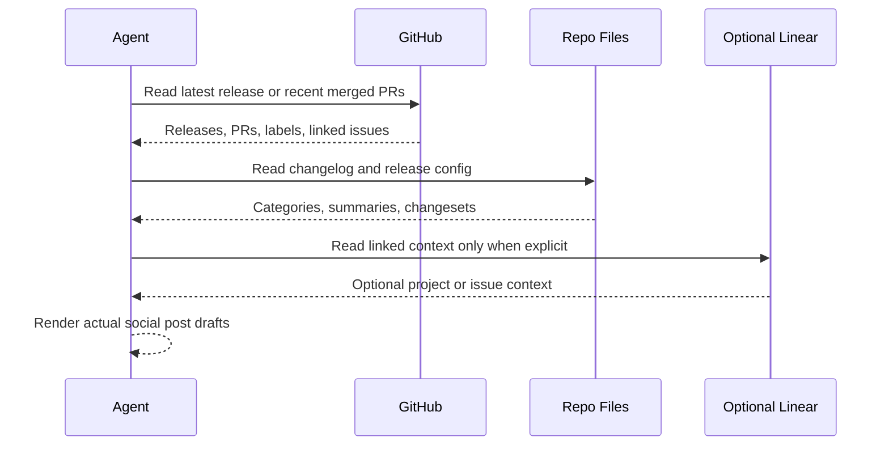

# GitHub Product Post Drafts

## Overview

`github-product-post-drafts` turns recent shipped GitHub work into actual social post drafts for X, LinkedIn, and similar channels.

Use it when you want something a founder, product lead, or marketer can actually post with light edits. It keeps the output draft-only, but the main deliverable is post copy built around a real product story, not a repo digest.

## How It Works

1. Uses the current repository.
2. Prefers the latest published release up to `HEAD`, then falls back to recent merged PRs.
3. Reads the strongest reviewed text it can find: release notes, PR descriptions, labels, linked issues, changesets, and changelog fragments.
4. Filters out maintenance noise unless the reviewed source text explicitly says the change is user-visible.
5. Finds the real arc behind the work, such as one feature push, one friction fix, or one broader workflow improvement, and turns that into post drafts with a small evidence map underneath.
6. Produces multiple tonal variants, including one bolder wild-card version, so the output is not trapped in safe B2B voice.



## When To Use It

Use it when:

- you want a weekly or daily product-facing summary grounded in shipped GitHub work;
- your team merges enough work that raw PR lists are too noisy to turn directly into good posts;
- you need inspiration for posts from shipped work, not just a dry changelog;
- you want the automation to find the bigger story or epic behind the work instead of listing technical fixes;
- you want original post drafts grounded in real shipped work without autoposting anything publicly.
- you want one strong angle with a few style variants, not five watered-down summaries.
- you want at least one post draft that pushes beyond safe corporate tone while still staying true to what shipped.

## Cursor Cloud Usage

1. Open [Cursor Automations](https://cursor.com/automations/new).
2. Name your automation and paste [github-product-post-drafts.md](/Users/adamchmara/projects/awesome-agent-automations/automations/github-product-post-drafts/github-product-post-drafts.md) as the automation prompt.
3. Add GitHub access through the built-in GitHub integration, a GitHub MCP server, or authenticated `gh` in the runtime.
4. Optional: add Linear access only if your PRs or issues already link cleanly to Linear and you want extra project context.
5. Set the schedule or run manually and save the automation.

## Codex App Usage

1. Make sure the runtime has GitHub access through the GitHub app, GitHub MCP, or authenticated `gh`.
2. Click `Automation` > `New Automation`.
3. Name your automation and paste [github-product-post-drafts.md](/Users/adamchmara/projects/awesome-agent-automations/automations/github-product-post-drafts/github-product-post-drafts.md) as the automation prompt.
4. Optional: add Linear if you want linked issue or project enrichment.
5. Set the schedule or run manually and save the automation.

## Claude Code Usage

1. Make sure the runtime has GitHub access through a GitHub connector, GitHub MCP, or authenticated `gh`.
2. Optional: add Linear access if you want linked context and already use explicit GitHub-to-Linear links.
3. For repeated checks in an open Claude Code session, use `/loop`, for example:

```text
/loop fridays at 9am Follow the instructions in automations/github-product-post-drafts/github-product-post-drafts.md
```

4. For durable Claude-managed automation that survives outside the current session, use `/schedule` or create a Routine in `claude.ai/code/routines`.

## Recommended Defaults

| Setting | Default |
| --- | --- |
| Cadence | `weekly` |
| Repository scope | `one repository per run` |
| Time range | `latest recent release..HEAD`, otherwise `last 7 days of merged PRs` |
| First pass | `up to 30 merged PRs or compared commits` |
| Stories turned into posts | `1 main story, optional 1 backup story` |
| Output | `social post drafts with style variants` |
| External posting | `none` |
| Linear enrichment | `linked-only and optional` |

Additional prompt behavior:

- Keep the story count small enough that each draft can be genuinely good.
- Prefer reviewed PR or release text over raw commit subjects.
- Treat weakly supported value claims as `Needs Review`, not as finished post copy.
- Make the posts feel written by a person with taste, not by a generic product-news generator.
- Build posts around the feature arc or user pain first, then use technical details only as proof or color.
- Prefer a strong story plus variants over a pile of channel-by-channel rewrites.
- Make one variant bold enough to feel surprising or slightly unhinged, but keep it anchored in the shipped truth.

## Useful Repo-Specific Inputs

Tell the runner anything it cannot reliably infer from GitHub alone.

Scope example:

```text
Run every Friday morning for the current repository and produce social post drafts we can actually use.
```

Label policy example:

```text
Treat labels customer-facing, launch, integration, and performance as high-signal. Treat chore, ci, refactor, and dependencies as noise unless the PR body says otherwise.
```

Feature-flag policy example:

```text
Do not turn feature-flagged work into post drafts unless the PR description explicitly says it was enabled for users.
```

Linear example:

```text
Use linked Linear issues only to sharpen the framing. GitHub is still the source of truth for what shipped.
```
