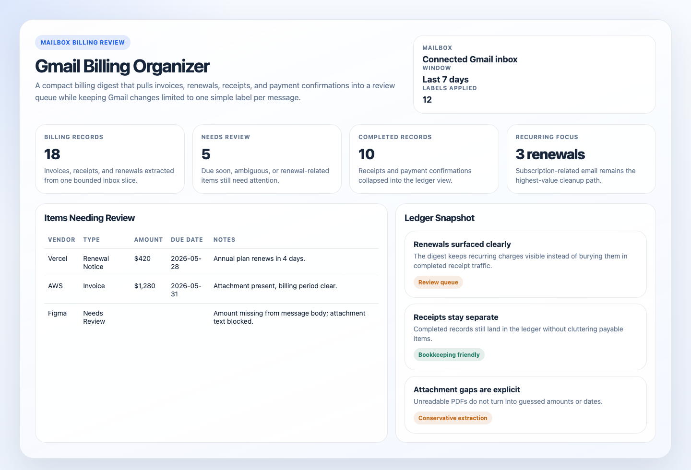
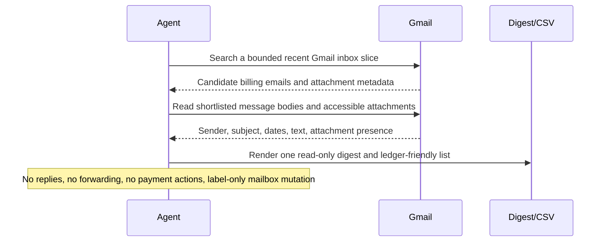

# Gmail Billing Organizer

## Overview

`gmail-billing-organizer` scans the connected Gmail account by default for invoices, receipts, renewal notices, and payment confirmations, then turns the matches into one clean billing digest plus a ledger-friendly list while also applying simple Gmail labels to confident matches.

Use it when you want your billing email easier to review in Gmail without forwarding messages, renaming files, or introducing heavy mailbox automation. It is aimed at regular users first: personal subscriptions, app-store charges, online purchases, renewal notices, and lightweight expense tracking. The default behavior is digest-first, with narrow Gmail label writes only for confident classifications. When the workspace is writable, it can also persist a companion static HTML artifact alongside the Markdown and CSV outputs.

## Preview



## How It Works

1. Starts from safe Gmail defaults: recent inbound inbox mail, the last 7 days, a bounded candidate cap, and a narrow write surface limited to Gmail labels.
2. Shortlists likely billing messages from subject lines, sender patterns, attachment presence, and billing language.
3. Reads only the bounded candidate set and classifies each item as an invoice, receipt, renewal notice, payment confirmation, or non-match.
4. Extracts the fields that matter for everyday review and optional export: vendor, amount, currency, due date, billing period, message date, document type, invoice or receipt reference when visible, and whether an attachment is present.
5. Deduplicates repeated reminders, thread noise, and duplicate copies of the same bill when the evidence is strong enough.
6. Applies one simple Gmail label to each confident match: `Invoice`, `Receipt`, `Renewal Notice`, `Payment Confirmation`, or `Needs Review`.
7. Produces one digest plus one table-shaped list. If the runtime can write files, it also persists Markdown and CSV companions under `.automation-state/`.



## Prerequisites

- Gmail access through a supported connector in the automation runner.
- Permission to read message metadata, body text, and attachment presence in the connected Gmail account.
- Read access to message metadata, body text, and attachment presence. Text extraction from PDFs is helpful but not required.
- Approval to surface vendor names, invoice amounts, due dates, and similar billing metadata in the chosen output destination.

The automation works out of the box against the connected Gmail account with built-in search defaults and simple Gmail labels.

## Cursor Cloud Usage

1. Open [Cursor Automations](https://cursor.com/automations/new).
2. Name your automation and paste [gmail-billing-organizer.md](/Users/adamchmara/projects/awesome-agent-automations/automations/gmail-billing-organizer/gmail-billing-organizer.md) as the automation prompt.
3. Add Gmail access for the account you want to scan.
4. Use the prompt as-is for the connected Gmail inbox.
5. Start in preview-only mode until the query is reliably catching the right billing mail.
6. Save the automation and add a daily or weekday schedule.

## Codex App Usage

1. Make sure Codex has access to the target Gmail account through an installed Gmail connector.
2. Click `Automation` > `New Automation`.
3. Name your automation and paste [gmail-billing-organizer.md](/Users/adamchmara/projects/awesome-agent-automations/automations/gmail-billing-organizer/gmail-billing-organizer.md) as the automation prompt.
4. Use the prompt as-is for the connected Gmail inbox.
5. Keep the first runs under review so you can confirm the label choices match what you want in Gmail.
6. Set the schedule or run manually and save the automation.

If the runtime has workspace write access, the automation can also persist companion artifacts under:

```text
.automation-state/gmail-billing-organizer/reports/<YYYY-MM-DD>.md
.automation-state/gmail-billing-organizer/reports/<YYYY-MM-DD>.html
.automation-state/gmail-billing-organizer/reports/<YYYY-MM-DD>.csv
```

## Claude Code / Codex CLI / Copilot Usage

1. Make sure the runtime can read the connected Gmail account through a Gmail tool surface.
2. Use the prompt as-is for the connected Gmail inbox.
3. Keep this automation label-only on the mailbox side. If someone wants payment scheduling, vendor replies, archiving, or bookkeeping writes, split that into a separate workflow.
4. For repeated checks in an open Claude Code session, use `/loop`, for example:

```text
/loop weekdays at 8am Follow the instructions in automations/gmail-billing-organizer/gmail-billing-organizer.md
```

5. In Codex CLI or Copilot-style coding-agent environments, prefer mailbox connectors over ad hoc mail scraping scripts so the scope and auth model stay explicit.

## Recommended Defaults

| Setting | Default |
| --- | --- |
| Cadence | `daily on weekdays` |
| Mailbox scope | `connected Gmail account, inbound inbox mail only` |
| Window | `last 7 days` |
| First-pass candidate pool | `up to 60 messages` |
| Final extracted items | `up to 25 records` |
| Thread expansion | `latest message plus directly relevant billing context only` |
| Output | `preview digest plus simple labels, plus optional static HTML artifact and ledger-friendly markdown table` |
| File artifacts | `persist Markdown, HTML, and CSV when writable` |
| Gmail labels | `apply one simple label per confident match` |
| Empty-run behavior | `return a short no-new-billing-items result` |

Additional prompt behavior:

- Prefer Gmail-native search over broad mailbox crawling.
- Create missing Gmail labels if needed, but only from the built-in set: `Invoice`, `Receipt`, `Renewal Notice`, `Payment Confirmation`, `Needs Review`.
- Surface renewals and recurring charges clearly because they are often the highest-value items for personal Gmail cleanup.
- Treat payment confirmations and finalized receipts differently from invoices that still need review or payment.
- If an amount, due date, or billing period is ambiguous, leave the field blank and note the uncertainty instead of guessing.
- Prefer attachment-backed evidence over subject-line inference when they conflict.
- Apply `Needs Review` instead of a stronger label when classification is materially ambiguous.
- Skip image-only or password-protected attachments if the runner cannot read them, and report that limitation explicitly.
- Keep the final output small enough for human triage, not as a full mailbox export.

## Useful Workspace-Specific Inputs

Tell the runner anything it cannot safely infer from Gmail content alone.

Mailbox scope example:

```text
Use the connected Gmail account, but only review messages in the AP label and inbox.
Do not search sent mail, drafts, spam, trash, or personal labels.
```

Query policy example:

```text
Keep the default 7-day window, but prioritize Gmail results that mention invoice, receipt, renewal, statement, payment confirmation, or attached PDF.
Exclude newsletters, marketing promotions, travel itineraries, and internal notifications unless they include a real payable document.
```

Deduplication example:

```text
If the same vendor sends a reminder for an invoice already captured in the current window, keep the newest message and preserve the original due date when visible.
```

Redaction example:

```text
It is safe to include vendor name, invoice number, amount, currency, due date, billing period, payment status, and message permalink in the output.
Do not include full card numbers, bank account numbers, tax IDs, mailing addresses, or employee personal email content.
```

CSV example:

```text
Prefer one row per bill or receipt.
Use blank values instead of guessed values for missing amount, due date, or billing period fields.
```
