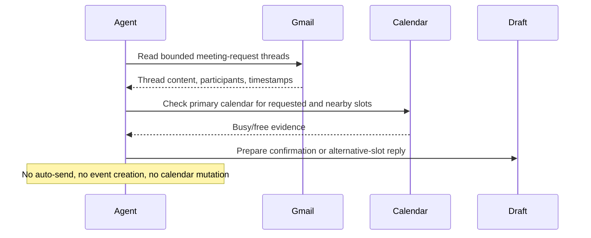

# Gmail Meeting Request Draft Assistant

## Overview

`gmail-meeting-request-draft-assistant` reviews a bounded set of recent inbound Gmail threads that appear to ask for a meeting, a meeting move, or a meeting confirmation, checks availability on the user's primary Google Calendar by default, and prepares a reply draft.

It is intentionally draft-first. The automation never sends email, never creates or edits calendar events, and never searches an entire mailbox or all calendars without bounds. When the requested time is workable, it drafts a confirmation or acceptance reply. When it is not, it proposes one or more realistic alternatives and explains the constraint briefly.

Use it when you want a scheduling assistant that works with minimal setup and without giving the agent permission to commit to meetings on its own.

## How It Works

1. Starts from safe defaults: a bounded recent inbound Gmail slice, the primary calendar, the account timezone when available, and ordinary weekday working hours.
2. Reads a bounded recent slice of Gmail threads that look like meeting requests, reschedules, or confirmations.
3. Extracts the scheduling facts that matter: proposed times, timezone clues, duration, attendees already visible in the thread, and the meeting context.
4. Checks the primary calendar for conflicts and nearby free blocks.
5. Prepares one reply outcome per thread:
   - confirm or accept a viable requested slot
   - propose one or more free alternatives when the request conflicts or is ambiguous
   - stop and report when timezone or scope is too unclear to answer safely
6. Produces a run report and, when the tool surface allows it, creates a Gmail draft reply rather than sending anything.



## Prerequisites

- Gmail and Google Calendar access.
- Permission to create Gmail drafts if you want the run to write back into Gmail. If draft creation is unavailable, the automation should return prepared reply text in markdown instead.

Use the simplest path for your runner:

### Codex App Or Codex CLI

- Enable the OpenAI-curated `gmail@openai-curated` and `google-calendar@openai-curated` plugins from the Plugins directory.
- Authenticate both connectors.
- Verify the runtime can:
  - search and read Gmail threads
  - check Google Calendar availability
  - create a Gmail draft without sending it

In the Codex app, use the `Plugins` UI.
In Codex CLI, start `codex` and open `/plugins`.

### Cursor, Claude Code, Or Copilot

- Use a Google Workspace MCP server if your runner supports one well.
- Otherwise use the `gws` CLI as the portable fallback.

If you use `gws`, install and authenticate it before the automation runs:

```bash
gws version
gws auth list
```

Confirm the chosen account can read Gmail, inspect the primary calendar, and create drafts before you schedule recurring runs.

## Cursor Cloud Usage

1. Open [Cursor Automations](https://cursor.com/automations/new).
2. Name your automation and paste [gmail-meeting-request-draft-assistant.md](/Users/adamchmara/projects/awesome-agent-automations/automations/gmail-meeting-request-draft-assistant/gmail-meeting-request-draft-assistant.md) as the automation prompt.
3. Add Google Workspace access through a configured Workspace MCP server when available.
4. If your Cursor runner does not have a suitable Workspace MCP path, make sure `gws` is installed and authenticated in the runner.
5. Verify the runtime can read Gmail threads, check primary-calendar availability, and create Gmail drafts.
6. Save the automation and start with manual runs or a low-frequency schedule until the draft quality is stable.

## Codex App Usage

1. Enable `gmail@openai-curated` and `google-calendar@openai-curated` from the `Plugins` UI in Codex.
2. Authenticate both connectors and verify they can read Gmail and Google Calendar.
3. Click `Automation` > `New Automation`.
4. Paste [gmail-meeting-request-draft-assistant.md](/Users/adamchmara/projects/awesome-agent-automations/automations/gmail-meeting-request-draft-assistant/gmail-meeting-request-draft-assistant.md) as the automation prompt.
5. Keep the first runs draft-only and review the produced rationale before increasing cadence.

## Claude Code / Codex CLI / Copilot Usage

1. In Codex CLI, enable `gmail@openai-curated` and `google-calendar@openai-curated` from `/plugins`, then authenticate both connectors.
2. In Claude Code or Copilot coding-agent environments, use a Google Workspace MCP server when available, or the `gws` CLI otherwise.
3. Use the prompt as-is before using `/loop` or `/schedule`.
4. Keep the automation draft-only. If someone wants event creation, RSVP updates, or automatic sends, move that into a separate approved automation.
5. For repeated checks in an open Claude Code session, use `/loop`, for example:

```text
/loop weekdays at 9am Follow the instructions in automations/gmail-meeting-request-draft-assistant/gmail-meeting-request-draft-assistant.md
```

## Recommended Defaults

| Setting | Default |
| --- | --- |
| Mailbox scope | `recent inbound inbox threads from the last 7 days, bounded by a 20-thread review cap` |
| Review window | `last 7 days` |
| First-pass candidate pool | `up to 20 threads` |
| Final reply drafts per run | `up to 5 threads` |
| Calendar scope | `primary calendar only` |
| Working-hours policy | `Monday to Friday, 09:00-17:00 in the resolved primary timezone` |
| Timezone handling | `account or primary-calendar timezone when readable; stop on unresolved ambiguity` |
| Alternative slots | `up to 3` |
| Default duration | `30 minutes when the thread does not state one` |
| Writes | `Gmail draft only` |

Additional prompt behavior:

- Start from the built-in bounded defaults.
- Use recent inbound inbox mail rather than broad mailbox search.
- Check only the primary calendar.
- Use the thread itself as the source of truth for attendees and meeting context. Do not search unrelated mail or documents for enrichment.
- If timezone evidence conflicts or is missing, prefer a blocked or prepared result over a confident-sounding guess.
- If the requested slot conflicts, propose nearby free blocks that respect the configured working-hours policy.
- If draft creation is unavailable, still return the exact reply body in markdown so a human can review and paste it.
