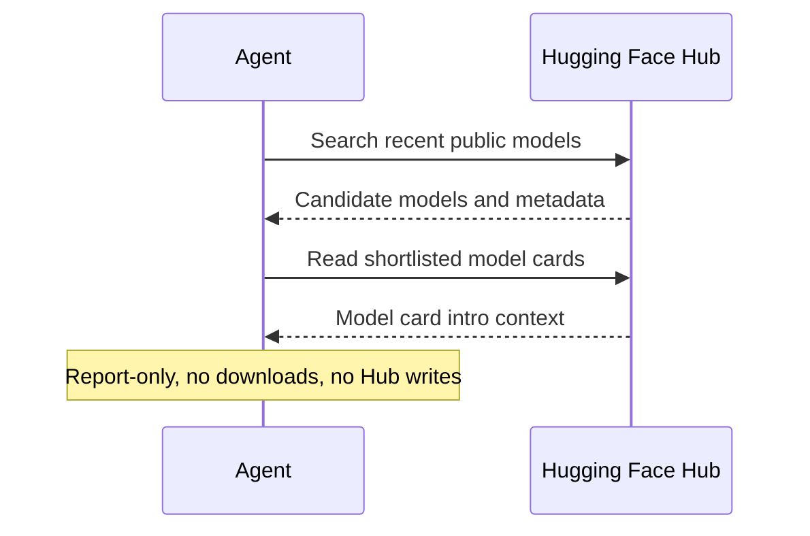

# Hugging Face Model Digest

## Overview

`huggingface-model-digest` turns recent public Hugging Face activity into one short Markdown digest.

It looks at a bounded recent window, shortlists only a few notable models, and reads model-card intro context before summarizing.

Use it when you want signal from the Hugging Face ecosystem without turning the Hub into a raw newest-upload feed.

## How It Works

1. Search a recent Hugging Face window.
2. Build a bounded candidate pool of recent or newly-rising models.
3. Use lightweight signals such as recency, likes, downloads, and card completeness to decide which items are worth deeper review.
4. Read each shortlisted model card or `README.md` intro before writing a summary.
5. Return one concise digest with short human-readable writeups, plus compact supporting signals and confidence.



## Prerequisites

- Access to public Hugging Face Hub metadata through the official MCP server or the official `hf` CLI
- Ability to read model-card intro text or repository `README.md`

Public discovery can work without authentication. If your environment needs higher rate limits or private access later, authenticate with Hugging Face first.

## Cursor Cloud Usage

1. Open [Cursor Automations](https://cursor.com/automations/new).
2. Name your automation and paste [huggingface-model-digest.md](/Users/adamchmara/projects/awesome-agent-automations/automations/huggingface-model-digest/huggingface-model-digest.md) as the automation prompt.
3. Add Hugging Face access through one of these paths:
   - MCP: connect the official Hugging Face MCP server in the automation runtime.
   - CLI: make sure the runtime has `hf` available, for example by installing `huggingface_hub`, and authenticate with `hf auth login` if needed.
4. Make sure the runtime can read public Hugging Face pages for model cards.
5. Set the schedule or run manually, then save the automation.

## Codex App Usage

1. Set up Hugging Face access in Codex using one of these paths:
   - MCP: add the official Hugging Face MCP server to Codex and complete authentication if your setup requires it.
   - CLI: make sure `hf` is installed in the runtime, for example with `python -m pip install -U huggingface_hub`, then run `hf auth login` if you need authenticated access.
2. Click `Automation` > `New Automation`.
3. Name your automation and paste [huggingface-model-digest.md](/Users/adamchmara/projects/awesome-agent-automations/automations/huggingface-model-digest/huggingface-model-digest.md) as the automation prompt.
4. Set schedule or run manually and save the automation.

## Claude Code Usage

1. Add the official Hugging Face MCP server to Claude Code if you want MCP-backed runs, or make `hf` available in the runtime with `python -m pip install -U huggingface_hub`.
2. Authenticate with Hugging Face if you need higher-rate or private access. Public discovery can stay unauthenticated.
3. For repeated checks in an open Claude Code session, use `/loop`, for example:

```text
/loop mondays at 9am Follow the instructions in automations/huggingface-model-digest/huggingface-model-digest.md
```

4. For durable Claude-managed automation outside the current session, use `/schedule` or create a Routine in `claude.ai/code/routines`.

## Recommended Defaults

| Setting | Default |
| --- | --- |
| Time window | `last 7 days` |
| Scope | `global public Hub` |
| Candidate pool | `up to 30 models` |
| Final shortlist | `up to 6 models` |
| Output | `Markdown digest` |
| Delivery mode | `report-only` |

Additional prompt behavior:

- Prefer fewer well-supported picks over padded coverage.
- Use model-card intros as the descriptive source of truth.
- Treat likes, downloads, and recency as ranking clues, not as a substitute for reading the cards.
- Skip or downgrade items with empty, unreadable, or obviously thin cards.
- Write short per-model paragraphs that lead with what the model is and what is distinctive, then tuck metadata into compact support lines.

## Useful Workspace-Specific Inputs

Tell the runner anything it cannot safely infer from the public Hub alone.

Scope example:

```text
Keep the default weekly window, but limit discovery to multimodal and agents-related models.
```

Audience example:

```text
Write the digest for product-minded engineers. Keep it concrete and explain why each model matters in practice.
```

Noise control example:

```text
Down-rank obvious repackagings, mirrors, and quantization-only reposts unless the model card explains a meaningful new use case.
```
