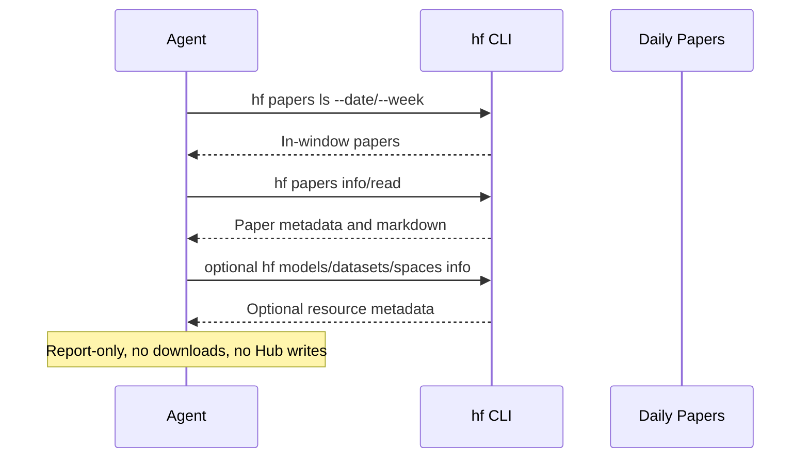

# Hugging Face Weekly Papers Digest

## Overview

`huggingface-weekly-papers-digest` turns a recent Hugging Face Daily Papers slice into one short paper-first digest.

The goal is not a broad literature review. The goal is a compact brief of recent papers that were notable in the selected window, with optional links to code, demos, or Hugging Face artifacts when they are clearly useful.

Use it when you want to keep up with what was notable in Hugging Face Daily Papers without reading the whole feed yourself.

This promoted package is CLI-only. It is designed around the official `hf` CLI rather than MCP or general web search.

## How It Works

1. Use `hf papers ls` with `--date`, `--week`, or `--month` to get a chronological Daily Papers slice.
2. Build a bounded candidate set from that in-window slice.
3. Read each serious paper with `hf papers info` and `hf papers read`.
4. Optionally inspect linked models, datasets, or Spaces with `hf models info`, `hf datasets info`, or `hf spaces info` when they clearly add value.
5. Shortlist only the papers with the strongest summaries, activity, and practical or conceptual relevance in the window.
6. Return one concise digest, or a short blocked brief when the CLI cannot produce a trustworthy in-window slice.



## Prerequisites

- The official `hf` CLI available in the runtime

Public discovery can work without authentication. If your environment needs higher rate limits or private access later, authenticate with Hugging Face first.

## Install The CLI

Install the official Hugging Face CLI with the recommended standalone installer:

```bash
curl -LsSf https://hf.co/cli/install.sh | bash
```

Then verify the CLI is available:

```bash
hf --help
hf papers --help
```

You should also confirm the runtime can use `hf papers`. The `hf models info`, `hf datasets info`, and `hf spaces info` commands are optional enrichment paths.

If your environment needs authenticated access, log in with:

```bash
hf auth login
```

## Cursor Cloud Usage

1. Open [Cursor Automations](https://cursor.com/automations/new).
2. Name your automation and paste [huggingface-weekly-papers-digest.md](/Users/adamchmara/projects/awesome-agent-automations/automations/huggingface-weekly-papers-digest/huggingface-weekly-papers-digest.md) as the automation prompt.
3. Authenticate with `hf auth login` if your environment needs authenticated access.
4. Set the schedule or run manually, then save the automation.

## Codex App Usage

1. Authenticate with `hf auth login` if you need authenticated access.
2. Click `Automation` > `New Automation`.
3. Name your automation and paste [huggingface-weekly-papers-digest.md](/Users/adamchmara/projects/awesome-agent-automations/automations/huggingface-weekly-papers-digest/huggingface-weekly-papers-digest.md) as the automation prompt.
4. Set schedule or run manually and save the automation.

## Claude Code Usage

1. Authenticate with Hugging Face if you need higher-rate or private access. Public discovery can stay unauthenticated.
2. For repeated checks in an open Claude Code session, use `/loop`, for example:

```text
/loop every friday at 9am Follow the instructions in automations/huggingface-weekly-papers-digest/huggingface-weekly-papers-digest.md
```

3. For durable Claude-managed automation outside the current session, use `/schedule` or create a Routine in `claude.ai/code/routines`.

## Recommended Defaults

| Setting | Default |
| --- | --- |
| Time window | `current or most recent week` |
| Candidate pool | `up to 20 papers` |
| Final shortlist | `up to 5 papers` |
| Output | `Markdown digest` |
| Delivery mode | `report-only` |
| Retrieval path | `hf CLI only` |

Additional prompt behavior:

- Use `hf papers ls` as the source of truth for the in-window Daily Papers slice.
- Use paper summaries and markdown context as the descriptive source of truth.
- Use linked Hugging Face artifacts, GitHub repos, or project pages only as optional enrichment when they materially help explain the paper.
- Treat votes or popularity as ranking clues, not as a substitute for reading the source material.
- Skip or downgrade papers with thin summaries or unclear practical meaning.
- If the CLI cannot produce a trustworthy in-window slice, return a short blocked brief instead of an empty fake digest.

## Useful Workspace-Specific Inputs

Tell the runner anything it cannot safely infer from Daily Papers alone.

Topic example:

```text
Keep the weekly window, but focus on multimodal, agents, and speech papers.
```

Audience example:

```text
Write the brief for applied ML engineers. Emphasize what is new, what is interesting, and what they might want to read first.
```

Selection example:

```text
Prefer agent systems, multimodal reasoning, and practical tooling papers over more theoretical items this week.
```

Noise control example:

```text
Skip papers if the summary is too thin to explain the main idea clearly in a short digest.
```
