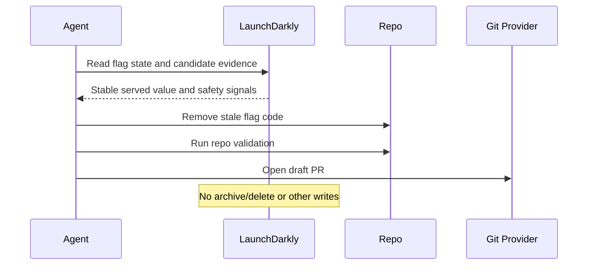

# LaunchDarkly Feature Flag Cleanup

## Overview

Removes stale temporary LaunchDarkly flag code, validates the change, and opens a draft PR or prepares PR-ready output.

The automation uses LaunchDarkly as evidence for candidate selection and to confirm the served flag value before removing code. LaunchDarkly archive/delete remains a manual post-merge step.

## How It Works

1. Finds stale temporary LaunchDarkly flags that look safe to clean up.
2. Checks LaunchDarkly state to confirm a single stable served value.
3. Removes flag-related code paths and clearly orphaned references.
4. Runs validation and opens a draft PR or prepares PR-ready output.



## Prerequisites

- LaunchDarkly access through MCP or `ldcli`
- GitHub or equivalent PR tooling if you want automatic PR creation

## Cursor Cloud Usage

1. Open [Cursor Automations](https://cursor.com/automations/new).
2. Name your automation and paste [launchdarkly-feature-flag-cleanup.md](/Users/adamchmara/projects/awesome-agent-automations/automations/launchdarkly-feature-flag-cleanup/launchdarkly-feature-flag-cleanup.md) as the automation prompt.
3. Add trigger conditions.
4. Click `Add tools or MCP` > `MCP server` > `LaunchDarkly feature management` > `New connection` > `LaunchDarkly` > `Connect`.
  - CLI alternative: use [ldcli](#cli-alternative) in the agent environment instead of steps 4-5.
5. Select `LaunchDarkly feature management` from the list of MCP servers.
6. Add the `Open Pull Request` tool, or let the agent use an existing GitHub CLI or plugin in the environment.
7. Optionally add other tools, such as Slack for notifications.
8. Click `Create`.

References:

- [Cursor Automations](https://cursor.com/blog/automations)
- [LaunchDarkly hosted MCP server](https://launchdarkly.com/docs/home/getting-started/mcp-hosted)

## Codex App Usage

1. Install the hosted LaunchDarkly feature management MCP server in Codex:
  ```bash
   codex mcp add launchdarklyFeatureManagement --url https://mcp.launchdarkly.com/mcp/fm
   codex mcp login launchdarklyFeatureManagement
   codex mcp list
  ```
  - CLI alternative: use [ldcli](#cli-alternative) in the agent environment instead of MCP.
2. Click `Automation` > `New Automation`.
3. Name your automation and paste [launchdarkly-feature-flag-cleanup.md](/Users/adamchmara/projects/awesome-agent-automations/automations/launchdarkly-feature-flag-cleanup/launchdarkly-feature-flag-cleanup.md) as the automation prompt.
4. Set schedule or run manually and save the automation.
5. Add the GitHub plugin to Codex, or let Codex use an existing GitHub CLI/tool in the agent environment.

References:

- [Codex Automations](https://openai.com/academy/codex-automations)
- [LaunchDarkly hosted MCP server](https://launchdarkly.com/docs/home/getting-started/mcp-hosted)

## Claude Code Usage

1. Add the hosted LaunchDarkly feature management MCP server in Claude Code:
  ```bash
  claude mcp add --transport http launchdarklyFeatureManagement https://mcp.launchdarkly.com/mcp/fm
  claude mcp list
  ```
  - To share the MCP configuration through the repo, use `--scope project`.
  - CLI alternative: use [ldcli](#cli-alternative) in the agent environment instead of MCP.
2. Open Claude Code and run `/mcp` to authenticate with LaunchDarkly in your browser.
3. For repeated checks in an open Claude Code session, use `/loop`, for example:

```text
/loop 1d Follow the instructions in automations/launchdarkly-feature-flag-cleanup/launchdarkly-feature-flag-cleanup.md
```

4. For durable Claude-managed automation that survives outside the current session, use `/schedule` or create a Routine in `claude.ai/code/routines`.
5. Make sure the runtime has repository access and permission to run the validation commands you expect.

Claude-native automation options:

- `/loop` for repeated runs in the current session
- `/schedule` for scheduled routines managed by Claude
- Routines in `claude.ai/code/routines` for durable cloud-hosted automation

References:

- [Claude Code MCP](https://code.claude.com/docs/en/mcp)
- [Claude Code CLI Reference](https://code.claude.com/docs/en/cli-usage)
- [Run prompts on a schedule](https://code.claude.com/docs/en/scheduled-tasks)
- [Automate work with routines](https://code.claude.com/docs/en/web-scheduled-tasks)
- [LaunchDarkly Hosted MCP Server](https://launchdarkly.com/docs/home/getting-started/mcp-hosted)

## CLI Alternative

If you prefer not to use MCP, you can install and use `ldcli` in the agent environment.

Install it with:

```bash
brew tap launchdarkly/homebrew-tap
brew install ldcli
ldcli login
```

If you use this path, make sure the agent environment can actually execute `ldcli` and access its auth state. In sandboxed runners that usually means:

- `ldcli` is on `PATH` inside the agent runtime
- required auth files or environment variables are visible to the agent
- the sandbox allows the command to run

Docs: [LaunchDarkly CLI](https://launchdarkly.com/docs/home/getting-started/ldcli), [LaunchDarkly CLI commands](https://launchdarkly.com/docs/home/getting-started/ldcli-commands), [LaunchDarkly local MCP server](https://launchdarkly.com/docs/home/getting-started/mcp-local)

## Recommended Defaults


| Setting           | Default                                         |
| ----------------- | ----------------------------------------------- |
| Max flags per run | `3`                                             |
| Branch            | `chore/launchdarkly-flag-cleanup-YYYY-MM-DD`    |
| Commit message    | `chore(flags): remove stale LaunchDarkly flags` |
| PR mode           | `Draft`                                         |


## Useful Repo-Specific Inputs

Tell the runner anything it cannot reliably infer from the repo.

Validation example:

```text
To validate code changes, run the actual repo commands for the affected package or app, for example:
pnpm --filter <package> typecheck
pnpm --filter <package> test
npm run test --workspace <package>

If the changed package is unclear, run the root typecheck and test commands.
```

Guardrails example:

```text
Do not edit generated files directly. Skip migrations, seeds, infrastructure config, and files under vendor/.
```

Monorepo example:

```text
Keep changes inside the package where the flag is used unless adjacent shared tests or fixtures are clearly flag-specific.
```

Notification example:

```text
If a chat connector is available, send a short message after opening the draft PR with the PR link, flags removed, validation result, and a reminder that LaunchDarkly was not modified.
```
