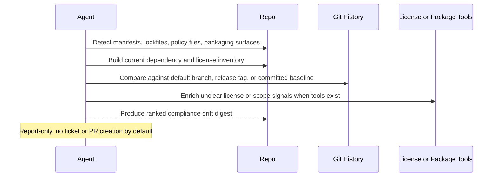

# License Compliance Drift Digest

## Overview

`license-compliance-drift-digest` inspects the current repository's dependency and package metadata surface, compares it against the best available baseline and any local license policy, and produces a ranked read-only digest of the changes that are most likely to matter to legal, security, or platform reviewers.

It is intentionally triage-first. The goal is not to fail on every license warning or dump raw scanner noise. The useful output is a short report that distinguishes real review items from routine dependency churn.

Use it when you want a recurring answer to a concrete question such as "did anything in this repo's dependency or distribution surface change in a way that needs compliance review?" rather than a generic license inventory export.

## How It Works

1. Detects the repository's dependency ecosystems, manifests, lockfiles, workspace files, and container or packaging surfaces.
2. Builds a current dependency and license inventory from repository evidence first, then uses available package-manager, license-scanner, registry, or GitHub data only as supporting enrichment.
3. Chooses the best available comparison baseline, preferring committed policy or baseline files, then the default branch, then the latest release tag.
4. Identifies meaningful changes such as new runtime dependencies, unknown or changed licenses, dual-license ambiguity, vendored code with unclear provenance, or policy-relevant drift.
5. Ranks only the items that look worth human review and returns one concise digest with evidence, affected manifests, and recommended next actions.



## When To Use It

Use it when:

- you want a weekly or release-adjacent compliance digest for the current repository;
- you want dependency and license changes ranked by business relevance, not just listed;
- you want the runner to use repository evidence such as manifests, lockfiles, Dockerfiles, or policy files before escalating a change;
- you want a safer first pass than a hard-fail gate on every unknown or copyleft string.

## Prerequisites

- The runtime should have repository read access and `git` available for baseline comparison.
- `rg` is strongly recommended for bounded repository inspection.
- Package-manager or license-tool access is optional but useful for stronger inventory quality.

Helpful optional tools include:

- package-manager CLIs such as `npm`, `pnpm`, `yarn`, `pip`, `poetry`, `uv`, `go`, `cargo`, `mvn`, `gradle`, `bundle`, or `docker`
- license and dependency tools such as `license-checker`, `licensee`, `pip-licenses`, `cargo-deny`, `go-licenses`, `syft`, or `scancode-toolkit`
- GitHub access through the GitHub plugin or `gh` for dependency graph or metadata enrichment
- Slack or an equivalent messaging connector if you want to forward the digest after the run

The automation still works in repo-only mode when those enrichers are unavailable. It should degrade to a narrower report rather than guessing.

## Cursor Cloud Usage

1. Open [Cursor Automations](https://cursor.com/automations/new).
2. Name your automation and paste [license-compliance-drift-digest.md](/Users/adamchmara/projects/awesome-agent-automations/automations/license-compliance-drift-digest/license-compliance-drift-digest.md) as the automation prompt.
3. Make sure the runtime can read the repository and execute `git` and `rg`.
4. Optionally provide package-manager, license-tool, GitHub, or Slack access if you want richer evidence or delivery.
5. Set the schedule or run manually, then save the automation.

## Codex App Usage

1. Click `Automation` > `New Automation`.
2. Name your automation and paste [license-compliance-drift-digest.md](/Users/adamchmara/projects/awesome-agent-automations/automations/license-compliance-drift-digest/license-compliance-drift-digest.md) as the automation prompt.
3. Make sure the runtime can inspect the repository and run `git` and `rg`.
4. Optionally add the GitHub plugin or allow existing package-manager and license tooling in the environment for stronger evidence.
5. Set the schedule or run manually and save the automation.

## Claude Code / Codex CLI / Copilot Usage

1. Start the agent in the repository you want reviewed.
2. Make sure the runtime can execute `git` and `rg`. Optional package-manager, license, GitHub, or container tooling improves evidence quality but is not required.
3. For repeated checks in an open Claude Code session, use `/loop`, for example:

```text
/loop 1w Follow the instructions in automations/license-compliance-drift-digest/license-compliance-drift-digest.md
```

4. For durable Claude-managed automation outside the current session, use `/schedule` or create a Routine in `claude.ai/code/routines`.

## Recommended Defaults

| Setting | Default |
| --- | --- |
| Scope | `current repository only` |
| Baseline order | `committed policy or baseline file, then default branch, then latest release tag` |
| Evidence priority | `manifests and lockfiles first, then local tool output, then registry or GitHub enrichment` |
| Ecosystems | `auto-detect common package-manager and container surfaces` |
| Ranked review items | `up to 10` |
| Output | `Markdown digest` |
| Writes | `none` |

Additional prompt behavior:

- Prefer direct dependency and runtime-path changes over dev-only churn.
- Prefer clear evidence from lockfiles, manifests, and repository packaging surfaces over registry-only guesses.
- Treat unknown or missing license signals as review items, not automatic violations.
- Treat dual-license ambiguity as a review item only when the repository evidence suggests real usage or distribution relevance.
- Use repository evidence to infer whether the software is distributed, containerized, published as a library, or likely internal-only, and say when that inference is uncertain.
- If a trustworthy comparison baseline is unavailable, still produce a current-state digest and say that the run is baseline-limited.
- If no meaningful compliance drift is found, return a short no-material-drift summary rather than padding the report.

## Useful Repo-Specific Inputs

Tell the runner anything it cannot safely infer from the repository alone.

Policy example:

```text
Use LICENSE_POLICY.md and .github/dependency-review-config.yml as the authoritative allow or deny policy.
Treat permissive licenses as normally allowed, weak copyleft as review, and strong copyleft as escalation unless already approved.
```

Scope example:

```text
Focus on production services and publishable packages.
Ignore docs examples, internal playgrounds, sample apps, generated lockfiles under fixtures, and archived packages.
```

Distribution-context example:

```text
Treat this repository as distributed customer software, not an internal-only service.
Container images, desktop bundles, and shipped SDKs should outrank internal CI tooling.
```

Vendored-code example:

```text
Flag vendored directories, copied third-party source, or embedded assets only when provenance, license text, or upstream source links are unclear.
```

Notification example:

```text
If a chat connector is available, prepare a short summary suitable for Slack after the full report, but keep the main output as the detailed Markdown digest.
```

## Limitations

- This automation is not a substitute for formal legal review, full SBOM governance, or organization-wide compliance tooling.
- It is weaker when the repository lacks lockfiles, clear manifests, or an internal license policy.
- Package registry metadata can be incomplete or inconsistent across ecosystems, so repository evidence should stay primary.
- It can rank likely review items, but it cannot by itself determine final distribution obligations, exception approvals, or contractual licensing constraints.
