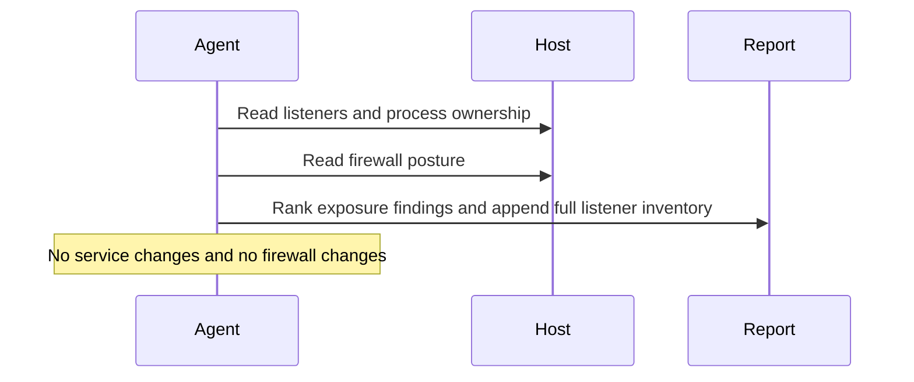

# Local Listening Service And Firewall Audit

## Overview

`local-listening-service-and-firewall-audit` inspects one macOS or Linux host's inbound exposure surface and produces a plain-language report of what the machine is listening on, what is reachable beyond localhost, and whether the firewall posture looks acceptable.

Use it when you want a narrower hardening-oriented view than `local-network-monitor`: what is listening, what is reachable beyond loopback, and whether the local firewall posture looks acceptable. Do not use it for LAN-wide discovery, packet capture, or automatic remediation.

## How It Works

1. Detects the local platform and available read-only tooling, preferring `osquery` for listener and process mapping.
2. Builds a listener inventory with process ownership, executable path when readable, port, protocol, and bind address.
3. Reads the local firewall posture from the best native source available on the host.
4. Ranks only meaningful exposure findings and returns one short human-readable report with a compact technical summary.



## Prerequisites

- The automation must run on the machine being inspected, or in an environment that can execute local shell commands on that machine.
- The runtime needs read access to local socket state and firewall posture.
- `osquery` is optional but recommended for cleaner listener and process joins across macOS and Linux.

## Cursor Cloud Usage

1. Open [Cursor Automations](https://cursor.com/automations/new).
2. Name your automation and paste [local-listening-service-and-firewall-audit.md](/Users/adamchmara/projects/awesome-agent-automations/automations/local-listening-service-and-firewall-audit/local-listening-service-and-firewall-audit.md) as the automation prompt.
3. Make sure the runner is attached to the host you want to inspect. A generic hosted sandbox will inspect itself, not your workstation or server.
4. No MCP setup is required. Optionally install `osquery` on the host for more consistent listener and process discovery.
5. Set the schedule or run manually, then save the automation.

## Codex App Usage

1. Click `Automation` > `New Automation`.
2. Name your automation and paste [local-listening-service-and-firewall-audit.md](/Users/adamchmara/projects/awesome-agent-automations/automations/local-listening-service-and-firewall-audit/local-listening-service-and-firewall-audit.md) as the automation prompt.
3. Run it only in a Codex environment that has shell access to the machine you want to inspect.
4. No MCP setup is required. Optionally install `osquery` on the host for more consistent listener inventory output.
5. Set the schedule or run manually and save the automation.

## Claude Code / Codex CLI / Copilot Usage

1. No extra MCP setup is required for the core workflow.
2. Start the agent session on the host you want to inspect, or in a remote shell environment that can read that host's local socket state and firewall posture.
3. For repeated checks in an open Claude Code session, use `/loop`, for example:

```text
/loop 1d Follow the instructions in automations/local-listening-service-and-firewall-audit/local-listening-service-and-firewall-audit.md
```

4. For durable Claude-managed automation, use `/schedule` or create a Routine in `claude.ai/code/routines`.
5. In Codex CLI or Copilot coding-agent environments, schedule this only if the runtime stays attached to the target host between runs.

References:

- [Cursor Automations](https://cursor.com/blog/automations)
- [Codex Automations](https://openai.com/academy/codex-automations)
- [Claude Code CLI Reference](https://code.claude.com/docs/en/cli-usage)
- [Run prompts on a schedule](https://code.claude.com/docs/en/scheduled-tasks)
- [Automate work with routines](https://code.claude.com/docs/en/web-scheduled-tasks)

## Recommended Defaults

| Setting | Default |
| --- | --- |
| Host scope | `current machine only` |
| Listener scope | `all readable TCP and UDP listeners` |
| Exposure emphasis | `non-loopback and wildcard binds first` |
| Firewall mode | `inspect only` |
| Allowlist mode | `none unless explicitly provided` |
| Output | `plain-language Markdown report with compact technical summary` |

Additional prompt behavior:

- Prefer `osquery` when available, but do not fail just because it is missing.
- If firewall state is unreadable or partial, return the listener report anyway and call out the posture gap.
- Keep exposure language concrete. A service can be unexpected without being malicious.
- Prefer short explanations over large tables. Lead with what matters and keep the detailed listener list compact.

## Useful Host-Specific Inputs

Tell the runner anything it cannot safely infer from the host snapshot alone.

Expected-service example:

```text
Expected non-loopback listeners: ssh on 22/tcp, Tailscale on 41641/udp, local file sharing disabled, no VNC, no AirPlay receiver.
```

Risk-tolerance example:

```text
Treat remote-access services, admin panels, SMB, printer services, and anything bound to 0.0.0.0 as higher priority than developer-only loopback listeners.
```

Firewall example:

```text
If the firewall is enabled but broad allow rules exist, rank them as posture gaps rather than exposure findings unless a specific listener maps to the rule.
```

Verification example:

```text
For any non-loopback listener that is not obviously expected, include one manual verification command before suggesting a hardening change.
```
