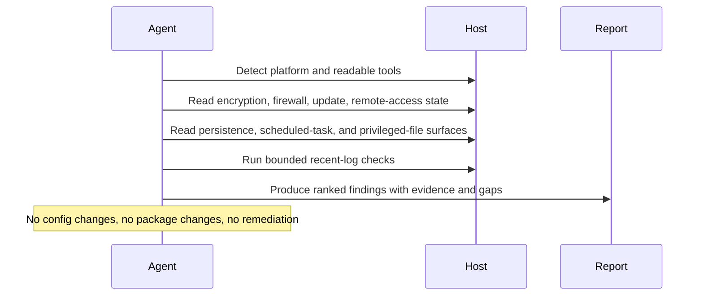

# Local Security Monitor

## Overview

`local-security-monitor` inspects one macOS or Linux host and produces a concise, evidence-backed security report. It checks disk-encryption posture, local firewall state, security-update coverage, remote-access exposure, notable persistence surfaces, privileged-file risk, and a small set of recent security-relevant host signals.

Use it for recurring host-local posture reviews that should stay read-only and conservative. Do not use it for automated hardening, package remediation, SCAP compliance scans, or file-integrity baselining.

## How It Works

1. Detects the local platform and available read-only tooling, preferring native OS signals first.
2. Collects core posture evidence for encryption, firewall state, update coverage, and remote-access posture.
3. Reviews startup, scheduled-task, SSH, and privileged-binary surfaces when they are readable.
4. Uses tightly bounded recent-log checks only when reliable local log sources are available.
5. Returns one short Markdown report with ranked findings, evidence, confidence, and explicit coverage gaps.



## Prerequisites

- The automation must run on the machine being inspected, or in an environment that can execute local shell commands on that machine.
- The runtime needs read access to local security posture sources, readable config files, and recent system logs.
- `osquery` is optional but recommended for more consistent cross-platform reads of startup items, scheduled tasks, SSH config, and privileged binaries.

### Recommended Host Tooling

For the higher-signal mode of this automation, install `osquery` on the target host.

macOS example:

```bash
brew install --cask osquery
osqueryi --json "select * from os_version;"
```

Linux example:

```bash
sudo apt-get install osquery
osqueryi --json "select * from os_version;"
```

If `osquery` is unavailable, the automation still works with native commands. Optional local tools such as `lynis` may add supporting evidence, but they are not required and should not replace direct host evidence.

## Cursor Cloud Usage

1. Open [Cursor Automations](https://cursor.com/automations/new).
2. Name your automation and paste [local-security-monitor.md](/Users/adamchmara/projects/awesome-agent-automations/automations/local-security-monitor/local-security-monitor.md) as the automation prompt.
3. Make sure the runner is attached to the host you want to inspect. A generic hosted sandbox will inspect itself, not your laptop or server.
4. No MCP setup is required. Optionally install `osquery` on the host for more consistent startup, SSH, and privileged-surface inspection.
5. Set the schedule or run manually, then save the automation.

## Codex App Usage

1. Click `Automation` > `New Automation`.
2. Name your automation and paste [local-security-monitor.md](/Users/adamchmara/projects/awesome-agent-automations/automations/local-security-monitor/local-security-monitor.md) as the automation prompt.
3. Run it only in a Codex environment that has shell access to the machine you want to inspect.
4. No MCP setup is required. Optionally install `osquery` on the host for more consistent cross-platform surface coverage.
5. Set the schedule or run manually and save the automation.

## Claude Code / Codex CLI / Copilot Usage

1. No extra MCP setup is required for the core workflow.
2. Start the agent session on the host you want to inspect, or in a remote shell environment that can read that host's local security state and logs.
3. For repeated checks in an open Claude Code session, use `/loop`, for example:

```text
/loop 1d Follow the instructions in automations/local-security-monitor/local-security-monitor.md
```

4. For durable Claude-managed automation, use `/schedule` or create a Routine in `claude.ai/code/routines`.
5. In Codex CLI or Copilot coding-agent environments, schedule this only if the runtime stays attached to the target host between runs.

References:

- [Cursor Automations](https://cursor.com/blog/automations)
- [Codex Automations](https://openai.com/academy/codex-automations)
- [Claude Code CLI Reference](https://code.claude.com/docs/en/cli-usage)
- [Run prompts on a schedule](https://code.claude.com/docs/en/scheduled-tasks)
- [Automate work with routines](https://code.claude.com/docs/en/web-scheduled-tasks)

## Recommended Defaults

| Setting | Default |
| --- | --- |
| Host scope | `current machine only` |
| Platform | `auto-detect macOS or Linux` |
| Tooling mode | `native commands first; use osquery or lynis only if present` |
| Log window | `last 24 hours, bounded and security-relevant only` |
| Update review | `OS and distro-native security-update posture only` |
| Persistence review | `startup items, scheduled tasks, SSH posture, privileged binaries when readable` |
| Mutation policy | `report only` |
| Output | `Markdown report` |

Additional prompt behavior:

- Prefer native OS security signals over generic checklist advice.
- On macOS, distinguish FileVault state from broader hardware-encryption context when the host exposes both.
- On Linux, distinguish pending security updates from general outdated packages whenever distro tooling supports that split.
- Treat `osquery` as an optional normalization layer and `lynis` as optional secondary evidence.
- Do not expand the default run into SCAP, AIDE, or package-autofix workflows.
- Keep the ranked findings list short. Prefer at most 5 ranked findings and move routine or expected items into lower-priority observations.
- Suppress routine macOS Continuity, AirDrop, Spotify, updater, and common enterprise-agent noise unless it is unexpected for the host or clearly actionable.
- Do not treat a system plist alone as proof that a remote-access service is enabled.
- Do not claim strong firewall protection unless the host evidence actually covers the relevant firewall state and exceptions.
- If a core source is unreadable, return a partial report and label the missing visibility explicitly.
- Keep hardening suggestions tied to observed evidence rather than generic best-practice lists.

## Useful Host-Specific Inputs

Tell the runner anything it cannot safely infer from the current host snapshot alone.

Expected-remote-access example:

```text
Expected remote-access surfaces: ssh on 22/tcp for this host, no screen sharing, no remote desktop, no AirPlay receiver.
```

Baseline example:

```text
Expected startup items include Tailscale, a corporate endpoint agent, and Docker Desktop.
Expected privileged binaries include standard OS packages only. Flag anything outside /usr, /bin, /sbin, /usr/local, or the package manager's normal install roots.
```

Package-scope example:

```text
For Linux update posture, focus on distro-native security updates only. Do not include Homebrew, npm, pip, or language-level package drift in this run.
```

Noise-control example:

```text
Treat failed ssh logins from localhost during local testing as low priority unless they are repeated or tied to an unexpected process or service.
```

Escalation example:

```text
If you find a new remote-access service, writable privileged file, or disabled firewall, include one concrete manual verification command before suggesting a hardening step.
```
