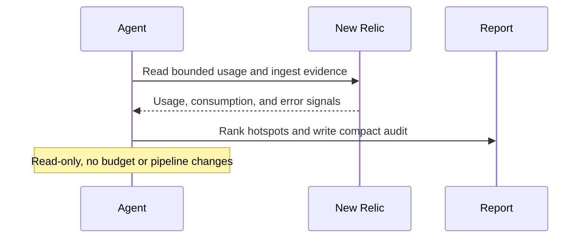

# New Relic Cost And Ingest Hygiene Audit

## Overview

`new-relic-cost-and-ingest-hygiene-audit` reads recent New Relic usage and ingest signals for one account, finds the biggest telemetry cost surfaces, localizes the most concrete waste candidates it can, and turns that into one compact audit plus one standalone HTML report artifact.

It is read-only. Each run is meant to answer a practical question: where is ingest going now, what concrete waste is most likely inside it, and what is the smallest useful action to reduce it. A good run should name specific repeated patterns or levers, not just the biggest service. The HTML artifact should make those opportunities obvious at a glance.

## Preview


## How It Works

1. Requires a completed run-configuration block with explicit account scope and time window.
2. Reads the best available ingest and usage surfaces for the current and optional comparison windows.
3. Ranks the biggest cost or noise hotspots across logs, spans, metrics, events, partitions, or integration errors.
4. Returns one compact Markdown audit with a hotspot ledger, concrete reduction candidates, and the highest-value next actions.
5. Produces one standalone HTML report artifact with charts, candidate cards, and visual drilldowns for the most important surfaces.
6. If it cannot identify a concrete lever inside a large surface, it should say that directly instead of pretending the surface itself is already an actionable finding.



## When To Use It

- you want a recurring view of New Relic ingest pressure and telemetry waste
- you want to spot log, span, metric, or custom-event sources that are disproportionate or newly noisy
- you want one compact account-level audit instead of manually digging through usage screens
- you want likely reduction opportunities, not just high-level ingest rankings
- you want a visual artifact that makes the biggest reduction opportunities obvious to a human reviewer

## Prerequisites

- New Relic access through MCP or the official New Relic CLI
- enough permission to read the account usage, ingest, and query surfaces you care about

Important New Relic constraints:

- Use a least-privilege New Relic account or API key for this automation.
- New Relic documents its MCP server as a preview feature.
- New Relic states that the public preview MCP server must not be used for FedRAMP- or HIPAA-regulated accounts.

## Cursor Cloud Usage

1. Open [Cursor Automations](https://cursor.com/automations/new).
2. Name your automation and paste [new-relic-cost-and-ingest-hygiene-audit.md](/Users/adamchmara/projects/awesome-agent-automations/automations/new-relic-cost-and-ingest-hygiene-audit/new-relic-cost-and-ingest-hygiene-audit.md) as the automation prompt.
3. Add the New Relic MCP server.
   - US accounts: `https://mcp.newrelic.com/mcp/`
   - EU accounts: `https://mcp.eu.newrelic.com/mcp/`
4. Complete the OAuth flow or configure your environment for the official CLI alternative.
5. Set the schedule or run manually, then save the automation.

References:

- [Cursor Automations](https://cursor.com/blog/automations)
- [Set up New Relic MCP](https://docs.newrelic.com/docs/agentic-ai/mcp/setup/)
- [New Relic MCP tool reference](https://docs.newrelic.com/docs/agentic-ai/mcp/tool-reference/)

## Codex App Usage

1. Click `Automation` > `New Automation`.
2. Name your automation and paste [new-relic-cost-and-ingest-hygiene-audit.md](/Users/adamchmara/projects/awesome-agent-automations/automations/new-relic-cost-and-ingest-hygiene-audit/new-relic-cost-and-ingest-hygiene-audit.md) as the automation prompt.
3. Install the New Relic MCP server or make the official New Relic CLI available in the runtime.
4. Set the schedule or run manually and save the automation.

References:

- [Set up New Relic MCP](https://docs.newrelic.com/docs/agentic-ai/mcp/setup/)
- [Codex Automations](https://openai.com/academy/codex-automations)

## Claude Code / Codex CLI / Copilot Usage

1. Add the New Relic MCP server, or make the official New Relic CLI available in the runtime.
2. Make sure the environment can read the account usage and query surfaces you expect.
3. For repeated checks in an open Claude Code session, use `/loop`, for example:

```text
/loop 1w Follow the instructions in automations/new-relic-cost-and-ingest-hygiene-audit/new-relic-cost-and-ingest-hygiene-audit.md
```

4. For durable Claude-managed automation, use `/schedule` or create a Routine in `claude.ai/code/routines`.

## CLI Alternative

If you prefer not to use MCP, the official New Relic CLI is a credible alternative for this automation.

Install and authenticate it first:

```bash
brew install newrelic-cli
newrelic profile add
```

Relevant official docs:

- [Get started with the New Relic CLI](https://docs.newrelic.com/docs/new-relic-solutions/tutorials/new-relic-cli/)
- [New Relic CLI reference](https://docs.newrelic.com/docs/new-relic-solutions/build-nr-ui/newrelic-cli/)
- [New Relic CLI repository](https://github.com/newrelic/newrelic-cli)

## Recommended Defaults

| Setting | Default |
| --- | --- |
| Account scope | `required in run configuration` |
| Current window | `required in run configuration` |
| Comparison window | `optional in run configuration` |
| First-pass hotspot cap | `top 20 surfaces by ingest pressure` |
| Final spotlight count | `top 5 findings` |
| Delivery | `Markdown audit plus standalone HTML report artifact` |

Additional prompt behavior:

- Prefer repeated high-volume, low-signal telemetry over one-day spikes.
- If exact measured cost is unavailable, label cost pressure as inferred.
- Prefer actionable hygiene findings over a raw usage dump.
- Estimate likely savings in bytes or surface share when exact dollar cost is unavailable.
- Prefer repeated message templates, logger names, span names, metric namespaces, or integration sources over service-level totals when writing final recommendations.
- Stop if the account scope or window is missing, still template-like, or ambiguous.
- Use the HTML artifact for visual ranking, concentration, and candidate comparison; do not just restyle the Markdown report.

## Useful Workspace-Specific Inputs

Tell the runner anything it cannot reliably infer.

Account scope example:

```text
Only inspect the production observability account for the checkout platform.
If multiple visible accounts match, stop and report the ambiguity.
```

Strict run-configuration example:

```text
Allowed New Relic account(s): platform-production
Environment: production
Current audit window: last 7 days
Comparison window: preceding 7 days
Priority signal families: logs, spans, custom events

Do not continue if this run-configuration block is missing or still contains template/example text.
```

Priority example:

```text
Prioritize log streams and custom events before infrastructure metrics when choosing the final hotspot list.
```

Waste example:

```text
Treat duplicate forwarding, debug-level production logs, high-cardinality custom events, and unused noisy spans as higher-priority hygiene candidates.
```

Reduction example:

```text
When a log surface dominates ingest, try to identify the top repeated message templates or logger names first and estimate savings from suppressing, downgrading, or sampling them.
If only family-level totals are visible, say that the audit found a large surface but not yet a concrete reduction candidate.
```

Stronger expectation example:

```text
Do not stop at "worker logs are large." Name the repeated pattern if possible, such as a request-completed line, a success-path payload log, or a specific logger category. If the pattern cannot be extracted from the available data, say so explicitly and keep the finding out of the top recommendation slot.
```

Log-analysis example:

```text
For log-heavy surfaces, aggregate first by message template, logger, route, job label, status family, or other structured fields. Only inspect a tiny sample from the top few buckets after that. Do not browse raw logs broadly.
```

Delivery example:

```text
Keep the audit short. Lead with the largest avoidable ingest surfaces and the most actionable next steps.
```

HTML artifact example:

```text
Include charts for ingest by signal family, top hotspot concentration, and current-vs-comparison windows when comparison exists.
Do not paste the Markdown report into the HTML. Build a standalone visual summary with candidate cards and drilldown tables instead.
```
