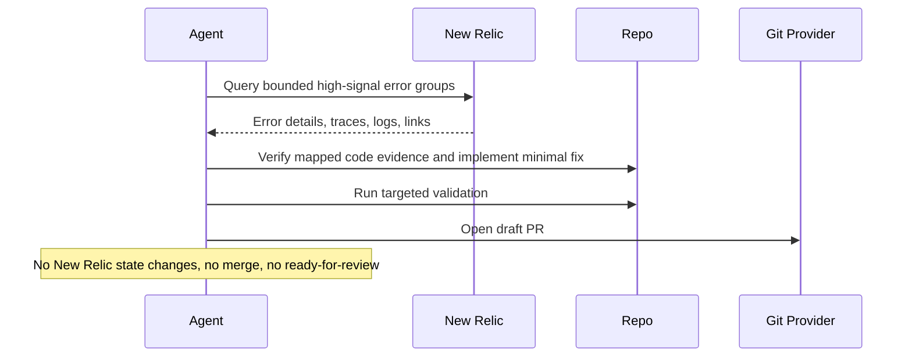

# New Relic Error Fixer

## Overview

`new-relic-error-fixer` selects one strong New Relic error candidate, validates the repository and code evidence, attempts the smallest safe fix, runs validation, and opens a draft PR or prepares PR-ready output.

Use it when you want one high-value production error turned into reviewable engineering work, not an unattended batch autofix pipeline.

If no safe fix is available, the automation still produces a structured investigation report with a Slack-ready summary block.

## How It Works

1. Queries New Relic for a bounded set of recent high-signal unexpected or resurfacing error groups.
2. Requires a bounded service, entity, or workload scope, then ranks candidates and selects at most one error with clear mapping to the current repository, editable in-app code, and available validation commands.
3. Verifies the root-cause hypothesis in the local codebase, implements the smallest safe fix, and adds a targeted regression test when feasible.
4. Runs validation and opens a draft PR, or stops with a reviewable investigation report if the fix cannot be validated safely.



## Prerequisites

- New Relic access through MCP or the official New Relic CLI
- Repository access in the workspace where the fix will be made
- Validation commands for the affected app, package, or service
- GitHub or equivalent PR tooling if you want automatic draft PR creation

Important New Relic constraints:

- Use a least-privilege New Relic account or API key for this automation.
- New Relic documents its MCP server as a preview feature.
- New Relic states that the public preview MCP server must not be used for FedRAMP- or HIPAA-regulated accounts.

## Cursor Cloud Usage

1. Open [Cursor Automations](https://cursor.com/automations/new).
2. Name your automation and paste [new-relic-error-fixer.md](/Users/adamchmara/projects/awesome-agent-automations/automations/new-relic-error-fixer/new-relic-error-fixer.md) as the automation prompt.
3. Add trigger conditions.
4. Add the New Relic MCP server.
   - US accounts: `https://mcp.newrelic.com/mcp/`
   - EU accounts: `https://mcp.eu.newrelic.com/mcp/`
5. Complete the OAuth flow if your Cursor setup supports it, or configure an API key header if your MCP client uses header-based auth.
6. Add the `Open Pull Request` tool, or let the agent use an existing GitHub CLI or plugin in the environment.
7. Make sure the runtime can execute the validation commands required for the mapped repository.
8. Click `Create`.

References:

- [Cursor Automations](https://cursor.com/blog/automations)
- [Set up New Relic MCP](https://docs.newrelic.com/docs/agentic-ai/mcp/setup/)
- [New Relic MCP tool reference](https://docs.newrelic.com/docs/agentic-ai/mcp/tool-reference/)

## Codex App Usage

1. Install the New Relic MCP server in Codex.
   - OAuth method:
   ```bash
   codex mcp add new-relic-mcp-server --url "https://mcp.newrelic.com/mcp/"
   ```
   - EU accounts should replace the URL with `https://mcp.eu.newrelic.com/mcp/`.
2. If you prefer API-key auth, New Relic documents this config shape in `~/.codex/config.toml`:
   ```toml
   [mcp_servers.new-relic]
   url = "https://mcp.newrelic.com/mcp/"
   env_http_headers = { "api-key" = "NEW_RELIC_API_KEY" }
   ```
3. Run Codex and complete `/mcp` authentication if needed.
4. Click `Automation` > `New Automation`.
5. Name your automation and paste [new-relic-error-fixer.md](/Users/adamchmara/projects/awesome-agent-automations/automations/new-relic-error-fixer/new-relic-error-fixer.md) as the automation prompt.
6. Set the schedule or run manually and save the automation.
7. Add the GitHub plugin to Codex, or let Codex use an existing GitHub CLI or tool in the environment.

References:

- [Set up New Relic MCP](https://docs.newrelic.com/docs/agentic-ai/mcp/setup/)
- [Codex Automations](https://openai.com/academy/codex-automations)

## Claude Code Usage

1. Add the New Relic MCP server in Claude Code.
   - OAuth method:
   ```bash
   claude mcp add newrelic --transport http https://mcp.newrelic.com/mcp/
   ```
   - API key method:
   ```bash
   claude mcp add newrelic https://mcp.newrelic.com/mcp/ --transport http --header "Api-Key: NRAK-YOUR-KEY-HERE"
   ```
   - EU accounts should replace the URL with `https://mcp.eu.newrelic.com/mcp/`.
2. Run `claude mcp list` to confirm the server is configured.
3. Open Claude Code and run `/mcp` to authenticate with New Relic in your browser when using OAuth.
4. Make sure the runtime can work in the affected repository and run the required validation commands.
5. For repeated checks in an open Claude Code session, use `/loop`, for example:

```text
/loop weekdays at 11am Follow the instructions in automations/new-relic-error-fixer/new-relic-error-fixer.md
```

6. For durable Claude-managed automation that survives outside the current session, use `/schedule` or create a Routine in `claude.ai/code/routines`.
7. Make sure the runtime has repository write access and PR creation access if you want automatic draft PRs.

References:

- [Set up New Relic MCP](https://docs.newrelic.com/docs/agentic-ai/mcp/setup/)
- [Claude Code MCP](https://code.claude.com/docs/en/mcp)
- [Run prompts on a schedule](https://code.claude.com/docs/en/scheduled-tasks)

## CLI Alternative

If you prefer not to use MCP, the official New Relic CLI is a credible alternative for this automation because it supports New Relic entity discovery plus NRQL and NerdGraph execution.

Install and authenticate it first:

```bash
brew install newrelic-cli
newrelic profile add
```

If you are not using Homebrew, use the official installation guide instead.

Relevant official docs:

- [Get started with the New Relic CLI](https://docs.newrelic.com/docs/new-relic-solutions/tutorials/new-relic-cli/)
- [New Relic CLI reference](https://docs.newrelic.com/docs/new-relic-solutions/build-nr-ui/newrelic-cli/)
- [New Relic CLI repository](https://github.com/newrelic/newrelic-cli)

Use this path when your runner can reliably execute `newrelic nrql` and `newrelic nerdgraph` commands for bounded error investigation and when MCP is unavailable or undesirable.

## Recommended Defaults

| Setting | Default |
| --- | --- |
| Query window | `24h` |
| Candidate pool size | `10` |
| Max root causes fixed per run | `1` |
| Signals | `unexpected`, `resurfacing`, `high recurrence`, `high recent impact` |
| PR mode | `draft-pr` |
| Branch | `fix/new-relic-error-fixer-YYYY-MM-DD` |
| Commit message | `fix: address mapped New Relic error` |

Additional prompt behavior:

- Prefer a local evidence-backed fix over speculative cleanup or broad refactors.
- Stop if service or entity scope is ambiguous.
- Skip expected auth failures, request-validation noise, rate limiting, tenant data problems, and external dependency failures that are not localized product bugs in this repo.
- Stop when repository mapping, root cause, or validation commands are unclear.
- Keep the PR draft until a human reviews it.
- Always emit the investigation report structure when the run stays report-only.

## Useful Repo-Specific Inputs

Tell the runner anything it cannot reliably infer from New Relic alone.

Scope example:

```text
New Relic workload: checkout-production
Entities: checkout-api, checkout-worker
Environment: production
```

Tighter scope example:

```text
Only investigate these New Relic entities: checkout-api.
If the top candidate belongs to any other entity or account, stop and report a scope mismatch.
Exclude expected 4xx validation errors, expected auth failures, and rate-limit behavior.
```

Repository mapping example:

```text
Treat the current repo as the source of truth for `checkout-api`.
If the evidence points to `checkout-worker` or any other service, stop and report a cross-repo blocker instead of guessing.
```

Validation example:

```text
For API changes run:
pnpm test -- --runInBand
pnpm exec tsc --noEmit
```

Guardrails example:

```text
Do not touch auth, billing, migrations, data backfills, or infrastructure code in this automation.
Skip any candidate that requires cross-repository changes.
```

Report sink example:

```text
When no safe fix is available, keep the markdown investigation report and make the Slack-Ready Summary concise enough to paste directly into #eng-incidents.
```

Safe-target example:

```text
Only auto-fix localized server-side product bugs in this repository.
Do not auto-fix client misuse, tenant data issues, partner outages, or incidents that require policy or product decisions.
```
