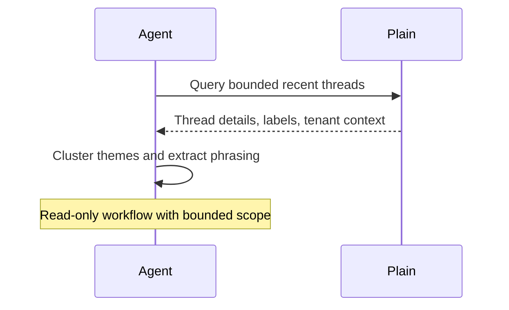

# Plain Customer Voice Digest

## Overview

`plain-customer-voice-digest` reviews a bounded set of recent Plain support threads and turns them into one evidence-backed customer voice summary.

Use it when you want a weekly or twice-weekly readout of what customers are actually saying: recurring pain points, bug language, confusing workflows, repeated objections, and the wording worth preserving for product, support, or marketing work.

## How It Works

1. Reads a bounded slice of recent support threads from Plain.
2. Expands only the thread and tenant context needed to understand repeated themes.
3. Clusters the strongest signals into a small number of themes and keeps the output simple enough to scan quickly.
4. If durable automation memory is available, compares current themes against `memory.md` to mark them as new, recurring, persistent, escalating, or cooling.
5. Selects representative examples and useful customer phrasing.
6. Produces one compact digest. If delivery tools are unavailable, it returns the digest as preview output.



## When To Use It

- weekly support insight review
- product feedback review grounded in real threads
- support-manager summaries
- customer-language mining for docs or messaging

## Prerequisites

- Plain access through the official MCP server
- A workspace with enough thread volume to produce repeated signals
- Optional durable automation memory if you want cross-run trend detection
- Optional Slack or docs tooling only if you want the digest delivered somewhere else

## Cursor Cloud Usage

1. Open [Cursor Automations](https://cursor.com/automations/new).
2. Name your automation and paste [plain-customer-voice-digest.md](/Users/adamchmara/projects/awesome-agent-automations/automations/plain-customer-voice-digest/plain-customer-voice-digest.md) as the automation prompt.
3. Add the Plain MCP server at `https://mcp.plain.com/mcp` and complete the OAuth flow.
4. Add optional delivery tooling only if you want the digest posted outside the run output.
5. If the platform supports persistent automation memory, allow the run to reuse `memory.md`.
6. Save the automation.

References:

- [Plain MCP Server](https://help.plain.com/article/mcp-server)

## Codex App Usage

1. Install the Plain MCP server in Codex:
  ```bash
  codex mcp add plain -- npx -y mcp-remote https://mcp.plain.com/mcp
  codex mcp list
  ```
  This wrapper matters for Codex runs that use `codex exec` or automations. In testing, the direct streamable HTTP setup with `codex mcp add plain --url https://mcp.plain.com/mcp` did not expose Plain as a callable tool source inside the automation runner, while the `mcp-remote` stdio wrapper did.
2. Click `Automation` > `New Automation`.
3. Name your automation and paste [plain-customer-voice-digest.md](/Users/adamchmara/projects/awesome-agent-automations/automations/plain-customer-voice-digest/plain-customer-voice-digest.md) as the automation prompt.
4. Add optional delivery tools only if you want the digest sent elsewhere.
5. If supported by the automation runner, let the automation reuse persistent `memory.md` between runs for trend detection.
6. Set the schedule or run manually and save the automation.

References:

- [Plain MCP Server](https://help.plain.com/article/mcp-server)
- [Codex Automations](https://openai.com/academy/codex-automations)

## Claude Code Usage

1. Add the Plain MCP server in Claude Code:
  ```bash
  claude mcp add --transport http plain https://mcp.plain.com/mcp
  claude mcp list
  ```
2. Open Claude Code and run `/mcp` to authenticate with Plain.
3. For repeated checks in an open Claude Code session, use `/loop`, for example:

```text
/loop 1w Follow the instructions in automations/plain-customer-voice-digest/plain-customer-voice-digest.md
```

4. For durable Claude-managed automation, use `/schedule` or create a Routine in `claude.ai/code/routines`.
5. If the runner supports persistent memory files, allow reuse of `memory.md` between runs; otherwise the automation stays stateless and avoids trend claims.

References:

- [Plain MCP Server](https://help.plain.com/article/mcp-server)
- [Run prompts on a schedule](https://code.claude.com/docs/en/scheduled-tasks)

## Recommended Defaults

| Setting | Default |
| --- | --- |
| Time window | `last 7 days` |
| First-pass candidate pool | `up to 50 threads` |
| Representative examples per theme | `1 to 3` |
| Final theme count | `3 to 5` |
| Signal status | `new/recurring/persistent/escalating/cooling when memory exists; current-window otherwise` |
| Empty-run behavior | `report that no repeated themes qualified` |
| Delivery mode | `preview output` |

Additional guidance:

- Favor repeated evidence over one loud anecdote.
- Prefer themes that imply action, confusion, or risk.
- Preserve customer wording only in short excerpts.
- Keep classification logic richer than the visible report. The output should stay readable.
- Use `memory.md` only for compact theme fingerprints and trend hints, not raw customer transcripts.
- Keep the digest compact enough for a product or support lead to scan quickly.

## Useful Workspace-Specific Inputs

Tell the runner anything it cannot infer reliably from Plain alone.

Scope example:

```text
Focus on external customer threads only.
Exclude spam, test tenants, internal dogfooding, and hiring or partnership conversations.
```

Theme policy example:

```text
Prioritize bugs, confusing setup flows, pricing objections, onboarding friction, and repeated feature gaps.
Treat one-off billing edge cases as lower priority unless they recur across multiple tenants.
```

Delivery example:

```text
If Slack is connected, post the final digest to #support-insights.
If Slack is not connected, keep the digest in preview output only.
```
