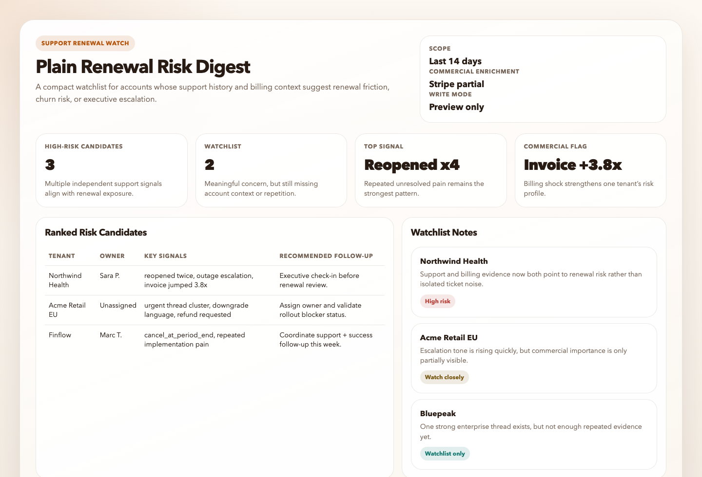
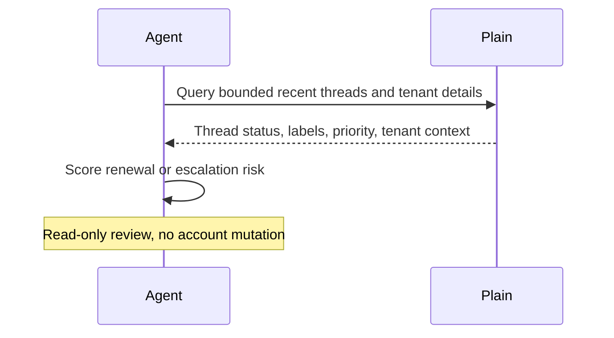

# Plain Renewal Risk Digest

## Overview

`plain-renewal-risk-digest` reviews recent Plain support activity for accounts that may be heading toward renewal friction, churn risk, or executive escalation.

Use it when your Plain workspace carries enough tenant or account context to connect support behavior with renewal-sensitive customers. This automation is intentionally stricter than the customer voice digest because false positives are expensive. When the workspace is writable, it can also persist a companion static HTML artifact for watchlist review.

## Preview



## How It Works

1. Reads a bounded set of recent support threads and tenant details from Plain.
2. Resolves real tenant and customer display names when the workspace exposes them, plus representative thread links and owners.
3. Looks for repeated negative signals such as unresolved pain, escalations, priority spikes, repeated reopenings, billing shock, downgrade pressure, or concentrated issue volume.
4. If Stripe is available and account matching is reliable, enriches the support signals with subscription, invoice, refund, dispute, failed-payment, contraction, or cancellation context.
5. Ranks only the clearest at-risk tenants or thread clusters.
6. Produces one compact risk digest and stops short of making any customer-facing or system-facing changes.



## When To Use It

- weekly CSM or support-lead risk review
- pre-renewal account health review
- escalation watch for high-value tenants
- support-driven churn signal detection

## Prerequisites

- Plain access through the official MCP server
- Reliable tenant or account context in Plain
- Optional Stripe access if you want commercial enrichment that separates support pain from true renewal risk

## Cursor Cloud Usage

1. Open [Cursor Automations](https://cursor.com/automations/new).
2. Name your automation and paste [plain-renewal-risk-digest.md](/Users/adamchmara/projects/awesome-agent-automations/automations/plain-renewal-risk-digest/plain-renewal-risk-digest.md) as the automation prompt.
3. Add the Plain MCP server at `https://mcp.plain.com/mcp` and complete the OAuth flow.
4. Optionally add a short workspace note if you want to narrow scope to enterprise, strategic, or renewal-sensitive tenants.
5. Save the automation.

References:

- [Plain MCP Server](https://help.plain.com/article/mcp-server)

## Codex App Usage

1. Install the Plain MCP server in Codex:
  ```bash
  codex mcp add plain -- npx -y mcp-remote https://mcp.plain.com/mcp
  codex mcp list
  ```
  This wrapper matters for Codex runs that use `codex exec` or automations. In testing, the direct streamable HTTP setup with `codex mcp add plain --url https://mcp.plain.com/mcp` did not expose Plain as a callable tool source inside the automation runner, while the `mcp-remote` stdio wrapper did.
2. If Stripe is available in your Codex environment, leave it connected so the automation can enrich support-driven risk with subscription and billing context when matching is reliable.
3. Click `Automation` > `New Automation`.
4. Name your automation and paste [plain-renewal-risk-digest.md](/Users/adamchmara/projects/awesome-agent-automations/automations/plain-renewal-risk-digest/plain-renewal-risk-digest.md) as the automation prompt.
5. Optionally add a short workspace note if you want to narrow scope to enterprise, strategic, or renewal-sensitive tenants.
6. Set the schedule or run manually and save the automation.

References:

- [Plain MCP Server](https://help.plain.com/article/mcp-server)
- [Codex Automations](https://openai.com/academy/codex-automations)

## Claude Code Usage

1. Add the Plain MCP server in Claude Code:
  ```bash
  claude mcp add --transport http plain https://mcp.plain.com/mcp
  claude mcp list
  ```
2. Open Claude Code and run `/mcp` to authenticate with Plain.
3. Optionally prepend a short workspace note if you want to narrow scope to enterprise, strategic, or renewal-sensitive tenants.
4. For repeated checks in an open Claude Code session, use `/loop`, for example:

```text
/loop 1w Follow the instructions in automations/plain-renewal-risk-digest/plain-renewal-risk-digest.md
```

5. For durable Claude-managed automation, use `/schedule` or create a Routine in `claude.ai/code/routines`.

References:

- [Plain MCP Server](https://help.plain.com/article/mcp-server)
- [Run prompts on a schedule](https://code.claude.com/docs/en/scheduled-tasks)

## Recommended Defaults

| Setting | Default |
| --- | --- |
| Review window | `last 14 days` |
| First-pass candidate pool | `up to 40 threads` |
| Final risk list | `up to 10 tenants or thread clusters` |
| Default scope | `customer-facing tenant-linked activity with obvious noise excluded` |
| Preferred identity output | `tenant name, customer name, owner, and thread links when available` |
| Commercial enrichment | `use Stripe only when account matching is reliable` |
| Delivery mode | `preview output with optional static HTML artifact` |
| Write mode | `read-only` |

Additional guidance:

- Start with manual review of the digest before operationalizing any downstream workflow.
- Narrow to renewal-sensitive or strategic accounts when the workspace can define that scope clearly, but do not require operator configuration just to run.
- Prefer repeated evidence over sentiment alone.
- Prefer real tenant and customer display names over anonymized placeholders whenever the workspace exposes them.
- Use Stripe to confirm business significance, not to override clear support evidence or to guess at weak account matches.
- Exclude low-context noisy customers unless the operator explicitly includes them.
- When account importance or renewal timing is unclear, classify candidates as watchlist rather than high risk.

## Useful Workspace-Specific Inputs

Tell the runner anything it cannot infer reliably from Plain alone.

Risk scope example:

```text
Only evaluate enterprise and mid-market tenants.
Ignore free workspaces, sandbox tenants, and internal accounts.
```

Renewal policy example:

```text
Treat these as strong signals:
- repeated unresolved bugs
- multiple reopenings within 14 days
- urgent or high-priority threads from the same tenant
- explicit churn, cancellation, rollback, or legal-escalation language
Treat these as weak signals unless repeated:
- generic dissatisfaction
- one delayed response
- a single feature request without operational impact
```

Scope note example:

```text
If tenant tier is visible, prioritize enterprise and strategic accounts first.
If tenant tier is not visible, stay read-only and use watchlist language unless the support pattern is clearly severe.
```

Stripe enrichment example:

```text
If Stripe is connected and the tenant/customer match is reliable, enrich each risk candidate with:
- subscription status
- current plan
- recent invoice spikes
- failed payments
- refunds or disputes
- scheduled cancellation or contraction
If the match is ambiguous, skip Stripe enrichment instead of guessing.
```

Escalation example:

```text
If Slack is connected, send only the final ranked digest to #customer-risk-review.
Do not notify customer-facing channels directly.
```
