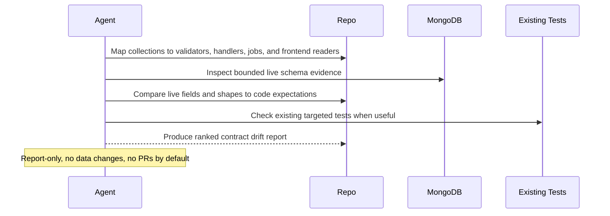

# Production Data Contract Change Watch

## Overview

`production-data-contract-change-watch` compares live MongoDB document shapes against the contracts implied by the current repository's API handlers, background jobs, and frontend data consumers, then returns one ranked read-only drift report.

It is for catching the kinds of failures that often slip past code review and unit tests: brittle migrations, partially rolled out fields, legacy app versions still writing old shapes, and background jobs producing inconsistent records. The useful output is not a raw schema dump. It is a short contract drift report with affected collections, code paths, evidence, and test ideas.

Use it when you want a recurring answer to a concrete question such as "does production data still match what the code now expects?" rather than a generic schema inventory.

## How It Works

1. Resolves the current repository and one production or production-like MongoDB data source.
2. Searches the repo for contract surfaces tied to persistence boundaries such as validators, model definitions, parsers, serializers, and code paths that read or write Mongo-backed documents.
3. Builds a bounded list of collections worth reviewing first, based on real code usage rather than scanning everything equally.
4. Uses MongoDB schema inspection or bounded document sampling to compare live shapes against the contracts the code appears to rely on.
5. Ranks only the mismatches that look materially risky, then returns one concise drift report with evidence, affected code paths, likely producers, and concrete test ideas.



## When To Use It

- schema-affecting changes have landed and you want a production-reality check
- mobile, desktop, or old web clients may still write legacy document shapes
- background jobs or integrations may be producing inconsistent records
- a migration was partial, interrupted, or intentionally long-lived
- API handlers or frontend readers assume fields that production data may not consistently contain
- you want test ideas grounded in live drift instead of hypothetical edge cases

## Prerequisites

- repository read access and a runtime that can inspect the current repo with `git` and `rg`
- read-only access to one production or production-like MongoDB database, preferably through MongoDB MCP or a read-only `mongosh` profile
- optional targeted test commands if you want the automation to strengthen a finding with existing repo validation

The automation should degrade to `partial` only when some collections or code paths are unreadable. If it cannot identify one trustworthy live data source for the repo, it should stop with `Status: blocked` rather than guessing.

### MongoDB Setup

Preferred setup for repeated runs:

1. Connect MongoDB MCP to the cluster or replica set you want inspected.
2. Use read-only credentials scoped to the target database.
3. Prefer a replica, analytics node, or other approved read path when production policy requires it.
4. Make sure the runtime can inspect collections, read bounded schema statistics, and run small read-only sample queries.

True CLI alternative:

1. Install `mongosh` in the runner environment.
2. Provide a read-only connection string or profile.
3. Verify that the runner can connect and read metadata before scheduling the automation.

Example connectivity check:

```bash
mongosh "$MONGODB_URI" --eval 'db.runCommand({ ping: 1 })'
```

The automation should keep all live reads bounded. It should not run unbounded collection scans or export whole documents into the model context.

## Cursor Cloud Usage

1. Open [Cursor Automations](https://cursor.com/automations/new).
2. Name your automation and paste [production-data-contract-change-watch.md](/Users/adamchmara/projects/awesome-agent-automations/automations/production-data-contract-change-watch/production-data-contract-change-watch.md) as the automation prompt.
3. Make sure the runtime can read the current repo and either access MongoDB MCP or execute `mongosh`.
4. If you want stronger confidence, also make the repository's targeted test commands available in the runtime.
5. Set the schedule or run manually, then save the automation.

## Codex App Usage

1. Make the current repo available in the Codex run environment.
2. Add MongoDB MCP with read-only access to the production or production-like database you want reviewed, or provide `mongosh` in the environment.
3. Click `Automation` > `New Automation`.
4. Paste [production-data-contract-change-watch.md](/Users/adamchmara/projects/awesome-agent-automations/automations/production-data-contract-change-watch/production-data-contract-change-watch.md) as the automation prompt.
5. Optionally allow existing targeted test commands for the repo if you want the run to confirm nearby validation coverage.
6. Set the schedule or run manually and save the automation.

## Claude Code / Codex CLI / Copilot Usage

1. Start the agent in the repository you want reviewed.
2. Make one live MongoDB read path available through MongoDB MCP or `mongosh`.
3. Keep the runtime read-only for database access and bounded for collection inspection.
4. For repeated checks in an open Claude Code session, use `/loop`, for example:

```text
/loop 1d Follow the instructions in automations/production-data-contract-change-watch/production-data-contract-change-watch.md
```

5. For durable Claude-managed automation outside the current session, use `/schedule` or create a Routine in `claude.ai/code/routines`.

## Recommended Defaults

| Setting | Default |
| --- | --- |
| Scope | `current repository and one production or production-like MongoDB database` |
| Candidate collections | `up to 12` |
| Live evidence | `schema stats first, then bounded sampling when needed` |
| Sampling budget | `up to 100 documents per reviewed collection unless a stronger schema surface exists` |
| Ranked findings | `up to 10` |
| Evidence policy | `field names, types, counts, and redacted examples only` |
| Validation | `existing targeted tests only when clearly relevant` |
| Writes | `none` |
| Output | `Markdown contract drift report` |

Additional prompt behavior:

- Prefer collections that are touched by current handlers, jobs, and frontend readers over audit, event-log, cache, and session collections.
- Treat runtime validators and explicit parser code as stronger contract signals than loose TypeScript interfaces alone.
- Separate `confirmed drift` from `compatibility risk`, `tolerated legacy shape`, and `unknown due to limited evidence`.
- Down-rank one-off anomalies unless even a single bad document would break a critical path.
- Prefer evidence from current code and live data over old migration comments or stale docs.
- Never include raw full-document dumps, secrets, tokens, email addresses, or long identifiers in the report.
- If a useful baseline such as an ongoing migration, feature flag, or backward-compatibility shim exists, mention it and lower the risk level when appropriate.

## Useful Workspace-Specific Inputs

Tell the runner anything it cannot safely infer from the repo and live data alone.

Database scope example:

```text
Use the app-prod cluster and the app database only.
If both primary and analytics replicas are visible, prefer analytics for read-only inspection.
```

Collection priority example:

```text
Prioritize users, organizations, subscriptions, invoices, and job_runs.
Ignore analytics events, session stores, audit trails, and cache collections unless current code changes directly touched them.
```

Contract-authority example:

```text
Treat src/contracts/, src/routes/, and shared zod schemas as authoritative over older interface-only types.
Treat frontend fallback rendering as weaker evidence than API request and response validation.
```

Legacy-shape example:

```text
The legacy field customerIdString is tolerated during the mobile 4.x rollout.
Do not rank it unless current server code has already removed that compatibility path.
```

Validation example:

```text
If a finding maps cleanly to an existing test target, prefer:
pnpm --filter api test -- src/contracts
pnpm --filter worker test -- src/jobs
pnpm --filter web test -- src/lib/data
```

## Limitations

- This automation is strongest when the repo has explicit validators, parsers, or well-defined persistence boundaries.
- Bounded sampling can miss extremely rare drift, so absence of findings is not a formal proof of uniform data quality.
- Intentional multi-version compatibility windows can look risky without operator context, so repo-specific notes improve ranking quality.
- It can identify likely contract drift and test ideas, but it does not replace migration plans, backfills, or deeper data-quality programs.
