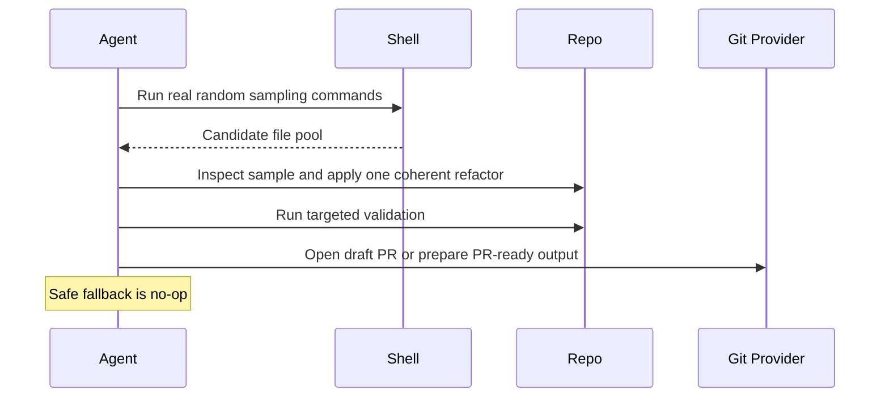

# Sampled Refactor

## Overview

`sampled-refactor` inspects a real random slice of a JavaScript or TypeScript repository, applies at most one coherent behavior-preserving refactor, validates it, and opens a draft PR or prepares PR-ready output.

Use it for recurring maintainability improvements when you want conservative end-to-end automation instead of a report-only scout.

## How It Works

1. Searches the whole repository for source files while excluding hidden directories, well-known ignore locations, and similar non-source paths.
2. Runs one explicit sampling command using `shuf -n 8` or `sort -R | head -8`, then prints the exact command and raw sampled output.
3. Chooses 3-5 files from that sample for inspection and selects at most one coherent refactor.
4. Expands scope only when needed to complete that one refactor safely.
5. Runs targeted validation for the changed surface.
6. Opens a draft PR, or prepares PR-ready output when PR tooling is unavailable.
7. Stops with a short no-change summary when nothing is safe enough.



## Cursor Cloud Usage

1. Open [Cursor Automations](https://cursor.com/automations/new).
2. Name your automation and paste [sampled-refactor.md](/Users/adamchmara/projects/awesome-agent-automations/automations/sampled-refactor/sampled-refactor.md) as the automation prompt.
3. Add trigger conditions.
4. Add the `Open Pull Request` tool, or let the agent use an existing GitHub CLI or plugin in the environment.
5. Make sure the runtime can execute shell discovery and randomization commands plus the validation commands relevant to your repo.
6. Click `Create`.

## Codex App Usage

1. Click `Automation` > `New Automation`.
2. Name your automation and paste [sampled-refactor.md](/Users/adamchmara/projects/awesome-agent-automations/automations/sampled-refactor/sampled-refactor.md) as the automation prompt.
3. Set schedule or run manually and save the automation.
4. Add the GitHub plugin to Codex, or let Codex use an existing GitHub CLI/tool in the agent environment.
5. Make sure the environment can execute repository sampling commands and relevant validation commands.

## Claude Code / Codex CLI / Copilot Usage

1. No extra MCP setup is required for the core workflow.
2. Make sure the runtime can execute shell discovery commands, a real randomization command, and the validation commands you expect.
3. For repeated checks in an open Claude Code session, use `/loop`, for example:

```text
/loop 1d Follow the instructions in automations/sampled-refactor/sampled-refactor.md
```

4. For durable Claude-managed automation, use `/schedule` or create a Routine in `claude.ai/code/routines`.
5. In Codex CLI or Copilot coding-agent environments, run the prompt on a schedule only if the environment already has repository write access, validation commands, and PR tooling configured.

References:

- [Cursor Automations](https://cursor.com/blog/automations)
- [Codex Automations](https://openai.com/academy/codex-automations)
- [Claude Code CLI Reference](https://code.claude.com/docs/en/cli-usage)
- [Run prompts on a schedule](https://code.claude.com/docs/en/scheduled-tasks)
- [Automate work with routines](https://code.claude.com/docs/en/web-scheduled-tasks)

## Recommended Defaults

| Setting | Default |
| --- | --- |
| Candidate files sampled | `8` |
| Final chosen slice | `3-5` distinct files |
| Default languages | `js`, `jsx`, `ts`, `tsx` |
| Implemented refactors per run | `1` |
| Preferred randomizer | `shuf`, fallback `sort -R` |
| Branch | `refactor/sampled-refactor-YYYY-MM-DD` |
| Commit message | `refactor(code-health): apply sampled refactor` |
| PR mode | `Draft` |

Additional prompt behavior:

- If safe random sampling cannot run, stop without edits.
- If no candidate has a credible validation path, stop without edits.
- If nothing is strong enough, return a short no-change summary.

## Useful Repo-Specific Inputs

Guardrails example:

```text
Do not edit generated files directly. Skip migrations, seeds, infrastructure config, and files under vendor/.
```

Validation example:

```text
For validation, run the actual repo commands for the affected package or app, for example:
pnpm --filter api exec tsc --noEmit
pnpm --filter web exec tsc --noEmit
pnpm --filter worker test
```

Sampling roots example:

```text
To scope the automation, replace `find .` with a narrower root such as `find apps/web` or add extra exclusions like `! -path "*/legacy/*"`.
If your repo keeps real source in a hidden directory such as `.storybook`, remove `! -path "*/.*/*"` from the sampling commands.
```

Protected paths example:

```text
Never edit files under generated/, dist/, coverage/, or .next/.
```

Language example:

```text
To use this outside JS/TS, replace the default extension matcher in both sampling commands. For example, use `-name "*.py"` for Python or add `-o -name "*.go"` for Go.
```
