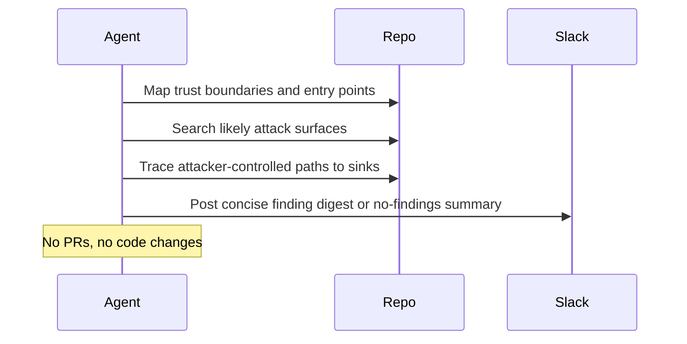

# Scan Codebase Vulnerabilities

## Overview

`scan-codebase-vulnerabilities` is a scheduled or manual application-security reviewer for a repository. It looks for validated medium, high, or critical vulnerabilities with a real end-to-end attack path and posts a concise Slack summary (or equivalent messaging-platform summary) or preview.

This automation is for exploitable code-path security review, not dependency version remediation. If you want draft PRs for vulnerable packages, use `dependency-vulnerability-autofix` instead.

## How It Works

1. Maps the repository's key trust boundaries and exposed entry points.
2. Searches for high-signal attack surfaces such as auth flows, request handlers, raw SQL, shell execution, file access, templating, webhooks, and secret handling.
3. Verifies exploitability with concrete code tracing.
4. Reports only validated medium+ findings with a real attacker, controllable input, reachable sink, and clear impact.
5. Posts one concise Slack summary (or equivalent messaging-platform summary), or renders preview output when delivery is unavailable.



## When To Use It

Use it when:

- you want recurring repository-level appsec review
- you want only validated medium+ findings, not speculative security lint
- you want Slack delivery, another messaging-platform delivery surface, or preview output instead of code changes

## Cursor Cloud Usage

1. Open [Cursor Automations](https://cursor.com/automations/new).
2. Name your automation and paste [scan-codebase-vulnerabilities.md](/Users/adamchmara/projects/awesome-agent-automations/automations/scan-codebase-vulnerabilities/scan-codebase-vulnerabilities.md) as the automation prompt.
3. Add Slack, or another messaging platform, as the delivery tool.
4. Set a schedule or run manually.
5. Click `Create`.

References:

- [Cursor Automations](https://cursor.com/blog/automations)
- [Scan codebase for vulnerabilities](https://cursor.com/en/marketplace/automations/scan-codebase-vulnerabilities)

## Codex App Usage

1. Click `Automation` > `New Automation`.
2. Name your automation and paste [scan-codebase-vulnerabilities.md](/Users/adamchmara/projects/awesome-agent-automations/automations/scan-codebase-vulnerabilities/scan-codebase-vulnerabilities.md) as the automation prompt.
3. Set the schedule or run manually and save the automation.
4. Add a Slack connector or another messaging-platform connector, or let the environment provide an equivalent notification surface.

References:

- [Codex Automations](https://openai.com/academy/codex-automations)

## Claude Code Usage

1. No extra MCP setup is required for the core prompt.
2. For repeated checks in an open Claude Code session, use `/loop`, for example:

```text
/loop 1d Follow the instructions in automations/scan-codebase-vulnerabilities/scan-codebase-vulnerabilities.md
```

3. For durable Claude-managed automation that survives outside the current session, use `/schedule` or create a Routine in `claude.ai/code/routines`.

Claude-native automation options:

- `/loop` for repeated runs in the current session
- `/schedule` for scheduled routines managed by Claude
- Routines in `claude.ai/code/routines` for durable cloud-hosted automation

References:

- [Claude Code MCP](https://code.claude.com/docs/en/mcp)
- [Claude Code CLI Reference](https://code.claude.com/docs/en/cli-usage)
- [Run prompts on a schedule](https://code.claude.com/docs/en/scheduled-tasks)
- [Automate work with routines](https://code.claude.com/docs/en/web-scheduled-tasks)

## Recommended Defaults

| Setting | Default |
| --- | --- |
| Review mode | `full repository` |
| Severity threshold | `medium` and above |
| Max findings in final digest | `5` |
| Delivery | `Slack or equivalent messaging platform if available, otherwise preview` |
| Code changes | `never` |

Additional prompt behavior:

- If a candidate issue cannot be defended with a concrete attack path, skip it.
- If nothing qualifies, post a short no-findings summary rather than a heartbeat full of noise.
- If the repo is too large to review exhaustively in one run, focus on the highest-risk trust boundaries first and say what was not covered.

## Useful Repo-Specific Inputs

Tell the runner anything it cannot reliably infer from the repo.

Scope example:

```text
Prioritize the API gateway, auth services, background webhook workers, and admin surfaces.
Ignore test fixtures, local scripts, and generated clients unless they are reachable in production.
```

Threat model example:

```text
Treat anonymous users, authenticated users, tenant admins, and external webhook senders as separate attacker classes.
Assume the most sensitive assets are account takeover paths, secrets, billing actions, and cross-tenant data access.
```

Notification example:

```text
Post the final digest to #security-review and include a one-line "no validated medium+ vulnerabilities found" message when nothing qualifies.
```
