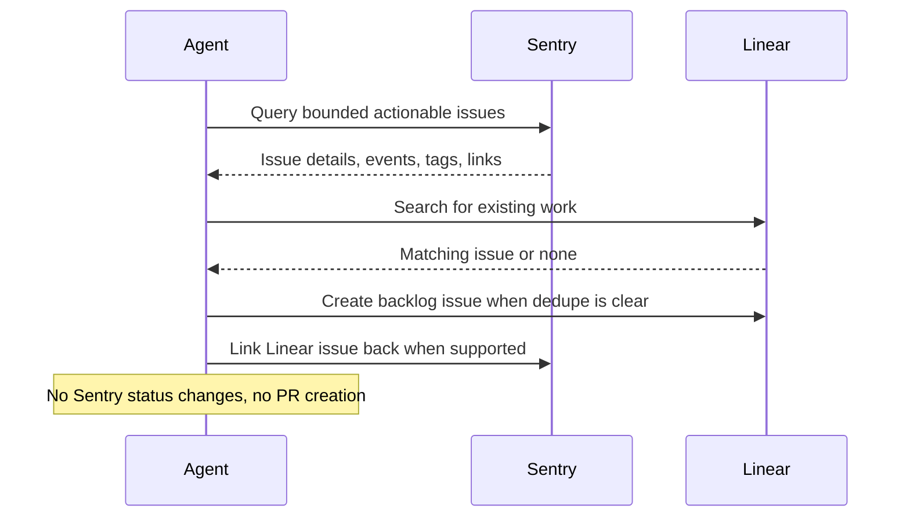

# Sentry Linear Backlog Sync

## Overview

`sentry-linear-backlog-sync` takes actionable Sentry issues, proves they are not already tracked, and creates or links durable Linear backlog work.

Use it when Sentry should remain the operational source of truth for production error evidence, while Linear becomes the durable planning and ownership surface for follow-up work.

## How It Works

1. Queries Sentry for a bounded set of high-signal unresolved issues such as regressed, escalating, for-review, or high-priority production issues.
2. Expands each candidate with issue evidence, impact, owner hints, and any existing external links.
3. Searches Linear for existing work using the Sentry short ID, permalink, title fingerprint, and stack/context clues.
4. Creates or updates at most a small number of Linear issues, then links the resulting Linear work back to Sentry when that integration path is available.



## Prerequisites

- Sentry access through MCP or [`sentry-cli`](#cli-alternative)
- Linear read and issue-write access through MCP, API, or a connector
- A defined Sentry organization, project, and environment scope

## Cursor Cloud Usage

1. Open [Cursor Automations](https://cursor.com/automations/new).
2. Name your automation and paste [sentry-linear-backlog-sync.md](/Users/adamchmara/projects/awesome-agent-automations/automations/sentry-linear-backlog-sync/sentry-linear-backlog-sync.md) as the automation prompt.
3. Add trigger conditions.
4. Click `Add tools or MCP` > `MCP server`.
5. Add the hosted Sentry MCP server at `https://mcp.sentry.dev/mcp` and complete the connection flow.
  - CLI alternative: use [`sentry-cli`](#cli-alternative) in the agent environment instead of steps 4-5.
6. Add Linear access through a Linear MCP server, Linear API tool, or workspace connector that supports issue search and issue creation.
7. Click `Create`.

References:

- [Cursor Automations](https://cursor.com/blog/automations)
- [Sentry MCP](https://mcp.sentry.dev)
- [Linear API](https://developers.linear.app/docs/graphql/working-with-the-graphql-api)

## Codex App Usage

1. Install the hosted Sentry MCP server in Codex:
  ```bash
  codex mcp add sentry --url https://mcp.sentry.dev/mcp
  codex mcp login sentry
  codex mcp list
  ```
  - CLI alternative: use [`sentry-cli`](#cli-alternative) in the agent environment instead of MCP.
2. Add Linear access in the runner through a connector, MCP server, or API-backed tool that can search and create issues.
3. Click `Automation` > `New Automation`.
4. Name your automation and paste [sentry-linear-backlog-sync.md](/Users/adamchmara/projects/awesome-agent-automations/automations/sentry-linear-backlog-sync/sentry-linear-backlog-sync.md) as the automation prompt.
5. Set schedule or run manually and save the automation.

References:

- [Codex Automations](https://openai.com/academy/codex-automations)
- [Sentry MCP](https://mcp.sentry.dev)
- [Linear API](https://developers.linear.app/docs/graphql/working-with-the-graphql-api)

## Claude Code Usage

1. Add the hosted Sentry MCP server in Claude Code:
  ```bash
  claude mcp add --transport http sentry https://mcp.sentry.dev/mcp
  claude mcp list
  ```
  - To share the MCP configuration through the repo, use `--scope project`.
  - CLI alternative: use [`sentry-cli`](#cli-alternative) in the agent environment instead of MCP.
2. Open Claude Code and run `/mcp` to authenticate with Sentry in your browser.
3. Make sure the runtime can search and create Linear issues through MCP, API, or a connector.
4. For repeated checks in an open Claude Code session, use `/loop`, for example:

```text
/loop weekdays at 10am Follow the instructions in automations/sentry-linear-backlog-sync/sentry-linear-backlog-sync.md
```

5. For durable Claude-managed automation that survives outside the current session, use `/schedule` or create a Routine in `claude.ai/code/routines`.

Claude-native automation options:

- `/loop` for repeated runs in the current session
- `/schedule` for scheduled routines managed by Claude
- Routines in `claude.ai/code/routines` for durable cloud-hosted automation

References:

- [Claude Code MCP](https://code.claude.com/docs/en/mcp)
- [Claude Code CLI Reference](https://code.claude.com/docs/en/cli-usage)
- [Run prompts on a schedule](https://code.claude.com/docs/en/scheduled-tasks)
- [Automate work with routines](https://code.claude.com/docs/en/web-scheduled-tasks)

## CLI Alternative

If you prefer not to use MCP for Sentry, `sentry-cli` is a strong portable fallback for this automation.

Install and authenticate it first:

```bash
brew install getsentry/tools/sentry-cli
sentry-cli login
```

If you are not using Homebrew, use the official install guide instead. The generic installer and platform-specific options are documented here:

- [Sentry CLI Installation](https://docs.sentry.dev/cli/installation/)
- [Sentry CLI Configuration and Authentication](https://docs.sentry.dev/cli/configuration/)

Useful examples:

```bash
sentry issue list <org>/<project> --query "is:unresolved issue.priority:high" --json
sentry issue view <issue-id> --json
sentry issue events <issue-id> --json
```

If you use this path, make sure the agent runtime can authenticate with `sentry-cli` and that the token has the issue and event scopes you need.

## Recommended Defaults

| Setting | Default |
| --- | --- |
| Query window | `24h` |
| Candidate pool size | `20` |
| Max Linear issues per run | `3` |
| Signals | `is:regressed`, `is:escalating`, `issue.priority:high`, `is:unresolved is:for_review` |
| Linear mode | `create-or-link` |
| Link-back mode | `best-effort` |
| Empty run mode | `no-create` |
| Cooldown | `24h per unchanged issue when prior state is available` |

Additional prompt behavior:

- Start in preview or prepare-only mode until dedupe quality is trusted.
- Prefer linking to existing Linear work over creating new issues.
- Keep the issue body concise and evidence-backed rather than copying raw event data.

## Adapting To Other Trackers

The runtime prompt is intentionally Linear-first because that is the recommended durable work-tracking layer for this automation.

To adapt the same package to GitHub Issues, Jira, Asana, or another tracker, keep these invariants:

- Sentry remains the source of truth for issue evidence, impact, and existing external links.
- The tracker search step must still dedupe on Sentry short ID, permalink, title fingerprint, and stack or ownership clues.
- The automation should create at most a small number of items per run.
- Link-back to Sentry should remain best-effort rather than required.

The main adaptation points are:

- issue search and create APIs
- project, team, label, and priority mapping
- assignee identity mapping
- permalink format for the created work item

If your tracker has weaker dedupe search than Linear, keep the automation in preview or prepare-only mode until the duplicate rate is acceptable.

## Useful Workspace-Specific Inputs

Tell the runner anything it cannot reliably infer from Sentry or Linear alone.

Scope example:

```text
Organization: acme
Projects: api, web
Environments: production
Linear team: Platform
```

Deduplication example:

```text
Treat an existing Linear issue as a match when it contains the Sentry short ID, Sentry permalink, or a clearly matching stack signature in the description.
```

Priority mapping example:

```text
Map Sentry regressions and escalating issues to Linear priority 2, and high-impact unresolved production issues to Linear priority 3 unless an existing team policy overrides that mapping.
```

Redaction example:

```text
Do not include emails, account IDs, tenant IDs, auth headers, cookies, request bodies, or any tag values that identify a customer. It is safe to include project, release, environment, transaction name, and sanitized URL path.
```
