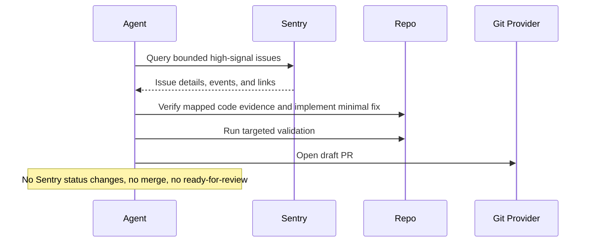

# Sentry Triage And Fix

## Overview

`sentry-triage-and-fix` selects one strong Sentry issue candidate, validates the repository and code evidence, attempts the smallest safe fix, runs validation, and opens a draft PR or prepares PR-ready output.

Use it when you want one high-value production issue turned into reviewable engineering work, not an unattended batch autofix pipeline.

## How It Works

1. Queries Sentry for a bounded set of high-signal unresolved issues.
2. Ranks candidates and selects at most one issue with clear repository mapping, in-app stack evidence, and available validation commands.
3. Verifies the root-cause hypothesis in the local codebase, implements the smallest safe fix, and adds a targeted regression test when feasible.
4. Runs validation and opens a draft PR, or stops with a reviewable report if the fix cannot be validated safely.



## Prerequisites

- Sentry access through MCP or [`sentry-cli`](#cli-alternative)
- Repository access in the workspace where the fix will be made
- Validation commands for the affected app, package, or service
- GitHub or equivalent PR tooling if you want automatic draft PR creation

## Cursor Cloud Usage

1. Open [Cursor Automations](https://cursor.com/automations/new).
2. Name your automation and paste [sentry-triage-and-fix.md](/Users/adamchmara/projects/awesome-agent-automations/automations/sentry-triage-and-fix/sentry-triage-and-fix.md) as the automation prompt.
3. Add trigger conditions.
4. Click `Add tools or MCP` > `MCP server`.
5. Add the hosted Sentry MCP server at `https://mcp.sentry.dev/mcp` and complete the connection flow.
  - CLI alternative: use [`sentry-cli`](#cli-alternative) in the agent environment instead of steps 4-5.
6. Add the `Open Pull Request` tool, or let the agent use an existing GitHub CLI or plugin in the environment.
7. Make sure the runtime can execute the validation commands required for the mapped repository.
8. Click `Create`.

References:

- [Cursor Automations](https://cursor.com/blog/automations)
- [Sentry MCP](https://mcp.sentry.dev)

## Codex App Usage

1. Install the hosted Sentry MCP server in Codex:
  ```bash
  codex mcp add sentry --url https://mcp.sentry.dev/mcp
  codex mcp login sentry
  codex mcp list
  ```
  - CLI alternative: use [`sentry-cli`](#cli-alternative) in the agent environment instead of MCP.
2. Click `Automation` > `New Automation`.
3. Name your automation and paste [sentry-triage-and-fix.md](/Users/adamchmara/projects/awesome-agent-automations/automations/sentry-triage-and-fix/sentry-triage-and-fix.md) as the automation prompt.
4. Set schedule or run manually and save the automation.
5. Add the GitHub plugin to Codex, or let Codex use an existing GitHub CLI/tool in the agent environment.

References:

- [Codex Automations](https://openai.com/academy/codex-automations)
- [Sentry MCP](https://mcp.sentry.dev)

## Claude Code Usage

1. Add the hosted Sentry MCP server in Claude Code:
  ```bash
  claude mcp add --transport http sentry https://mcp.sentry.dev/mcp
  claude mcp list
  ```
  - To share the MCP configuration through the repo, use `--scope project`.
  - CLI alternative: use [`sentry-cli`](#cli-alternative) in the agent environment instead of MCP.
2. Open Claude Code and run `/mcp` to authenticate with Sentry in your browser.
3. Make sure the runtime can work in the affected repository and run the required validation commands.
4. For repeated checks in an open Claude Code session, use `/loop`, for example:

```text
/loop weekdays at 11am Follow the instructions in automations/sentry-triage-and-fix/sentry-triage-and-fix.md
```

5. For durable Claude-managed automation that survives outside the current session, use `/schedule` or create a Routine in `claude.ai/code/routines`.
6. Make sure the runtime has repository write access and PR creation access if you want automatic draft PRs.

Claude-native automation options:

- `/loop` for repeated runs in the current session
- `/schedule` for scheduled routines managed by Claude
- Routines in `claude.ai/code/routines` for durable cloud-hosted automation

References:

- [Claude Code MCP](https://code.claude.com/docs/en/mcp)
- [Claude Code CLI Reference](https://code.claude.com/docs/en/cli-usage)
- [Run prompts on a schedule](https://code.claude.com/docs/en/scheduled-tasks)
- [Automate work with routines](https://code.claude.com/docs/en/web-scheduled-tasks)

## CLI Alternative

If you prefer not to use MCP, `sentry-cli` is a strong portable fallback for this automation.

Install and authenticate it first:

```bash
brew install getsentry/tools/sentry-cli
sentry-cli login
```

If you are not using Homebrew, use the official install guide instead. The generic installer and platform-specific options are documented here:

- [Sentry CLI Installation](https://docs.sentry.dev/cli/installation/)
- [Sentry CLI Configuration and Authentication](https://docs.sentry.dev/cli/configuration/)

Useful examples:

```bash
sentry issue list <org>/<project> --query "is:unresolved issue.priority:high" --json
sentry issue view <issue-id> --json
sentry issue events <issue-id> --json
```

If you use this path, make sure the agent runtime can authenticate with `sentry-cli` and that the token has the issue and event scopes you need.

## Recommended Defaults

| Setting | Default |
| --- | --- |
| Query window | `24h` |
| Candidate pool size | `10` |
| Max issues fixed per run | `1` |
| Signals | `is:regressed`, `is:escalating`, `issue.priority:high`, `is:unresolved is:for_review` |
| PR mode | `draft-pr` |
| Branch | `fix/sentry-triage-and-fix-YYYY-MM-DD` |
| Commit message | `fix: address mapped Sentry issue` |

Additional prompt behavior:

- Prefer a local evidence-backed fix over speculative cleanup or broad refactors.
- Stop when repository mapping, root cause, or validation commands are unclear.
- Keep the PR draft until a human reviews it.

## Useful Workspace-Specific Inputs

Tell the runner anything it cannot reliably infer from Sentry alone.

Scope example:

```text
Organization: acme
Projects: api, web
Environments: production
```

Repository mapping example:

```text
Map Sentry project `api` to `/workspace/services/api` and project `web` to `/workspace/apps/web`.
```

Validation example:

```text
For api changes run:
pnpm --filter api test -- --runInBand
pnpm --filter api exec tsc --noEmit

For web changes run:
pnpm --filter web test -- --runInBand
pnpm --filter web exec tsc --noEmit
```

Guardrails example:

```text
Do not touch auth, billing, migrations, data backfills, or infrastructure code in this automation. Skip any candidate that requires cross-repository changes.
```
