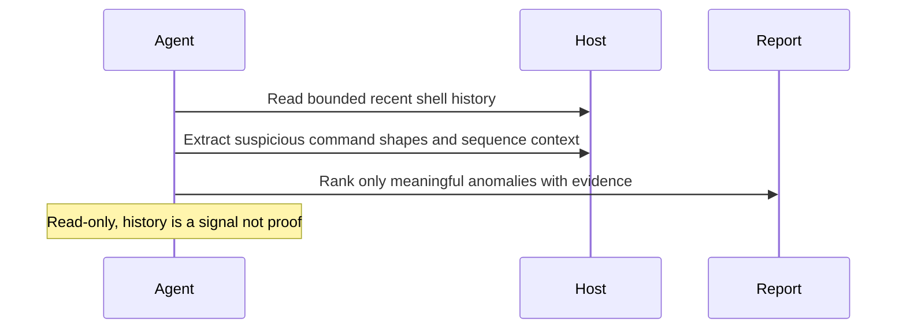

# Shell History Anomaly Digest

## Overview

`shell-history-anomaly-digest` inspects a bounded recent slice of readable shell history on one local machine and produces a concise, evidence-backed digest of unusual or security-relevant command patterns.

It is intentionally narrow. This automation does not try to prove compromise, reconstruct a full incident timeline, or replace broader host forensics. It uses shell history as a triage surface: a fast way to surface suspicious command sequences, history-tampering signals, risky remote-execution flows, or credential-access patterns that deserve a human review.

Use it when you want a recurring answer to a concrete question such as "did anything recently happen in shell history that looks unusual enough to investigate?" rather than a full host security audit.

## How It Works

1. Detects readable shell history sources such as `zsh`, `bash`, or `fish` history files.
2. Builds a bounded recent slice, preferring the last 24 hours when timestamps are available and bounded tail samples when they are not.
3. Extracts high-signal command patterns and adjacent sequence context.
4. Returns a short digest with ranked findings, observations, and explicit coverage gaps.



## When To Use It

Use it when:

- you want a daily or on-demand review of recent shell activity on one host;
- you want fast triage for suspicious command patterns without broader host scanning;
- you want the report to distinguish routine admin or developer work from higher-priority review items.

Do not use it when:

- you need a full incident-response timeline;
- you need filesystem, process, persistence, or network forensics beyond shell history;
- you want to mutate or clean shell history automatically.

## Prerequisites

- The automation must run on the machine being inspected, or in an environment that can read that machine's shell history files.
- The runtime needs read access to local shell history files.
- Standard shell tools such as `rg`, `awk`, `sed`, and `stat` are useful for bounded parsing and evidence handling. `perl` or `python` fallbacks are also acceptable when shell-tool behavior differs across hosts.

Optional but useful:

- `osquery` or other host context tools if you plan to pair this automation with broader local-host review.
- shell history formats that preserve timestamps, such as extended `zsh` history.

If no readable shell history source exists, the automation should stop with a blocked result rather than guessing from unrelated logs or shell configuration files.

## Cursor Cloud Usage

1. Open [Cursor Automations](https://cursor.com/automations/new).
2. Name your automation and paste [shell-history-anomaly-digest.md](/Users/adamchmara/projects/awesome-agent-automations/automations/shell-history-anomaly-digest/shell-history-anomaly-digest.md) as the automation prompt.
3. Make sure the runner is attached to the host you want to inspect. A generic hosted sandbox will inspect itself, not your laptop or server.
4. No MCP setup is required. Make sure the runtime can read local history files and run standard shell tools.
5. Set the schedule or run manually, then save the automation.

## Codex App Usage

1. Click `Automation` > `New Automation`.
2. Name your automation and paste [shell-history-anomaly-digest.md](/Users/adamchmara/projects/awesome-agent-automations/automations/shell-history-anomaly-digest/shell-history-anomaly-digest.md) as the automation prompt.
3. Run it only in a Codex environment that has shell access to the machine you want to inspect.
4. No MCP setup is required. Make sure the runtime can read local shell history files.
5. Set the schedule or run manually and save the automation.

## Claude Code / Codex CLI / Copilot Usage

1. No extra MCP setup is required for the core workflow.
2. Start the agent session on the host you want to inspect, or in a remote shell environment that can read that host's local shell history files.
3. For repeated checks in an open Claude Code session, use `/loop`, for example:

```text
/loop 1d Follow the instructions in automations/shell-history-anomaly-digest/shell-history-anomaly-digest.md
```

4. For durable Claude-managed automation, use `/schedule` or create a Routine in `claude.ai/code/routines`.
5. In Codex CLI or Copilot coding-agent environments, schedule this only if the runtime stays attached to the target host between runs.

## Recommended Defaults

| Setting | Default |
| --- | --- |
| Host scope | `current machine only` |
| History scope | `readable zsh, bash, and fish history files` |
| Review window | `last 24 hours or the most recent 1000 timestamped entries per file, otherwise a bounded tail sample of roughly 200 to 500 entries per untimestamped file` |
| Findings | `up to 10 retained findings` |
| Classification | `likely benign admin or dev activity`, `worth review`, `high-priority review`, `uncertain due to missing context` |
| Mutation policy | `report only` |
| Output | `Markdown report` |

Additional prompt behavior:

- Prefer sequence-level context over isolated command fragments.
- Prefer timestamped history over untimestamped history when both exist.
- Suppress routine admin and developer workflows unless they participate in a suspicious sequence.
- Treat history as one signal, not proof of compromise.
- If no finding is retained, say so directly rather than fabricating a placeholder anomaly.
- Redact obvious secrets and long encoded blobs in the final report.
- Stop with a partial or blocked report when readable history is missing or too incomplete to support a trustworthy result.

Confidence guidance:

- `high`: timestamped, exact command evidence with sequence context and no major visibility gap
- `medium`: exact command evidence is present, but timestamps, adjacency, or source coverage are partial
- `low`: isolated fragment or sparse history visibility makes interpretation uncertain

## Useful Host-Specific Inputs

Tell the runner anything it cannot safely infer from the host snapshot alone.

Expected activity example:

```text
Expected shell activity includes Docker, kubectl, Terraform, AWS CLI, and SSH administration for this host.
Treat those as routine unless the sequence includes credential dumping, history tampering, or suspicious download-and-execute behavior.
```

Lab context example:

```text
This machine is used for security testing and malware analysis.
Lower the priority of reverse-shell labs, base64 decoding, and packet-tool commands unless they target unusual local paths or persistence surfaces.
```

Developer context example:

```text
This is a development laptop. Routine package-manager, git, build, test, and local database commands should not become ranked findings by themselves.
```

Escalation example:

```text
If you find history-clearing commands, suspicious SSH key edits, or remote-execution download chains, include one concrete manual follow-up command or file path to inspect next.
```

## Limitations

- Shell history is often incomplete, editable, or missing timestamps.
- A suspicious command in history does not prove it succeeded, and a clean history does not prove the host is clean.
- This automation is intentionally weaker when commands are truncated, shell history is disabled, or sensitive work happened in subshells, scripts, or other non-history paths.
- For broader host review, pair it with `local-security-monitor` or a more focused persistence, network, or filesystem workflow.
