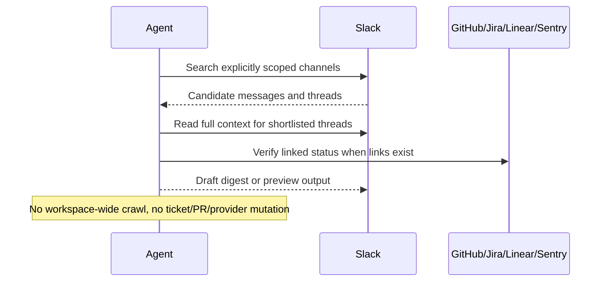

# Slack Engineering Signal Digest

## Overview

`slack-engineering-signal-digest` reads explicitly scoped Slack engineering channels, finds the highest-signal recent threads, verifies linked GitHub, Jira, Linear, or Sentry state when available, and produces one concise digest.

Use it when engineering discussion happens in Slack, but authoritative status still lives in downstream systems.

## How It Works

1. Searches only the explicitly configured Slack channels in a bounded time window.
2. Shortlists likely high-signal messages and threads before reading deeper.
3. Verifies linked downstream state when GitHub, Jira, Linear, or Sentry links are present.
4. Produces a digest with `TL;DR`, `Highlights`, and optional `Decisions`, `Needs Attention`, and `Action Items`.
5. Returns preview output, a Slack draft, or a canvas-friendly result instead of broad posting by default.



## Prerequisites

- Slack access through Slack MCP
- An explicit Slack channel allowlist set in the prompt's scope block
- Optional access to GitHub, Jira, Linear, or Sentry if you want verification beyond Slack

## Cursor Cloud Usage

1. Open [Cursor Automations](https://cursor.com/automations/new).
2. Name your automation and paste [slack-engineering-signal-digest.md](/Users/adamchmara/projects/awesome-agent-automations/automations/slack-engineering-signal-digest/slack-engineering-signal-digest.md) as the automation prompt.
3. Add trigger conditions.
4. Before saving, edit the scope block at the top of the prompt with your real channel allowlist.
5. Add Slack MCP access.
  - Slack documents a dedicated Cursor connection flow here: [Connect to Cursor](https://docs.slack.dev/ai/slack-mcp-server/connect-to-cursor/).
  - Your Slack workspace admin must approve the integration.
  - Manual MCP endpoint: `https://mcp.slack.com/mcp`
6. Add optional GitHub, Jira, Linear, or Sentry access if you want the automation to verify linked downstream state.
7. Save the automation.

References:

- [Slack MCP Server Overview](https://docs.slack.dev/ai/slack-mcp-server/)
- [Connect to Cursor](https://docs.slack.dev/ai/slack-mcp-server/connect-to-cursor/)

## Codex App Usage

1. Install the Slack MCP server in Codex:
  ```bash
  codex mcp add slack --url https://mcp.slack.com/mcp
  codex mcp login slack
  codex mcp list
  ```
  - If your Codex environment already exposes Slack as a managed connector, use that instead of manual MCP setup.
  - Your Slack workspace admin must approve the integration.
2. Click `Automation` > `New Automation`.
3. Name your automation and paste [slack-engineering-signal-digest.md](/Users/adamchmara/projects/awesome-agent-automations/automations/slack-engineering-signal-digest/slack-engineering-signal-digest.md) as the automation prompt.
4. Before saving, edit the scope block at the top of the prompt with your real channel allowlist.
5. Add optional GitHub, Jira, Linear, or Sentry connectors if you want verified downstream links in the digest.
6. Set schedule or run manually and save the automation.

References:

- [Slack MCP Server Overview](https://docs.slack.dev/ai/slack-mcp-server/)
- [Codex Automations](https://openai.com/academy/codex-automations)

## Claude Code Usage

1. Install the Slack plugin in Claude Code:
  ```bash
  claude plugin install slack
  ```
2. Complete the OAuth flow to authenticate into your Slack workspace.
  - Slack documents the Claude flow here: [Connect to Claude](https://docs.slack.dev/ai/slack-mcp-server/connect-to-claude/).
3. Before using the prompt, edit the scope block at the top with your real channel allowlist.
4. Add optional GitHub, Jira, Linear, or Sentry access if you want linked-state verification.
5. For repeated checks in an open Claude Code session, use `/loop`, for example:

```text
/loop weekdays at 9am Follow the instructions in automations/slack-engineering-signal-digest/slack-engineering-signal-digest.md
```

6. For durable Claude-managed automation that survives outside the current session, use `/schedule` or create a Routine in `claude.ai/code/routines`.

Claude-native automation options:

- `/loop` for repeated runs in the current session
- `/schedule` for scheduled routines managed by Claude
- Routines in `claude.ai/code/routines` for durable cloud-hosted automation

References:

- [Connect to Claude](https://docs.slack.dev/ai/slack-mcp-server/connect-to-claude/)
- [Claude Code CLI Reference](https://code.claude.com/docs/en/cli-usage)
- [Run prompts on a schedule](https://code.claude.com/docs/en/scheduled-tasks)
- [Automate work with routines](https://code.claude.com/docs/en/web-scheduled-tasks)

## Recommended Defaults

| Setting | Default |
| --- | --- |
| Slack scope | `Explicit channel allowlist required` |
| Query window | `24h` |
| Candidate pool | `30 messages or threads` |
| Max digest items | `6` |
| Delivery | `Preview or Slack draft` |
| Empty-run behavior | `No heartbeat post` |
| Downstream verification | `Only when links are present` |

Additional prompt behavior:

- Start with preview-only or draft-only until the destination and message shape are trusted.
- Keep the scope to public channels unless private-channel access is explicitly approved.
- If the digest is too long for a clean message, prefer a Slack canvas.

## Useful Workspace-Specific Inputs

Tell the runner anything it cannot reliably infer from Slack alone.

Channel scope example:

```text
Slack channels: #eng-infra, #incidents-api, #releases, #support-escalations
Window: 24h
```

Verification policy example:

```text
When a Slack thread links to GitHub, Jira, Linear, or Sentry, verify the current state before calling something fixed, shipped, resolved, or assigned.
If there is no linked system, keep the item as Slack-only and do not overstate certainty.
```

Delivery example:

```text
Produce preview output first. Once the digest shape looks right, draft the message for #eng-daily-digest.
If the output exceeds a normal channel message length, create a canvas instead of posting a long message.
```

Privacy example:

```text
Do not surface private-channel or DM content in outputs that go to broader audiences.
Do not include customer emails, account IDs, auth tokens, cookies, or pasted secrets from Slack messages.
```
