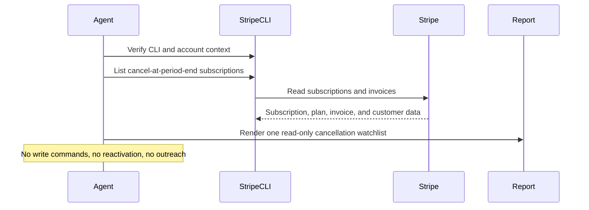

# Stripe Cancel At Period End Watch

## Overview

`stripe-cancel-at-period-end-watch` uses Stripe CLI as the source of truth and produces one internal, read-only watchlist of subscriptions scheduled to cancel at period end that most deserve human review.

Use it when you want an operational churn watchlist ranked by period-end urgency, ARR proxy, plan tier, billing stress, and save opportunity. It stays read-only and does not reactivate subscriptions, change cancellation settings, apply discounts, or contact customers.

## How It Works

1. Verifies Stripe CLI is installed and authenticated against the intended account.
2. Uses a single Stripe CLI subscription-list command to collect subscriptions scheduled to cancel at period end.
3. Enriches up to 10 of the highest-priority candidates with recent invoice history so the watchlist can distinguish billing-stress churn from cleaner voluntary churn.
4. Produces one concise internal digest with ranked accounts, high-value upcoming cancellations, billing-stress cancellations, likely save opportunities, skipped items, and setup gaps.



## Prerequisites

- Stripe CLI must be installed and authenticated against the target account before the automation runs.
- Verify the runtime with:

```bash
stripe --version
stripe account
```

- `stripe account` should return the account ID, display name, and whether the key in use is live or test.
- If Stripe CLI is missing or unauthenticated, the automation should stop and report instead of falling back to MCP or plugin tools.
- Optional separate Slack, GitHub, or email credentials if you want the digest delivered somewhere other than the run output.

### Install And Authenticate Stripe CLI

Install the CLI with Homebrew:

```bash
brew install stripe/stripe-cli/stripe
```

Authenticate with a browser-based login:

```bash
stripe login
```

Or configure a specific key for the environment:

```bash
stripe config --set api-key=<key>
```

Keep the workflow read-only and use restricted credentials where possible.

## Cursor Cloud Usage

1. Open [Cursor Automations](https://cursor.com/automations/new).
2. Name your automation and paste [stripe-cancel-at-period-end-watch.md](/Users/adamchmara/projects/awesome-agent-automations/automations/stripe-cancel-at-period-end-watch/stripe-cancel-at-period-end-watch.md) as the automation prompt.
3. Make sure Stripe CLI is installed in the runner and authenticated to the intended account before the automation starts.
4. Add Slack, GitHub, or email delivery only if you want the digest posted somewhere other than the run output.
5. Start with preview-only delivery, then add a daily or twice-weekly schedule.

## Codex App Usage

1. Make sure Stripe CLI is installed in the runtime and authenticated to the intended account.
2. Verify the runtime before scheduling:

```bash
stripe --version
stripe account
```

3. Click `Automation` > `New Automation`.
4. Paste [stripe-cancel-at-period-end-watch.md](/Users/adamchmara/projects/awesome-agent-automations/automations/stripe-cancel-at-period-end-watch/stripe-cancel-at-period-end-watch.md) as the automation prompt.
5. Add delivery tools only if needed, keep them separate from Stripe CLI auth, and start in preview mode.
6. Set a schedule or run manually.

## Claude Code / Codex CLI / Copilot Usage

1. Make sure Stripe CLI is installed and authenticated in the runtime before running the prompt.
2. Keep this automation internal and report-only. If someone wants retention outreach or offer creation, route that into a separate approved workflow.
3. For repeated checks in an open Claude Code session, use `/loop`, for example:

```text
/loop weekdays at 9am Follow the instructions in automations/stripe-cancel-at-period-end-watch/stripe-cancel-at-period-end-watch.md
```

4. If you add Slack or GitHub delivery, start with preview output.

## Recommended Defaults

| Setting | Default |
| --- | --- |
| Cadence | `daily` |
| Subscription query | `cancel_at_period_end=true, limit 100, expand subscription items` |
| Primary window | `period ends within 30 days` |
| Enrichment cap | `up to 10 customers with recent invoice history` |
| Final digest size | `up to 10 ranked accounts` |
| ARR source | `derived from plan.amount on subscription items, labeled estimate for tiered pricing` |
| Scope | `one Stripe account and one mode per run` |
| Output mode | `internal report-only / preview-first` |
| Customer identifiers | `customer name and email allowed for approved internal delivery` |

Additional prompt behavior:

- Use Stripe CLI as the only Stripe read surface for this automation.
- If the installed Stripe CLI version does not support the expected `--cancel-at-period-end` query shape, stop and report rather than broadening the query or falling back to another tool.
- Treat subscriptions beyond 30 days from period end as lower priority and move them into `Skipped This Run`.
- Treat open invoice balance alongside a scheduled cancellation as billing-stress churn, not clean voluntary churn.
- Use summed `amount_remaining` from invoices as the real balance signal whenever invoice data is available.
- Keep ARR language explicit when it is only a proxy derived from flat plan amount.
- Never turn this into a reactivation, discounting, or customer-message automation.

## Useful Stripe-Specific Inputs

Tell the runner anything it cannot safely infer from Stripe alone.

No-save example:

```text
Do not flag sandbox customers, internal accounts, or legacy low-touch plans as likely save opportunities even if they are scheduled to cancel.
```

Billing-stress example:

```text
If a scheduled cancellation also has one or more open invoices with amount_remaining > 0, classify it as billing-stress churn and prioritize recovery action over generic save outreach.
```

Usage-spike example:

```text
If an open invoice materially exceeds prior paid invoices for the same customer, flag it as a usage spike and suggest pricing or integration review.
```

Redaction example:

```text
It is safe to include customer name, customer email, country, plan tier, ARR proxy, invoice amounts, and Stripe object IDs in approved internal delivery. Do not include payment method details or full street addresses.
```
