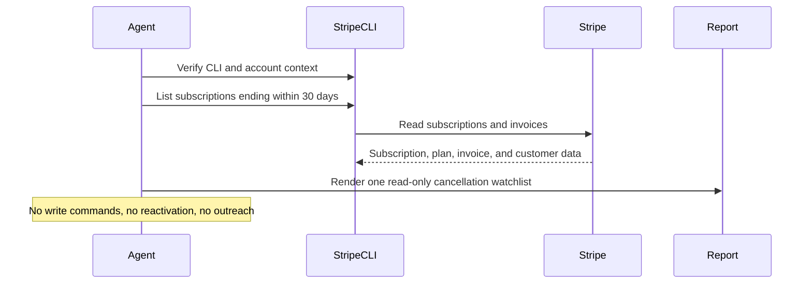

# Stripe Cancel At Period End Watch

## Overview

`stripe-cancel-at-period-end-watch` uses Stripe CLI as the source of truth and produces one internal, read-only watchlist of subscriptions scheduled to cancel at period end that most deserve human review.

Use it when you want an operational churn watchlist ranked by period-end urgency, ARR proxy, plan tier, billing stress, and save opportunity. It stays read-only and does not reactivate subscriptions, change cancellation settings, apply discounts, or contact customers.

## How It Works

1. Verifies Stripe CLI is installed and authenticated against the intended account.
2. Uses `stripe whoami` plus a scoped `stripe get /v1/account` read to confirm account identity and the intended live or test mode before collecting data.
3. Uses a supported Stripe CLI list query for subscriptions whose `current_period_end` falls within the next 30 days, then filters `cancel_at_period_end=true` locally.
4. Pages through that 30-day window when needed, with a conservative page cap so the run stays bounded.
5. Enriches up to 10 of the highest-priority candidates with recent invoice history so the watchlist can distinguish billing-stress churn from cleaner voluntary churn.
6. Produces one concise internal digest with ranked accounts, high-value upcoming cancellations, billing-stress cancellations, likely save opportunities, skipped items, and setup gaps.
7. When the runtime can write files, also maintains a static HTML companion report alongside a Markdown snapshot for visual review.



## Prerequisites

- Stripe CLI must be installed and authenticated against the target account before the automation runs.
- Verify the runtime with:

```bash
stripe --version
stripe whoami
```

- Record the account name and ID from `stripe whoami`.
- If exactly one of `Test mode key` or `Live mode key` is available, use that mode.
- If both are available, require the run to specify the intended mode instead of guessing.
- Validate the chosen mode with `stripe get /v1/account` for test or `stripe get /v1/account --live` for live.
- If Stripe CLI is missing or unauthenticated, the automation should stop and report instead of falling back to MCP or plugin tools.
- Optional separate Slack, GitHub, or email credentials if you want the digest delivered somewhere other than the run output.

### Install And Authenticate Stripe CLI

Install the CLI with Homebrew:

```bash
brew install stripe/stripe-cli/stripe
```

Authenticate with a browser-based login:

```bash
stripe login
```

Or configure a specific key for the environment:

```bash
stripe config --set api-key=<key>
```

Keep the workflow read-only and use restricted credentials where possible.

## Cursor Cloud Usage

1. Open [Cursor Automations](https://cursor.com/automations/new).
2. Name your automation and paste [stripe-cancel-at-period-end-watch.md](/Users/adamchmara/projects/awesome-agent-automations/automations/stripe-cancel-at-period-end-watch/stripe-cancel-at-period-end-watch.md) as the automation prompt.
3. Make sure Stripe CLI is installed in the runner and authenticated to the intended account before the automation starts.
4. Add Slack, GitHub, or email delivery only if you want the digest posted somewhere other than the run output.
5. Start with preview-only delivery, then add a daily or twice-weekly schedule.

Cursor Cloud Automations support `Memory`. You can use it for light continuity across runs, for example to remember which accounts were surfaced recently, whether a cancellation risk is getting stronger, or whether an operator already noted a save opportunity. Treat Memory as optional enrichment, not as required state or a source of truth.

If the runtime has workspace write access, the automation can also persist companion artifacts under:

```text
.automation-state/stripe-cancel-at-period-end-watch/reports/<YYYY-MM-DD>.md
.automation-state/stripe-cancel-at-period-end-watch/reports/<YYYY-MM-DD>.html
```

## Codex App Usage

1. Make sure Stripe CLI is installed in the runtime and authenticated to the intended account.
2. Verify the runtime before scheduling:

```bash
stripe --version
stripe whoami
stripe get /v1/account
```

3. Click `Automation` > `New Automation`.
4. Paste [stripe-cancel-at-period-end-watch.md](/Users/adamchmara/projects/awesome-agent-automations/automations/stripe-cancel-at-period-end-watch/stripe-cancel-at-period-end-watch.md) as the automation prompt.
5. Add delivery tools only if needed, keep them separate from Stripe CLI auth, and start in preview mode.
6. Set a schedule or run manually.

## Claude Code / Codex CLI / Copilot Usage

1. Make sure Stripe CLI is installed and authenticated in the runtime before running the prompt.
2. Keep this automation internal and report-only. If someone wants retention outreach or offer creation, route that into a separate approved workflow.
3. For repeated checks in an open Claude Code session, use `/loop`, for example:

```text
/loop weekdays at 9am Follow the instructions in automations/stripe-cancel-at-period-end-watch/stripe-cancel-at-period-end-watch.md
```

4. If you add Slack or GitHub delivery, start with preview output.

If durable file writes are available, keep the Markdown watchlist as the canonical response and treat the HTML file as a richer internal review artifact.

## Recommended Defaults

| Setting | Default |
| --- | --- |
| Cadence | `daily` |
| Subscription query | `status=all, current_period_end within next 30 days, expand subscription items, then local filter on cancel_at_period_end=true` |
| Primary window | `period ends within 30 days` |
| Enrichment cap | `up to 10 customers with recent invoice history` |
| Final digest size | `up to 10 ranked accounts` |
| ARR source | `derived from plan.amount on subscription items, labeled estimate for tiered pricing` |
| Scope | `one Stripe account and one explicit Stripe mode per run` |
| Output mode | `internal report-only / preview-first, with optional HTML artifact when writable` |
| Customer identifiers | `customer name and email allowed for approved internal delivery` |

Additional prompt behavior:

- Use Stripe CLI as the only Stripe read surface for this automation.
- Use `stripe whoami` as the primary auth and account-identity check.
- Use `stripe get /v1/account` or `stripe get /v1/account --live` to validate the chosen mode before any subscription or invoice reads.
- If both test and live keys are present and the run does not explicitly declare the intended mode, stop and report instead of guessing.
- Do not rely on `--cancel-at-period-end` or subscription search for this field. Stripe does not expose `cancel_at_period_end` as a supported list flag or subscription-search field in this CLI surface.
- Query the next 30 days of `current_period_end` with supported interval parameters, then filter `cancel_at_period_end=true` locally.
- If the 30-day window requires more than 10 pages of 100 subscriptions each, stop paging, mark the run partial, and record the truncation.
- Treat open invoice balance alongside a scheduled cancellation as billing-stress churn, not clean voluntary churn.
- Use summed `amount_remaining` from invoices as the real balance signal whenever invoice data is available.
- Keep ARR language explicit when it is only a proxy derived from flat plan amount.
- If artifact writes are possible, keep Markdown canonical and generate a static HTML companion report rather than a mini web app.
- Never turn this into a reactivation, discounting, or customer-message automation.

## Useful Stripe-Specific Inputs

Tell the runner anything it cannot safely infer from Stripe alone.

No-save example:

```text
Do not flag sandbox customers, internal accounts, or legacy low-touch plans as likely save opportunities even if they are scheduled to cancel.
```

Billing-stress example:

```text
If a scheduled cancellation also has one or more open invoices with amount_remaining > 0, classify it as billing-stress churn and prioritize recovery action over generic save outreach.
```

Usage-spike example:

```text
If an open invoice materially exceeds prior paid invoices for the same customer, flag it as a usage spike and suggest pricing or integration review.
```

Redaction example:

```text
It is safe to include customer name, customer email, country, plan tier, ARR proxy, invoice amounts, and Stripe object IDs in approved internal delivery. Do not include payment method details or full street addresses.
```

## HTML Report

When artifact writes are available, the HTML file should stay intentionally simple and static. The highest-value additions over Markdown are:

- summary cards for high-value upcoming cancellations, billing-stress churn, and likely save opportunities
- a clearer visual separation of accounts by days left and churn type
- a stronger watchlist scanning experience for ARR proxy, plan tier, and cancellation urgency
- a compact embedded Markdown copy for auditability

The HTML report should not become a client-side dashboard or require extra runtime services.
The HTML artifact is optional. One practical use is to treat it as a visual companion for downstream delivery, for example by opening it with a browser-capable tool, taking a screenshot, and posting that image to Slack or another internal channel while keeping the Markdown watchlist as the canonical record.
