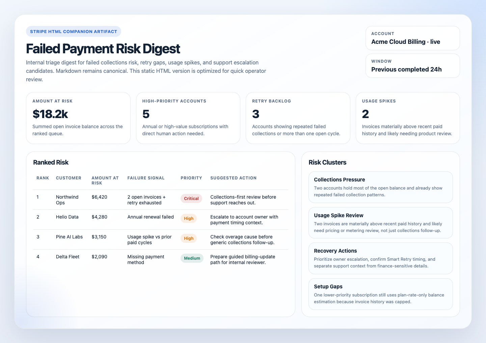
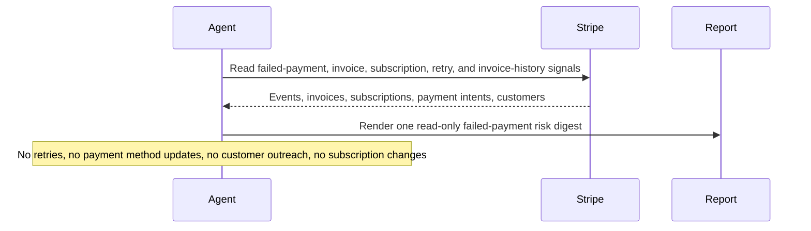

# Stripe Failed Payment Risk Digest

## Overview

`stripe-failed-payment-risk-digest` reads a bounded Stripe billing window and ranks the failed-payment situations most likely to turn into involuntary churn, delayed cash collection, or support escalations.

Use it when finance, support, or revenue operations teams want one practical internal report about failed invoices, past-due subscriptions, high-value open balances, retry gaps, usage spikes, and recovery blind spots without sending customer messages or mutating Stripe.

## Preview



## How It Works

1. Connects to Stripe, confirms the account, and infers live or test mode from Stripe objects.
2. Pulls a bounded candidate set with Stripe MCP convenience tools for payment intents, invoices, and past_due, unpaid, or incomplete subscriptions.
3. Enriches up to 10 customers with recent invoice history so the digest can use true outstanding balance, consecutive open invoices, and prior paid amounts rather than relying on flat plan price alone.
4. Flags usage spikes separately from ordinary failed collections and produces one concise internal digest with ranked risk, recovery actions, skipped items, and setup gaps.
5. When the runtime can write files, also maintains a static HTML companion report alongside a Markdown snapshot for visual review.



## Prerequisites

- Stripe access through either:
  - the hosted MCP server at `https://mcp.stripe.com`, or a local `@stripe/mcp` server backed by a restricted Stripe API key; or
  - authenticated Stripe CLI access for runners that prefer official CLI reads over MCP.
- Read access to invoices, subscriptions, payment intents, customers, prices, and recent relevant events.
- Optional separate Slack, GitHub, or email credentials if you want the digest delivered somewhere other than the run output.
- Optional knowledge of current recovery policy, such as Smart Retries, manual collection rules, or support ownership, if you want the recovery actions to be more specific.

### CLI Alternative

If you do not want to use MCP, Stripe CLI is a viable setup path for this automation as long as the runtime can perform the equivalent bounded reads for account info, payment intents, invoices, and subscriptions.

Typical setup:

```bash
brew install stripe/stripe-cli/stripe
stripe login
stripe config --list
```

Use restricted credentials where possible and keep the workflow read-only.

## Cursor Cloud Usage

1. Open [Cursor Automations](https://cursor.com/automations/new).
2. Name your automation and paste [stripe-failed-payment-risk-digest.md](/Users/adamchmara/projects/awesome-agent-automations/automations/stripe-failed-payment-risk-digest/stripe-failed-payment-risk-digest.md) as the automation prompt.
3. Add the official Stripe plugin from the Cursor marketplace and complete the connection flow there.
4. If your Cursor environment prefers CLI access instead of the plugin, make sure authenticated Stripe CLI reads are available to the runner.
5. If you want the digest posted somewhere, add Slack, GitHub, or email tooling separately from the Stripe credentials.
6. Start with preview-only delivery, then add a daily schedule once the report shape is correct for your team.

Cursor Cloud Automations support `Memory`. You can use it for light continuity across runs, for example to remember which accounts were surfaced recently, whether a risk is worsening, or whether a follow-up was already noted. Treat Memory as optional enrichment, not as required state or a source of truth.

## Codex App Usage

1. Add Stripe MCP to Codex.

```bash
codex mcp add stripe --url https://mcp.stripe.com
codex mcp login stripe
codex mcp list
```

2. If you prefer a key-based local runtime instead of hosted OAuth, run the local Stripe MCP server with a restricted key and add that server to Codex instead of the hosted URL.
3. Click `Automation` > `New Automation`.
4. Name your automation and paste [stripe-failed-payment-risk-digest.md](/Users/adamchmara/projects/awesome-agent-automations/automations/stripe-failed-payment-risk-digest/stripe-failed-payment-risk-digest.md) as the automation prompt.
5. Optionally add Slack, GitHub, or email delivery tools, but keep them separate from Stripe auth and start in preview mode.
6. Set a schedule or run manually and save the automation.

If the runtime has workspace write access, the automation can also persist companion artifacts under:

```text
.automation-state/stripe-failed-payment-risk-digest/reports/<YYYY-MM-DD>.md
.automation-state/stripe-failed-payment-risk-digest/reports/<YYYY-MM-DD>.html
```

## Claude Code / Codex CLI / Copilot Usage

1. Make sure the runtime has Stripe access through the hosted MCP server or a local `@stripe/mcp` process backed by a restricted key.
2. Keep this automation internal and report-only. If someone wants customer outreach, route that into a separate approved draft-first workflow.
3. For repeated checks in an open Claude Code session, use `/loop`, for example:

```text
/loop weekdays at 9am Follow the instructions in automations/stripe-failed-payment-risk-digest/stripe-failed-payment-risk-digest.md
```

4. In Codex CLI or Copilot-style coding-agent environments, treat Stripe CLI as a sandbox-validation helper rather than the main runtime path.
5. If you add Slack or GitHub delivery, start by rendering preview output before allowing routine posting.

If durable file writes are available, keep the Markdown digest as the canonical response and treat the HTML file as a richer internal review artifact.

## Recommended Defaults

| Setting | Default |
| --- | --- |
| Cadence | `daily` |
| Query window | `previous completed 24h` |
| Candidate pool | `up to 30 payment intents or invoices, plus up to 10 subscriptions per risk status` |
| Enrichment cap | `up to 10 customers with recent invoice history` |
| Final digest size | `up to 10 ranked customers or accounts` |
| Amount-at-risk source | `summed amount_remaining across open invoices when invoice data is available` |
| Scope | `one Stripe account per run` |
| Output mode | `internal report-only / preview-first, with optional HTML artifact when writable` |
| Customer identifiers | `customer name and email allowed for approved internal delivery` |

Additional prompt behavior:

- Prefer current Stripe object state over raw event text when they disagree.
- Focus on the recovery queue your team can actually act on: failed invoices, past_due or unpaid subscriptions, retry exhaustion, high-value open balances, and usage-driven balance spikes.
- Treat summed `amount_remaining` as the real balance whenever customer invoice history is available.
- Flag usage spikes separately because they often need a pricing or integration conversation instead of a simple payment follow-up.
- Keep the final report short enough for finance or support triage, not as a full account export.
- For non-enriched candidates, make it explicit that any balance estimate is based on plan rate only.
- If artifact writes are possible, keep Markdown canonical and generate a static HTML companion report rather than a mini web app.
- Never turn this into a customer-message sender or a billing-mutation workflow.

## Useful Stripe-Specific Inputs

Tell the runner anything it cannot safely infer from Stripe alone.

Scope example:

```text
Run against the live SaaS billing account only. Ignore internal test customers and any legacy manual invoices outside the core product.
```

Threshold example:

```text
Treat any single failed invoice above 1000, any customer with more than 2 consecutive open invoices, or any past_due annual subscription as high priority.
```

Recovery-policy example:

```text
Smart Retries is enabled. If the next payment attempt is already scheduled, prefer suggesting internal monitoring over immediate intervention unless the account is high value.
```

Usage-spike example:

```text
If an open invoice is materially above the customer's recent paid invoices, treat it as a usage spike and suggest pricing, packaging, or integration review rather than only collections follow-up.
```

Redaction example:

```text
It is safe to include Stripe object IDs, product names, plan names, invoice amounts, customer name, customer email, and country in approved internal delivery. Do not include full card details, bank details, or full street addresses.
```

## HTML Report

When artifact writes are available, the HTML file should stay intentionally simple and static. The highest-value additions over Markdown are:

- summary cards for total amount at risk, high-priority accounts, retry backlog, and usage spikes
- a sortable-feeling visual layout for the ranked risk table, even if the file is plain static HTML
- clearly separated risk-cluster sections

The HTML report should not become a client-side dashboard or require extra runtime services.

The HTML artifact is optional. One practical use is to treat it as a visual companion for downstream delivery, for example by opening it with a browser-capable tool, taking a screenshot, and posting that image to Slack or another internal channel while keeping the Markdown digest as the canonical record.
