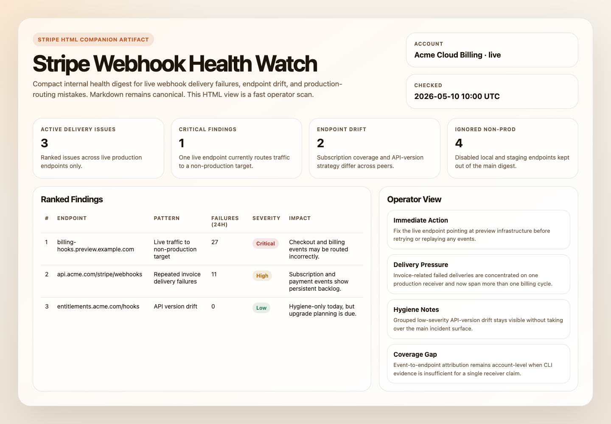
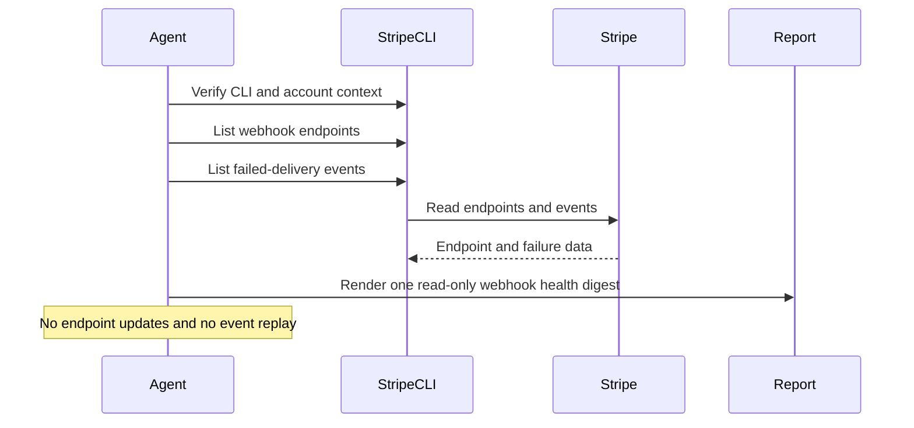

# Stripe Webhook Health Watch

## Overview

`stripe-webhook-health-watch` uses Stripe CLI as the source of truth and produces one internal, read-only digest of live production webhook health.

Use it when you want a bounded operational report that surfaces production delivery failures, live-mode misconfiguration, and anomaly patterns that suggest Stripe events are being dropped or routed to the wrong destination.

It is intentionally report-only. It does not update webhook endpoints, resend events, or mutate Stripe state. It also avoids noisy inventory output for disabled test tunnels or staging endpoints unless they are actually wired into live traffic.

## Preview



## How It Works

1. Verifies that Stripe CLI is installed and authenticated for live-mode reads.
2. Lists up to 20 live webhook endpoints and separates production endpoints from local, staging, dev, and temporary tunnel targets.
3. Lists up to 100 live failed-delivery events and extracts the highest-signal failure evidence.
4. Attributes failures to one production endpoint only when the CLI evidence is strong enough. Otherwise it reports the issue at the account level instead of pretending to know the exact receiver.
5. Produces one ranked internal digest with production endpoint inventory, findings, ignored non-production endpoint summary, grouped hygiene notes, detailed endpoint notes only where useful, skipped items, and setup gaps.



## When To Use It

Use it when you want early warning that billing, checkout, entitlement, or dispute workflows may be missing live Stripe events because one or more production webhook consumers are unhealthy or misconfigured.

This automation is a strong fit when:

- Stripe webhooks feed production systems such as fulfillment, billing sync, or entitlement sync
- the runtime can access live-mode Stripe data cleanly through Stripe CLI
- your team wants one concise internal health digest rather than raw event inspection

This automation is strongest when you want signal over exhaustiveness. Healthy runs should stay short. Repeated low-severity hygiene issues should be grouped rather than expanded into one incident block per endpoint.

## Prerequisites

- Stripe CLI must be installed and authenticated against the target account before the automation runs.
- Verify the runtime with:

```bash
stripe --version
stripe webhook_endpoints list --live --limit=1
stripe events list --live --limit=1
```

- If those live-mode read commands succeed, the CLI is authenticated enough for this automation.
- This automation is intentionally live-only. It should stop instead of falling back to test mode.
- If Stripe CLI is missing or unauthenticated, the automation should stop and report instead of falling back to MCP, plugins, or ad hoc API calls.
- Optional separate Slack, GitHub, or email credentials if you want the digest delivered somewhere other than the run output.

### Install And Authenticate Stripe CLI

Install the CLI with Homebrew:

```bash
brew install stripe/stripe-cli/stripe
```

Authenticate with a browser login:

```bash
stripe login
```

Or configure a specific key for the environment:

```bash
stripe config --set api-key=<key>
```

For stricter read-only operation, create a restricted key in the Stripe Dashboard with only the live read permissions this workflow needs and use that key for the CLI environment.

Use restricted credentials where possible and keep the workflow read-only.

## Cursor Cloud Usage

1. Open [Cursor Automations](https://cursor.com/automations/new).
2. Name your automation and paste [stripe-webhook-health-watch.md](/Users/adamchmara/projects/awesome-agent-automations/automations/stripe-webhook-health-watch/stripe-webhook-health-watch.md) as the automation prompt.
3. Make sure Stripe CLI is installed in the runner and authenticated for live-mode reads before the automation starts.
4. Add Slack, GitHub, or email delivery only if you want the digest posted somewhere other than the run output.
5. Start with preview-only delivery, then move to an hourly, every-6-hours, or daily schedule based on webhook volume.

## Codex App Usage

1. Make sure Stripe CLI is installed in the runtime and authenticated to the intended account.
2. Verify the runtime before scheduling:

```bash
stripe --version
stripe webhook_endpoints list --live --limit=1
stripe events list --live --limit=1
```

3. Click `Automation` > `New Automation`.
4. Paste [stripe-webhook-health-watch.md](/Users/adamchmara/projects/awesome-agent-automations/automations/stripe-webhook-health-watch/stripe-webhook-health-watch.md) as the automation prompt.
5. Add delivery tools only if needed, keep them separate from Stripe CLI auth, and start in preview mode.
6. Set a schedule or run manually.

## Claude Code / Codex CLI / Copilot Usage

1. Make sure Stripe CLI is installed and authenticated in the runtime before running the prompt.
2. Keep this automation internal and report-only. If someone wants endpoint repair, retry handling, or customer-facing remediation, route that into separate approved workflows.
3. For repeated checks in an open Claude Code session, use `/loop`, for example:

```text
/loop every 6 hours Follow the instructions in automations/stripe-webhook-health-watch/stripe-webhook-health-watch.md
```

4. If you add Slack or GitHub delivery, start with preview output.

## Recommended Defaults

| Setting | Default |
| --- | --- |
| Cadence | `every 6 hours` |
| Endpoint query | `stripe webhook_endpoints list --live --limit=20` |
| Failed-event query | `stripe events list --live --delivery-success=false --limit=100` |
| Findings cap | `up to 10 ranked findings` |
| Scope | `one Stripe account in live mode per run` |
| Output mode | `internal report-only / preview-first` |
| Endpoint attribution | `direct when available, otherwise clearly labeled inference` |

Additional prompt behavior:

- Use Stripe CLI as the only Stripe read surface for this automation.
- If live-mode access is missing or ambiguous, stop and report instead of dropping into test mode.
- Do not rely on a `stripe account` command. Verify access with the same read commands the automation actually needs.
- Ignore disabled local tunnels, dev targets, and staging endpoints unless they are clearly part of live traffic.
- Treat enabled live endpoints that point to staging, dev, test, localhost, or temporary tunnels as urgent misconfiguration.
- If endpoint attribution is not directly available from Stripe CLI output, infer cautiously from endpoint subscriptions and keep unresolved patterns at the account level when needed.
- Group repeated LOW-risk findings such as shared stale API versions into one hygiene finding instead of one row per endpoint.
- Check production endpoints for config drift, especially mismatched subscribed events, mismatched API version strategy, or one production endpoint receiving a critical event type that peers do not.
- Keep stale API versions as low-severity hygiene findings unless they overlap with active failures on a production endpoint.
- Never turn this into a resend, replay, or endpoint-editing workflow.

## Useful Stripe-Specific Inputs

Tell the runner anything it cannot safely infer from Stripe alone.

Criticality example:

```text
Treat checkout.session.completed, invoice.paid, invoice.payment_failed, customer.subscription.updated, and charge.dispute.created as operationally critical for this account.
```

Production-domain example:

```text
Treat only api.novu.co and eu.api.novu.co as production webhook targets. Ignore localhost, ngrok, staging, dev, preview, and sandbox hosts unless they are enabled in live mode.
```

Delivery example:

```text
Post only CRITICAL and HIGH findings to Slack. Keep the full endpoint inventory in the run output.
```

Healthy-run example:

```text
If there are no delivery failures and only grouped LOW-risk hygiene notes, keep the digest short and lead with one sentence saying that no active production webhook delivery issues were detected.
```

Redaction example:

```text
It is safe to include endpoint URLs, event types, Stripe object IDs, account ID, timestamps, and API versions in approved internal delivery. Do not include payment method details, event payload bodies, or full street addresses.
```
